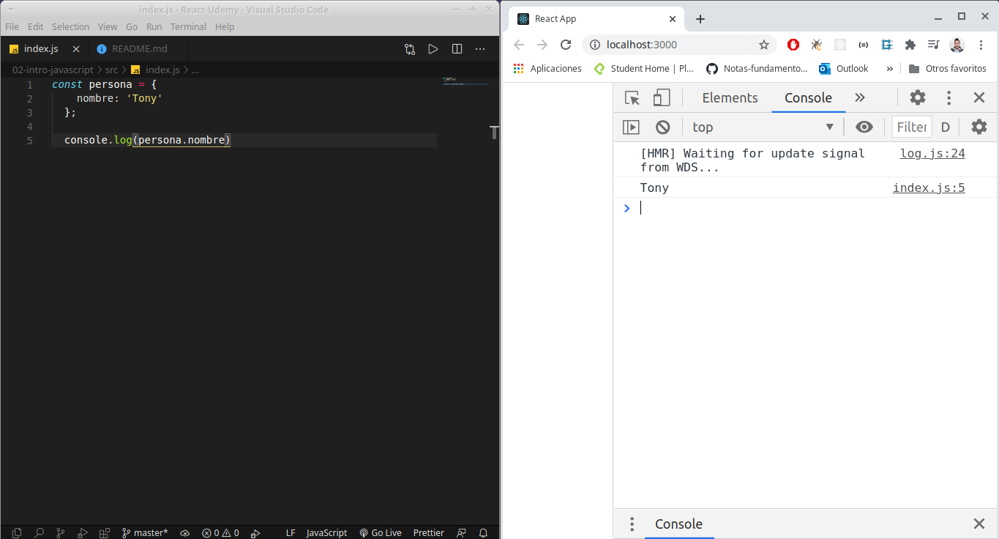
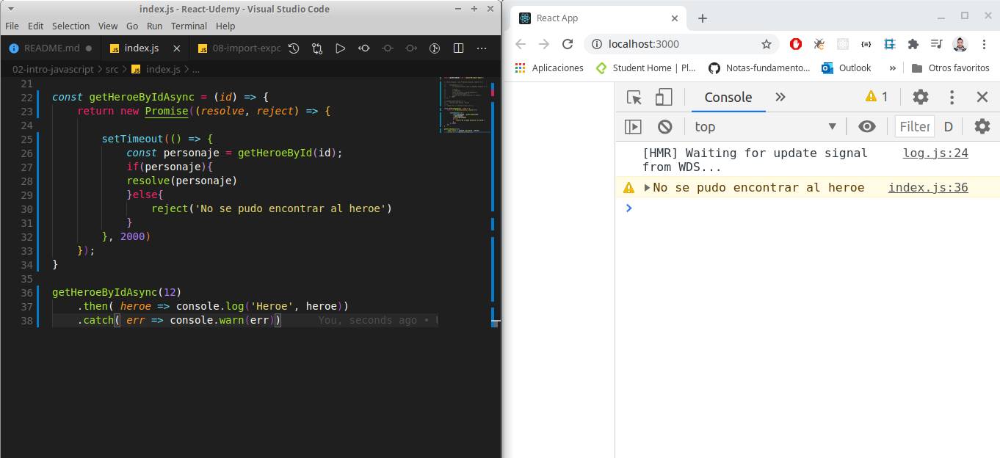
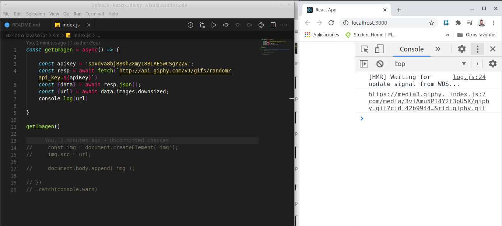
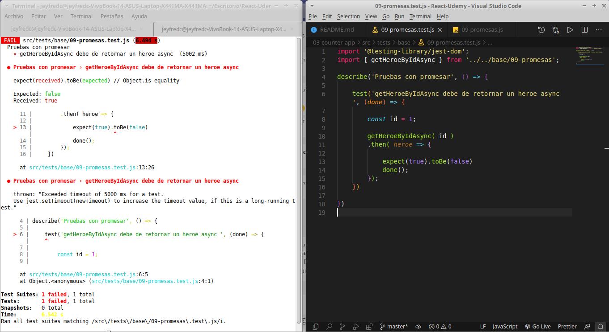

# React-Curso-Udemy

## Tabla de contenido 

[Primeros Pasos En React](#Primeros-Pasos-En-React)

[Introducción a babel](#Introducción-a-babel)

[Bases de JavaScript](#Bases-de-JavaScript)

[Variables y constantes](#Variables-y-constantes)

[Template string](#Template-string)

[Objetos literales](#Objetos-literales)

[Arreglos](#Arreglos)

[Funciones](#Funciones)

[Desestructuración de objetos](#Desestructuración-de-objetos)

[Import, export y funciones comunes de arreglos](#Import-export-y-funciones-comunes-de-arreglos)

[Múltiples exportaciones y exportaciones por defecto](#Múltiples-exportaciones-y-exportaciones-por-defecto)

[Promesas](#Promesas)

[Fetch API](#Fetch-API)

[Async-Await](#Async-Await)

[Operador condicional ternario](#Operador-condicional-ternario)

[¿Qué son los componentes?](#¿Qué-son-los-componentes?)

[Primera aplicación de React](#Primera-aplicación-de-React)

[Estructura de directorios](#Estructura-de-directorios)

[Contenido de la carpeta SRC](#Contenido-de-la-carpeta-SRC)

[Primer Componente](#Primer-Componente)

[Retornar elementos en el componente-Fragment](#Retornar-elementos-en-el-componente-Fragment)

[Impresión de variables en el HTML](#Impresión-de-variables-en-el-HTML)

[Comunicación entre componentes-Props](#Comunicación-entre-componentes-Props)

[PropTypes](#PropTypes)

[DefaultProps](#DefaultProps)

[Componente CounterApp](#Componente-CounterApp)

[Evento click (Eventos en general)](#Evento-click-(Eventos-en-general))

[useState-Hook](#useState-Hook)

[handleSubstract y handleReset](#handleSubstract-y-handleReset)

[Introducción a las pruebas unitarias y de integración](#Introducción-a-las-pruebas-unitarias-y-de-integración)

[Primera prueba](#Primera-prueba)

[Jest-Expect-toBe](#Jest-Expect-toBe)

[Pruebas en el archivo 02-template-string.js](#Pruebas-en-el-archivo-02-template-string.js)

[toEqual](#toEqual)

[Pruebas en el archivo 07-desestructuracion-arreglos.js](#Pruebas-en-el-archivo-07-desestructuracion-arreglos.js)

[Pruebas en 08-import-export.js-Arreglos](#Pruebas-en-08-import-export.js-Arreglos)

[Pruebas con tareas asincronas](#Pruebas-con-tareas-asincronas)

[Pruebas con async-await](#Pruebas-con-async-await)

[Pruebas sobre componentes de React](#Pruebas-sobre-componentes-de-React)

[Enzyme-Testing unit](#Enzyme-Testing-unit)

[Revisar elementos dentro del componente](#Revisar-elementos-dentro-del-componente)

[Pruebas básicas del CounterApp](#Pruebas-básicas-del-CounterApp)

[Simular eventos Click](#Simular-eventos-Click)

[Proyecto-GifExpertApp](#Proyecto-GifExpertApp)

[GifExpertApp-Component](#GifExpertApp-Component)

[Creando una lista de categorias](#Creando-una-lista-de-categorias)

[Componente AddCategory](#Componente-AddCategory)

[Comunicación entre componentes](#Comunicación-entre-componentes)

[Fetch API-Obtener las imagenes deseadas](#Fetch-API-Obtener-las-imagenes-deseadas)

[useEffect](#useEffect)

[Mostrar los títulos de las imagenes](#Mostrar-los-títulos-de-las-imagenes)

[](#)

[](#)

[](#)

[](#)

[](#)

[](#)

[](#)

[](#)

[](#)

[](#)

[](#)

[](#)

<div align="right">
  <small><a href="#tabla-de-contenido">🡡 volver al inicio</a></small>
</div>

## Primeros Pasos En React

Lo primero que hay que hacer es instalar los siguiente programas

- [Google Chrome](https://www.google.com/chrome/)

- [React Developer Tools](https://chrome.google.com/webstore/detail/react-developer-tools/fmkadmapgofadopljbjfkapdkoienihi?hl=es&authuser=1)

- [Redux Devtools](https://chrome.google.com/webstore/detail/redux-devtools/lmhkpmbekcpmknklioeibfkpmmfibljd?hl=es)

- [Visual Studio Code](https://code.visualstudio.com/)

- [Postman](https://www.postman.com/downloads/)

- [Mongo Compass](https://www.mongodb.com/try/download/compass)

- [Git](https://git-scm.com/)

- [Node](https://nodejs.org/es/)

## Instalaciones recomendadas en React

- [ES7 React/Redux](https://marketplace.visualstudio.com/items?itemName=dsznajder.es7-react-js-snippets)

- [Simple React Snippets](https://marketplace.visualstudio.com/items?itemName=burkeholland.simple-react-snippets)

- [Auto Close Tag](https://marketplace.visualstudio.com/items?itemName=formulahendry.auto-close-tag)

--

Despues de tener los programas y dependencias instalados en el escritorio se puede crear una nueva carpeta que se llame **React** y dentro de esta crear otra carpeta que se llame **01-intro-react** o cualquier otro nombre. dentro de esta carpeta crear un **index.html** que lleva la siguiente estructura

```
<!DOCTYPE html>
<html lang="en">
<head>
    <meta charset="UTF-8">
        <!-- Cargar React -->
        <script crossorigin src="https://unpkg.com/react@16/umd/react.production.min.js"></script>
        <script crossorigin src="https://unpkg.com/react-dom@16/umd/react-dom.production.min.js"></script>
        <script src="https://unpkg.com/babel-standalone@6/babel.min.js"></script>
    <title>ReactApp</title>
</head>
<body>
    
</body>
</html>
```

los script estan trayendo los cdn de react, react-dom y babel.

Buscar el archivo en la carpeta del escritorio y abrirla para ver en el navegador.

Cuando este ya este desplegado ejecutar los comandos `ctrl+shift+i` para abrir las herramientas de desarrollador del navegador y no se deberia mostrar ningun error sobre la consola del navegador, debe aparecer todo tal cual esta en la siguiente imagen


Regresando al archivo abrir una etiqueta script a continuacion de body y crear la siguiente constante

```
<!DOCTYPE html>
<html lang="en">
<head>
    <meta charset="UTF-8">
        <!-- Cargar React -->
        <script crossorigin src="https://unpkg.com/react@16/umd/react.production.min.js"></script>
        <script crossorigin src="https://unpkg.com/react-dom@16/umd/react-dom.production.min.js"></script>
        <script src="https://unpkg.com/babel-standalone@6/babel.min.js"></script>
    <title>ReactApp</title>
</head>
<body>
    
<script>


    const h1Tag = <h1>Hola Mundo</h1>;

</script>


</body>
</html>
```

Ahora en la consola del navegador se va a mostrar un error que indica que no se esperaba el token `'<'`.

Esto es debido a que lo que esta dentro de la etiqueta script es por un lado javaScript `const h1Tag`y por el otro lado `<h1>Hola Mundo</h1>` XML


Para corregir el error simplemente delante de la etiqueta que abre el script se agrega babel para que compile el codigo en cualquier navegador y este debe ir de la siguiente forma.

`<script type="text/babel">`

Si se recarga el navegador nuevamente va a aparecer una advertencia que indica que Babel esta en uso


A continuacion dentro del html se agrega una etiqueta div con id root, para despues renderizar Hola mundo dentro de la etiqueta.

```
<!DOCTYPE html>
<html lang="en">
<head>
    <meta charset="UTF-8">
        <!-- Cargar React -->
        <script crossorigin src="https://unpkg.com/react@16/umd/react.production.min.js"></script>
        <script crossorigin src="https://unpkg.com/react-dom@16/umd/react-dom.production.min.js"></script>
        <script src="https://unpkg.com/babel-standalone@6/babel.min.js"></script>
    <title>ReactApp</title>
</head>
<body>

    <div id="root"></div>
    
<script type="text/babel">


    const h1Tag = <h1>Hola Mundo</h1>;

</script>


</body>
</html>
```

para renderizarlo se necesita la referencia al elemento con id `root` por tanto se debe inicializar una constante con la propiedad querySelector

`const divRoot = document.querySelector('#root');`

hasta el momento se tiene la referencia pero para renderizarlo se debe hacer uso de `ReactDOM.render()` y pasar como argumento la constante que trae al XML y la referencia

```
<!DOCTYPE html>
<html lang="en">
<head>
    <meta charset="UTF-8">
        <!-- Cargar React -->
        <script crossorigin src="https://unpkg.com/react@16/umd/react.production.min.js"></script>
        <script crossorigin src="https://unpkg.com/react-dom@16/umd/react-dom.production.min.js"></script>
        <script src="https://unpkg.com/babel-standalone@6/babel.min.js"></script>
    <title>ReactApp</title>
</head>
<body>

    <div id="root"></div>
    
<script type="text/babel">

    const divRoot = document.querySelector('#root');

    const h1Tag = <h1>Hola Mundo</h1>;

    ReactDOM.render(h1Tag, divRoot);

</script>


</body>
</html>
```

Despues de realizar esto y recargar la pagina estara el primer **Hola Mundo**


Ahora si se utiliza por ejemplo una constante para traer un nombre, de esta forma


En principio no se ve nada pero se traigo la constante nombre a los corchetes va a haber un cambio, de esta forma


<div align="right">
  <small><a href="#tabla-de-contenido">🡡 volver al inicio</a></small>
</div>

## Introducción a babel

Babel funciona en el Background cuando creamos aplicaciones en React. Babel nos permite utilizar caracteristicas actuales de JavaScript, es decir el ultimo estandar de EcmaScript que tengamos e incluso permite hacer uso de estas caracteristicas en navegadores que aun no las soporten.

Aqui un ejemplo que tambien se puede probrar en la pagina de [babel](https://babeljs.io/):

En el lado derecho de la pantalla Babel hace la transformacion de JavaScript moderno a un navegador que no sea compatible con JavaScript.

El lado izquierdo utiliza template literals los cuales sirven para concatenar en este caso un string con numeros


El siguiente ejemplo utiliza ub objeto que recibe un array de personajes


De momento se ven iguales, pero si se comenta y se prueba en la consola del navegador va a salir un error que dice que la propiedad length no se puede leer en un elemento indefinido


Si delante de la palabra personajes se agrega un signo `?`, la consola no va a mostrar error solo mostrara undefined pero al mismo tiempo si se agrega a Babel el codigo que hace que sea compatible con otros navegadores cambia a una una forma mas compleja y es para esto que existe Babel


## Bases de JavaScript

A continuacion se va a crear la primera aplicacion React utilizando la terminal del computador y moviendose hasta la carpeta que se haya instalado en el escritorio. Cuando esten sobre la ubicacion de la carpeta ejecutar el comando `npx create-react-app intro-javascript` y luego presionar Enter

**Nota:**Deben tener en cuenta que ya se debio haber instalado node-js para verificar que ya este instalado ejecutar `npx --version` en la consola


a continuacion la consola despues de realizar la instalacion de la aplicacion sugiere ejecutar los comandos 

  `cd intro-javascript`
  `yarn start` o tambien se puede ejecutar `npm start`

Antes de realizar esto ir al escritorio abrir la carpeta que en mi caso se llama React-Udemy y renombrar la carpeta `intro-javascript` por `02-intro-javascript`

Ahora en la consola ejecutar 

  `cd 02-intro-javascript`
  `yarn start` o tambien se puede ejecutar `npm start`


para finalizar o cerrar el servidor que ejecuta react se debe presionar sobre la consola `ctrl + c`

si se quiere abrir solo la carpeta **02-intro-javascript** se puede ejecutar en consola `code .`, este comando solo va a abrir todo lo que este contenido en la carpeta. Asi por un lado esta la carpeta y por el otro el navegador ejecutando React


La carpeta **node_modules**, son todas las librerias que trae React por defecto, alli esta instalada Babel y otras librerias mas, el archivo .gitignore va a ayudar a no presentar algunos archivos cuando se utilice git, package.json es donde estan las dependencias del proyecto instaladas y comandos del proyecto. Dentro del Readme.md se encuentran instrucciones basicas de React.

Dentro de la carpeta **src** borrar todos los archivos que esten, del lado del navegador inmediatamente se va a mostrar un error


Este error pasa porque esta buscando un archivo dentro de la carpeta **src** que se llame **index.js**, para eso crear el archivo dentro de la carpeta

si dentro de este archivo se escribe un `console.log('Hola Mundo');` y abrimos la consola del navegador se va a mostrar sobre la consola.


Esto pasa gracias a webpack, que es el que ejecuta todo al instante en el navegador, lo pasa por Babel, lo pasa por varias configuraciones, detecta el cambio y actualiza el navegador web, lo cual permite realizar un desarrollo rapido para las aplicaciones

<div align="right">
  <small><a href="#tabla-de-contenido">🡡 volver al inicio</a></small>
</div>

## Variables y constantes

Lo primero que se debe hacer es que si en algun momento se trabajo con el keyword `var` en JavaScript, actualmente EcmaScript ya no hace uso de esta porque el scope siempre era declarado como global cuando se usaba en funciones y queriamos que no se usaran fuera de ella.

Actualmente se utilizan los keyword `let` y `const` para asignar informacion.

Dentro del archivo **index.js** del capitulo anterior borramos el `console.log('Hola Mundo');` y agregamos al archivo

```
const nombre= 'Pablito';
let
```
y vemos como en la consola del navegador aparece Pablito pero tambien se muestra un error que señala el keyword let en la linea 6 y ademas lanza un error `Unexpected reserved word 'let' (6:0)`


para solucionarlo simplemente a let  lo nombramos como apellido y le asignamos un string

```
const nombre= 'Pablito';
let apellido ='clavo un clavito'
```

Ahora lanza una advertencia o warning en la consola que indica que la variables nombre y apellido fueron asignadas pero no se esta haciendo uso de ellas 


Si nunca se va a cambiar el valor del apellido entonces se debe declarar como una constante

```
const nombre= 'Pablito';
const apellido ='clavo un clavito'
```

por ejemplo a continuacion se declara el valor de un dado con let y si quiero empezar a utilizar esas variables y constantes, hago uso de un `console.log` de esta forma ya no van a aparecer advertenciaas porque se esta haciendo uso de las variables

```
const nombre = 'pablito';
let apellido ='clavo un clavito'

let valorDado = 3;

console.log(nombre, apellido, valorDado);
```


Pero ahora, si yo quiero asignar otro numero a `valorDado` lo establezco porque utilice el keyword `let` y no `const`

```
const nombre = 'pablito';
let apellido ='clavo un clavito'

let valorDado = 3;
valorDado = 6;

console.log(nombre, apellido, valorDado);
```


**Nota:** si se utilizo el keyword `let` para declarar y asignar `valorDado`, no es necesario hacerlo 2 veces. por ejemplo este bloque de condigo lanzaria un error si se estalece de esta forma

```
let valorDado = 3;
let valorDado = 6;
```

Ahora viendolo en el scope, let ValorDado si lo puedo establecer pero solo dentro de un bloque de codigo, la variable que esta por encima del if es una variable que pertenece al scope global y la que esta dentro del if es del Scope local

```
const nombre = 'pablito';
let apellido ='clavo un clavito'

let valorDado = 3;
valorDado = 6;

console.log(nombre, apellido, valorDado);

if (true){
    let valorDado = 1;
    
    console.log(`Esto solo pertene al bloque de codigo del if" ${valorDado}`)
}
```


<div align="right">
  <small><a href="#tabla-de-contenido">🡡 volver al inicio</a></small>
</div>

## Template string

Anteriormente en JavaScript declarabamos 2 variables y las concatenabamos usando `variable + " " + variable`.

Ejemplo

```
const nombre = "pablito";
const apellido = "clavo un clavito";

const nombreCompleto = nombre + " " + apellido

console.log(nombreCompleto)
```


Actualmente JaaScript utiliza los template string las cuales son estas llamadas comillas francesas **` `**, las cuales se tiene que ubicar en el teclado porque cada configuracion es diferente y esto permite hacer la concatenacion de variables utilizando `${}`. 

Ejemplo

```
const nombre = "pablito";
const apellido = "clavo un clavito";

//const nombreCompleto = nombre + " " + apellido

const nombreCompleto = `${nombre} ${apellido}`

console.log(nombreCompleto)
```


adicional permite hacer saltos de linea y concatenar con mas elementos de JavaScript, por ejemplo añadiendo un numero y otra frase

Ejemplo

```
const nombre = "pablito";
const apellido = "clavo un clavito";

//const nombreCompleto = nombre + " " + apellido

const nombreCompleto = `
${nombre}
${apellido}
${4}
Esta es una 
           frase distinta al nombre`

console.log(nombreCompleto)
```


Ahora creamos una funcion a continuación que recibe como parametro a nombre y atención porque no se esta llamando en la funcion getSaludo que se esta pasando al `console.log`. 

La consola va a mandar un `undefined`

```
function getSaludo(nombre){
    return 'Hola ' + nombre;
}

console.log(`Este es un texto: ${getSaludo()}`)
```


Este undefined lo trae porque el argumento o parametro que establecimos en la funcion `getSaludo` es `nombre` por tanto se debe pasar en la funcion para que traiga el valor de este

```
function getSaludo(nombre){
    return 'Hola ' + nombre;
}

console.log(`Este es un texto: ${getSaludo(nombre)}`)
```


<div align="right">
  <small><a href="#tabla-de-contenido">🡡 volver al inicio</a></small>
</div>

## Objetos literales

Un objeto literal se considera que son 2 corchetes `{}` y estos tienes unas propiedades y prototipos por ejemplo aqui se crea una constante persona y se hace un console.log de esta 

```
const persona = {

};

console.log(persona)
```


`{}` estas llaves o corchetes inidican que es un objeto y si en la consola del navegador abrimos esos corchetes vamos a ver que tiene un `__proto__` donde encontramos, sus funciones, propiedades y metodos del objeto.


Los objeto literales trabajan con pares de valores, donde en este ejemplo tenemos una llave la cual es `nombre:` y su valor el cual es `Tony`

Ejemplo 

```
const persona = {
  nombre: 'Tony'
};

console.log(persona)
```

y si quiero objetener el valor del nombre haria un console.log`(persona.nombre)`



tambien se pueden añadir mas propiedades al objeto persona como apellido, edad. Cada propiedad va separada de una coma y recibe en este caso 2 string y 1 valor numerico

```
const persona = {
    nombre: 'Tony',
    apellido: 'Stark',
    edad: 45,
  };
  
  console.log(persona)
```


Si ahora hicieramos un `console.log( {persona: persona})` vamos a crear y crear un objeto dentro de otro objeto


Pero en JavaScript actualmente cuando la propiedad se llama igual al objeto se puede obviar la propiedad y hacer un `console.log({persona})`, se obtendra el mismo resultado de la imagen anterior.

Si se hace un `console.table` se puede obtener la misma informacion presentada en tabla pero tambien ver la onformacion como se ha venido presentando


En el objeto se puede adicionar, mas objetos, funciones, metodos y por ejemplo ahora se va a añadir otro objeto que se llama direccion y tiene otras propiedades

```
const persona = {
    nombre: 'Tony',
    apellido: 'Stark',
    edad: 45,
    direccion: {
        ciudad:'New york',
        zip: 55321321,
        lat: 14.3232,
        lng: 34.9233321
    }
  };
  
  console.log( persona )
```

En el navegador los datos se van a presentar en orden alfabetico asi yo no lo establezca de esta forma pero esto es propiedo del navegador 


Si queremos clonar al objeto persona existe una mala practica que se va a demostrar a continuacion pero no se debe poner en practica porque React no admite este tipo de errores y podria generar algunas complicaciones.

Primero se va a realizar de la forma incorrecta de hacer un clon y luego de forma correcta.

primero declaro una constante de `persona2 = persona;` y luego hago un `console.log` de `persona2`

luego en la consola del navegador vemos como tenemos una copia de persona 


y si yo quiero asignar otro nombre a `persona2`, lo que hago es que pongo

`persona2.nombre = 'peter';`


pero esto es una falsa idea porque lo que esta haciendo `persona2` es obtener una referencia de `persona`, por tanto si yo hago un `console.log` de `persona` despues de haber asignado a peter. Voy a obtener una modificacion de la referencia del nombre en memoria y ahora `persona` y `persona2` se van a tener el nombre de `peter`


A continuación la forma correcta de realizar un clon o una mutación de un objeto, se puede crea un objeto de persona2 asignando todas las propiedades

```
const persona2 = { nombre:'peter'};
```

y añadir el resto de propiedades manualmente, pero tampoco se debe realizar de esta forma a menos que se quiera, para esto JavaScript actualmente hace uso del operador de spread o operador de propagacion el cual esta representado con 3 puntos `...`.

Si utilizo la constante `persona2` y le asigno un objeto con el operador spread apuntando a `persona`, lo que realmente estoy haciendo es hacer una copia de persona y obtener todas sus propiedades para utilizarlas en mi nuevo objeto `persona2`

```
const persona = {
    nombre: 'Tony',
    apellido: 'Stark',
    edad: 45,
    direccion: {
        ciudad:'New york',
        zip: 55321321,
        lat: 14.3232,
        lng: 34.9233321
    }
  };
  
  
  const persona2 = { ...persona };
  
  persona2.nombre = 'peter';
  
  console.log( persona )
  console.log(persona2)

```


De esta forma es como se obtiene el clon del objeto `persona`.

<div align="right">
  <small><a href="#tabla-de-contenido">🡡 volver al inicio</a></small>
</div>

## Arreglos

Un arreglo es una colección de información que se encuentra dentro de una variable

por ejemplo un array se encuentra en JavaScript y se reconoce por que esta entre parentesis cuadrados `[]`, como lo definimos a continuación

```
const arreglo = new Array();

console.log(arreglo);
```


el array generalmente no se declara asi, no es recomendable pero se puede hacer, normalmente un array se declara de la siguiente forma

`const arreglo = [];`

y este se le puede añadir valores con el metodo `push` de la siguiente forma

```
const arreglo = [];

arreglo.push(1);
arreglo.push(2);
arreglo.push(3);
arreglo.push(4);

console.log(arreglo);
```

y luego encontramos a 1 en la posicion 0, 2 en la posicion 1, 3 en la posición 2 y 4 en la posición 3


Pero no solo se puede añadir valores mediante el metodo `push` si no tambien declararlos dentro del arreglo

```
const arreglo = [1, 2, 3, 4];

// arreglo.push(1);
// arreglo.push(2);
// arreglo.push(3);
// arreglo.push(4);

console.log(arreglo);
```


y si declaro un `arreglo2` puedo hacer una copia del 1 y de cierta forma concatenar `arreglo` con `arreglo2` de esta forma

```
const arreglo = [1, 2, 3, 4];

// arreglo.push(1);
// arreglo.push(2);
// arreglo.push(3);
// arreglo.push(4);

let arreglo2 = [ ...arreglo, 5 ];

console.log(arreglo);
console.log(arreglo2);
```


Ahora se va a crear un `arreglo3` haciendo uso del metodo `map` el cual hace un recorrido por el arreglo que se defina y a partir de este puedo crear un nuevo arreglo. para saber mas a cerca de este metodo pueden visitar el siguiente [enlace](https://developer.mozilla.org/es/docs/Web/JavaScript/Referencia/Objetos_globales/Array/map).

A continuacion declaro el arreglo3 que es igual al recorrido del arreglo 2 y dentro de los parentesis establezoco una funcion que recibe como parametro un numero

```
const arreglo = [1, 2, 3, 4];

// arreglo.push(1);
// arreglo.push(2);
// arreglo.push(3);
// arreglo.push(4);

let arreglo2 = [ ...arreglo, 5 ];

const arreglo3 = arreglo2.map( function(numero) {

})


console.log(arreglo);
console.log(arreglo2);
console.log(arreglo3);
```

Por el momento arreglo 3 esta obteniendo 5 veces el valor e undefined porque no le estoy retornando nada. Como se ve en la imagen a continuación `map` recorrio el `arreglo2` el cual esta compuesto por una copia de arreglo mas el numero de la variable, es por esta razon que se imprime 5 veces `undefined`


si hago un return de `Hola` se va a imprimir 5 veces Hola


y si a continuación retorno `numero * 2` voy a obtener el valor de cada numero por su doble


## Funciones

Una funcion basica se puede crear de la siguiente forma

```
function saludar( nombre){
  return `Hola, ${ nombre }`
}

console.log( saludar('Tony'));
```


si a continuacion se comenta el `console.log` anterior y se hace un `console.log()` de la función voy a obtener en consola una referencia a la funcion que se indica mediante una `f` en el navegador


y si ahora agrego `saludar=30`, voy a obtener su valor pero voy a dejar de obtener una referencia a la función


Por tanto no es recomendable declarar una función de esa forma.

Por tanto su a continuación se crea una constante `saludar` y el resto de la funcion se deja de la misma forma y asigno el numero a saludar voy a obtener un error

```
const saludar = function( nombre){
    return `Hola, ${ nombre }`;
  }

  saludar = 30;
  
/*   console.log( saludar('Tony')); */

console.log(saludar)
```


Una función como la anterior se puede transformar a una función de flecha o un `arrow function`, en esta modificación se quita el keyword `function` y delante del parametro se agrega una flecha `=>`

```
const saludar = function( nombre){
    return `Hola, ${ nombre }`;
  }

const saludar2 = (nombre) => {
    return `Hola, ${nombre}`;
}
  
  
console.log(saludar('Tony'));
console.log(saludar2('peter'));
```


Y existe otra forma de hacerlo mas facil en el caso que solo se necesite retornar una sola cosa y la funcion sea corta y es quitar la palabra `return` y dejar la función de flecha sin los corchetes

```
const saludar = function( nombre){
    return `Hola, ${ nombre }`;
  }

const saludar2 = (nombre) => {
    return `Hola, ${nombre}`;
}
  
const saludar3 = (nombre) => `Hola, ${nombre}`;
    
console.log(saludar('Tony'));
console.log(saludar2('peter'));
console.log(saludar3('Valentina'));
```


Ahora otro ejemplo utilizando una nueva funcion llamada `getUser` la cual retorna el id y el nombre de usuario de una persona

```
const saludar = function( nombre){
    return `Hola, ${ nombre }`;
  }

const saludar2 = (nombre) => {
    return `Hola, ${nombre}`;
}
  
const saludar3 = (nombre) => `Hola, ${nombre}`;
    
console.log(saludar('Tony'));
console.log(saludar2('peter'));
console.log(saludar3('Valentina'));


const getUser = () => {
    return{
    id: 'zxh123',
    username: 'camilo2004',
    }
}

console.log(getUser())
```


Si quitara el `return` y las llaves a continuación tendria un error porque de esta forma no puedo obtener un objeto


Si quiero obtener el objeto implicitamente debo establecer todo dentro de un parentesis para obtener el valor del objeto

```
const saludar = function( nombre){
    return `Hola, ${ nombre }`;
  }

const saludar2 = (nombre) => {
    return `Hola, ${nombre}`;
}
  
const saludar3 = (nombre) => `Hola, ${nombre}`;
    
console.log(saludar('Tony'));
console.log(saludar2('peter'));
console.log(saludar3('Valentina'));


const getUser = () => 
    ({
    id: 'zxh123',
    username: 'camilo2004',
    });

console.log(getUser());
```


El siguiente codigo esta funcionando pero como refuerzo pueden realizar la siguiente tarea

```
// Tarea
// 1. Tranformar a una función de flecha
// 2. Tiene que retornar un objeto implicito
// 3. Realizar pruebas

function getUsuarioActivo( nombre ) {
    return{
        id: 'abc567',
        username: nombre
    }
};

const usuarioActivo = getUsuarioActivo('Gonzalo');

console.log( usuarioActivo);
```

<div align="right">
  <small><a href="#tabla-de-contenido">🡡 volver al inicio</a></small>
</div>

## Desestructuración de objetos

Esta tambien es llamada como Asignación desestructurante y para ver mas a cerca de esta se puede revisar en el siguiente [enlace](https://developer.mozilla.org/es/docs/Web/JavaScript/Referencia/Operadores/Destructuring_assignment), donde esta la documentación de JavaScript.

A continuacióin se va a declarar nuevamente a un objeto persona que tiene propiedades de nombre, edad y clave

```
const persona = {
  nombre: 'Tony',
  edad: 45,
  clave: 'IronMan',
}
```

si quiero obtener el valor de cada propiedad anteriormente haria esto

```
console.log(persona.nombre);
console.log(persona.edad);
console.log(persona.clave);
```


pero si quiero dejar de utilizar la palabra `persona.` desestructuro el objeto de la siguiente forma y es muy común encontrarla en React

`const {} = persona;`

Lo que ahora coloque dentro de los corchetes va a ser lo que quiero obtener de ese objeto por ejemplo nombre

`const {nombre} = persona;`


si quiero obtener los otros valores agrego las otras propiedades no es necesario que tengan algun tipo de orden

`const {edad, clave, nombre} = persona;`


Ahora se puede crear una función de flecha que se llame `retornaPersona`, la cual va a recibir una `persona`, dentro de esta hacemos un console.log de persona que es lo que esta recibiendo como parametro y por fuera de esta se llama a la funcion pasando como parametro a persona

```
const persona = {
    nombre: 'Tony',
    edad: 45,
    clave: 'Ironman',
}

// const {edad, clave, nombre} = persona;

// console.log(nombre);
// console.log(edad);
// console.log(clave);

const retornaPersona = ( persona ) => {

    console.log(persona);
}

retornaPersona( persona );
```


y si nuevamente tengo la desestructuración de la persona tambien puedo hacer un `console.log` de cada propiedad


pero tambien se puede destructurar en los parametros de la función 

```
const persona = {
    nombre: 'Tony',
    edad: 45,
    clave: 'Ironman',
}

// const {edad, clave, nombre} = persona;

// console.log(nombre);
// console.log(edad);
// console.log(clave);

const retornaPersona = ( { nombre, clave} ) => {

    console.log( clave, nombre);
}

retornaPersona( persona );
```


tambien se pueden asignar valores que vienen por defecto por ejemplo asignar un rango

```
const persona = {
    nombre: 'Tony',
    edad: 45,
    clave: 'Ironman',
}

// const {edad, clave, nombre} = persona;

// console.log(nombre);
// console.log(edad);
// console.log(clave);

const retornaPersona = ( { nombre, clave, rango} ) => {

    console.log( clave, nombre, rango);
}

retornaPersona( persona );
```

Pero si se mira en el navegador rango es undefined porque no se ha definido como propiedad.


pero si a continuacion se agrega un `=` a `rango` y se asigna `capitán` este se va a imprimir


Pero si se asigna al objeto rango, va a tomar el valor del objeto

```
const persona = {
    nombre: 'Tony',
    edad: 45,
    clave: 'Ironman',
    rango: 'Ingeniero',
}

// const {edad, clave, nombre} = persona;

// console.log(nombre);
// console.log(edad);
// console.log(clave);

const retornaPersona = ( { nombre, clave, rango = 'Capitán'} ) => {

    console.log( clave, nombre, rango);
}

retornaPersona( persona );
```


tambien si hago un `return` dentro de la funcion de flecha y establezco nuevos pares de valores y lo obtengo en otra constante puedo obtener los valores de `persona` asi:

```
const persona = {
    nombre: 'Tony',
    edad: 45,
    clave: 'Ironman',
    rango: 'Ingeniero',
}

// const {edad, clave, nombre} = persona;

// console.log(nombre);
// console.log(edad);
// console.log(clave);

const retornaPersona = ( { edad, nombre, clave, rango = 'Capitán'} ) => {

    // console.log( clave, nombre, rango);

    return{
        nombreClave: clave,
        agnos: edad,
    }
}

const avenger = retornaPersona( persona );

console.log(avenger)
```


Si ahora cambio el nombre de `retornaPersona` por `usecontext` sigo obteniendo el mismo valor


Y si lo quiero desestructurar nuevamente, hago la constante que recibe al objeto con las propiedades = a la funcion que recibe el parametro `persona`

```
const persona = {
    nombre: 'Tony',
    edad: 45,
    clave: 'Ironman',
    rango: 'Ingeniero',
}

// const {edad, clave, nombre} = persona;

// console.log(nombre);
// console.log(edad);
// console.log(clave);

const usecontext = ( { edad, nombre, clave, rango = 'Capitán'} ) => {

    // console.log( clave, nombre, rango);

    return{
        nombreClave: clave,
        agnos: edad,
    }
}

const {nombreClave, agnos} = usecontext( persona );

console.log(nombreClave, agnos);
```


Como un objeto recibe a otro objeto, a continuación se va a agregar un nuevo objeto que retorna la funcion `usecontext` que va a aser `latlng` y luego se va a hacer la extraccion del objeto 

```
const persona = {
    nombre: 'Tony',
    edad: 45,
    clave: 'Ironman',
    rango: 'Ingeniero',
}

// const {edad, clave, nombre} = persona;

// console.log(nombre);
// console.log(edad);
// console.log(clave);

const usecontext = ( { edad, nombre, clave, rango = 'Capitán'} ) => {

    // console.log( clave, nombre, rango);

    return{
        nombreClave: clave,
        agnos: edad,
        latlng: {
            lat: 14.235,
            lng: 45.245,
        }
    }
}

const {nombreClave, agnos, latlng} = usecontext( persona );

console.log(nombreClave, agnos);
console.log(latlng);
```


pero si yo solo quiero obtener los valores, sin que se muestren como un objeto, cuando se hace la desestructuración en `usecontext` al objeto `latlng` debo agregarle `:{ propiedades que quiero extraer}` y ya no puedo hacer un `console.log` del objeto si no, de las propiedades

```
const persona = {
    nombre: 'Tony',
    edad: 45,
    clave: 'Ironman',
    rango: 'Ingeniero',
}

// const {edad, clave, nombre} = persona;

// console.log(nombre);
// console.log(edad);
// console.log(clave);

const usecontext = ( { edad, nombre, clave, rango = 'Capitán'} ) => {

    // console.log( clave, nombre, rango);

    return{
        nombreClave: clave,
        agnos: edad,
        latlng: {
            lat: 14.235,
            lng: 45.245,
        }
    }
}

const {nombreClave, agnos, latlng: { lat, lng}} = usecontext( persona );

console.log(nombreClave, agnos);
console.log(lat, lng);
```


normalmente se puede encontrar la desestructuración del objeto que esta dentro de otro objeto de la siguiente forma pero el resultado sera el mismo que esta en la imagen anterior

```
const {nombreClave, agnos, latlng,/* : { lat, lng} */} = usecontext( persona );
const { lat, lng} = latlng;
console.log(nombreClave, agnos);
console.log(lat, lng);
```


<div align="right">
  <small><a href="#tabla-de-contenido">🡡 volver al inicio</a></small>
</div>

## Desestructuración de arreglos

A continuación, una de las formas mas comunes de desestructurar un objeto, es accediendo por su posición

por ejemplo

```
const personajes = ['Iron Man', 'Capitan America', 'Spiderman'];

console.log(personajes[0])
console.log(personajes[1])
console.log(personajes[2])
```


pero no siempre se quiere acceder de esa forma a un elemento de un arreglo, existe otra forma y es definiendo otra constante que apunte al arreglo y llamando por posicion segun se requiera

```
const personajes = ['Iron Man', 'Capitan America', 'Spiderman'];

// console.log(personajes[0])
// console.log(personajes[1])
// console.log(personajes[2])

const [p1] = personajes;

console.log(p1);
```


El que haya colocado `p1`, no necesariamente quiere decir que por ser `p1` siempre vaya a acceder a `Iron Man`, por ejemplo si quiero acceder con `p1` a `Capitan America`, simplemente antepongo una coma antes y con esto ya tengo acceso a `Capitan America`

```
const personajes = ['Iron Man', 'Capitan America', 'Spiderman'];

// console.log(personajes[0])
// console.log(personajes[1])
// console.log(personajes[2])

const [ , p1] = personajes;

console.log(p1);
```


y asi mismo sera para acceder al personaje 3.

O tambien se puede ignorar un elemento y acceder a los otros 2

```
const personajes = ['Iron Man', 'Capitan America', 'Spiderman'];

// console.log(personajes[0])
// console.log(personajes[1])
// console.log(personajes[2])

const [ , p2, p3] = personajes;

console.log(`${p2}, ${p3}`);
```


Tambien se puede desestructurar una función como la siguiente, la cual se llama `retornaArreglo`

```
const retornaArreglo = () => {
    return ['ABC' , 123];
}

const arr = retornaArreglo()
console.log(arr);
```


Si quiero obtener los campos y no retornarlo en un arreglo la desestructuro en letras y numeros de esta forma

```
const retornaArreglo = () => {
    return ['ABC' , 123];
}

const [letras, numeros] = retornaArreglo()
console.log(letras, numeros);
```


Ahora un ejercicio, se crea una constante llamada estados que retorna un arreglo en el cual estan un valor y una función

```
const estados = (valor) => {
    return [valor, () => { console.log('Hola Mundo')}];
}

const arr = estados('Iron Man');
console.log(arr);
```


La tarea consiste en hacer un console.log donde la primera posicion que se recibe es nombre y la funcion se llama en `setNombre();`

Transforma el siguiente codigo para que funcione

```
// Tarea
// 1. El primer valor del arr se llamara nombre
// 2. se llamara setNombre

const estados = (valor) => {
    return [valor, () => { console.log('Hola Mundo')}];
}

const arr = estados('Iron Man');

console.log( nombre );

setNombre();
```

La solucion se puede encontrar en el archivo [07-desestructuracion-array.js](https://github.com/jeyfredc/React---Curso-Udemy/blob/master/02-intro-javascript/src/bases/07-desesctructuracion-arreglos.js)

<div align="right">
  <small><a href="#tabla-de-contenido">🡡 volver al inicio</a></small>
</div>

## Import, export y funciones comunes de arreglos

A continuación dentro de la carpeta src crear una subcarpeta que se llame data y crear un archivo que se llame **heores.js** y pegar la siguiente información.

```
const heroes = [
    {
        id: 1,
        name: 'Batman',
        owner: 'DC'
    },
    {
        id: 2,
        name: 'Spiderman',
        owner: 'Marvel'
    },
    {
        id: 3,
        name: 'Superman',
        owner: 'DC'
    },
    {
        id: 4,
        name: 'Flash',
        owner: 'DC'
    },
    {
        id: 5,
        name: 'Wolverine',
        owner: 'Marvel'
    },
];
```

Lo que queremos hacer es traer este archivo y usarlo en **index.js**, para importarlo nos debemos dirigir a este archivo y hacer un import de la constante que necesito que es heroes, la ubicación del archivo es relativa en donde me encuentre, `./` quiere decir que voy a buscar dentro de las carpetas que estan al mismo nivel que **index.js** si quisiera irme una carpeta atras tendria que hacer `../` y empezar a buscar lo que necesito traer.

```
import { heroes } from './data/heroes'
```

Si hago un `console.log( heroes );` lo que espero es que me retorne el arreglo de heroes, pero en este caso obtengo `undefined`


Si ocurre esto, entonces a continuación me debo dirigir al archivo de **heroes.js** y exportar la constante de esta forma

```
export const heroes = [
    {
        id: 1,
        name: 'Batman',
        owner: 'DC'
    },
    {
        id: 2,
        name: 'Spiderman',
        owner: 'Marvel'
    },
    {
        id: 3,
        name: 'Superman',
        owner: 'DC'
    },
    {
        id: 4,
        name: 'Flash',
        owner: 'DC'
    },
    {
        id: 5,
        name: 'Wolverine',
        owner: 'Marvel'
    },
];
```

y con esto en la consola del navegador ya recibo todos los heroes


Ahora para hacer practica en el archivo **index.js** se va a crear un ejercicio, para traer el personaje 2 utilizando el metodo [find](https://developer.mozilla.org/es/docs/Web/JavaScript/Referencia/Objetos_globales/Array/find), para esto se deja la documentación y el ejercicio a realizar. Por tal motivo se debe buscar la forma para resolverlo y traer el id 2 el cual seria Spiderman.

```
import { heroes } from './data/heroes';

const getHeroeById = (id) => {
    return heroes.find();
}

console.log( getHeroeById(2));
```

la solucion la puedes encontrar en [08-import-import-export](https://github.com/jeyfredc/React---Curso-Udemy/blob/master/02-intro-javascript/src/bases/08-import-import-export.js)

**Nota:** Lo que este dentro del archivo del repositorio lo deben llevar para el index para poder probar el codigo

la otra tarea es buscar en la documentación de mozilla como usar `filter`, por tanto se deja planteado un ejercicio tambien para resolver. Aclarando que `find` solo sirve para traer un solo elemento por tanto se debe hacer un cambio en la siguiente función para traer todos los elementos que pertenezcan a DC

```
const getHeroesByOwner = ( owner) => heroes.find( (heroe) => heroe.id === id ); 

console.log( getHeroesByOwner('DC'));
```

El resultado de los 2 ejercicios debe ser el siguiente


**Nota:** Una forma facil para importar un archivo es que se escribe la referencia del archivo al que quiero ir por ejemplo escribo solo la palabra `heroes` y luego presiono `ctrl + espacio`, si aparece la opcion en las sugerencias de vsCode presiono `tab` y se importa de manera automatica la ruta

<div align="right">
  <small><a href="#tabla-de-contenido">🡡 volver al inicio</a></small>
</div>

## Múltiples exportaciones y exportaciones por defecto

Continuando con el mismo archivo del capitulo anterior en **index.js**, existen otras formas de exportar, en este caso se va hacer un exportacion por defecto, en el archivo de **heroes.js** se deja la siguiente forma
 
```
export default [
    {
        id: 1,
        name: 'Batman',
        owner: 'DC'
    },
    {
        id: 2,
        name: 'Spiderman',
        owner: 'Marvel'
    },
    {
        id: 3,
        name: 'Superman',
        owner: 'DC'
    },
    {
        id: 4,
        name: 'Flash',
        owner: 'DC'
    },
    {
        id: 5,
        name: 'Wolverine',
        owner: 'Marvel'
    },
];
```

En primer lugar la consola del navegador va a mostrar un error


pero luego que pasemos al archivo **index.js** y quitemos los corchetes de `import { heroes }` el codigo va a continuar funcionando como antes


pero no quiere decir que `heroes` sea una referencia del archivo **heroes.js**, si estas en linux y presionas `F2` cambias por otro nombre por ejemplo superHeroes, cambias todas las variables y el archivo va a seguir funcionando.
Si estas en windows presionas `windows + F2`.


Pero por lo general una exportación y sobre todo en React se encuentra  el `export default` en la ultima parte del documento asi, modificando esta vez sobre **heroes.js** y regresando todo como estaba


Tambien se pueden importar constantes, en este caso se crea la constante owners en el archivo **heroes.js**

`export const owners = ['DC' , 'Marvel'];`

En este caso tendria una exportacion por defecto + una exportacion individual. Entonces en **index.js** debo agregar la exportacion por defecto seguido de una coma y la desestructuracion de ese archivo o objeto que viene de heroes

`import heroes, { owners }  from './data/heroes';`

y si hago un `console.log( owners);` pueedo ver como esta importando de manera correcta esa exportación individual


<div align="right">
  <small><a href="#tabla-de-contenido">🡡 volver al inicio</a></small>
</div>

## Promesas

Las promesas en la vida real es algo que se propone realizar y al final se cumple, exactamente pasa eso con las promesas en javaScript.

La forma en como funcionan es que primero se ejecuta todo lo que exista de manera sincrona en la pila de tareas y la promesa se cumple al final, es decir de manera asincrona. Para ver como funciona pueden investigar mas en la [documentación](https://developer.mozilla.org/es/docs/Web/JavaScript/Referencia/Objetos_globales/Promise).

Las promesas llevan como argumento un callback y se estructura de la siguiente forma, dentro de estos estan `resolve` que es lo que resuelve el callback y `reject` que es cuando la promesa no se puede cumplir 

```
const promesa = new Promise((resolve, reject) => {


});
```

Si se agrega un callback como lo es la funcion `setTimeOut` obtenemos una respuesta por consola de que algo esta ocurriendo 2 segundos despues 

```
const promesa = new Promise((resolve, reject) => {

    setTimeout(() => {
        console.log('2 segundos después')
    }, 2000)
});
```


Pero aun no existe el modo de reaccionar o esperar cuando la promesa se termine, como realizar una acción. Existen 3 metodos, el primero es `then` que significa que la promesa se hizo correctamente, `catch` que captura un error y `finally` que es algo que se ejecuta despues del `then` y despues del `catch`, usualmente no es usado, pero en algunos proyectos se puede requerir.

Por el momento la promesa funcionara de la siguiente forma, se debe ejecutar dentro de un `resolve` porque `then` esta esperando una respuesta, cuando `then` detecta que la función se cumplio lanza el mensaje que la función ya se ejecuto

```
const promesa = new Promise((resolve, reject) => {

    setTimeout(() => {
        resolve(console.log('2 segundos después'))
    }, 2000)
});

promesa.then(() => {
    console.log('La promesa se cumplio')
})
```


Esto tambien se puede hacer por ejemplo con los archivos de los capitulos pasados, si estan guardados en archivos para hacer la importación de la función `getHeroById`.

```
const promesa = new Promise((resolve, reject) => {

    setTimeout(() => {
        /* resolve(console.log('2 segundos después')) */

        //Tarea
        // Importar 
        const heroe = getHeroeById(2);
        console.log(heroe)
    }, 2000)
});

promesa.then(() => {
    console.log('La promesa se cumplio')
})
```

primero hay que importar el archivo correctamente al **index.js**

`import {getHeroeById} from './bases/08-import-export';`

el archivo `08-import-export` contiene lo siguiente, es el de el capitulo anterior, pero se corrigio el acceso a la importación porque dejo de llamarse **index** en las clases anteriores

```
import heroes from '../data/heroes';

export const getHeroeById = (id) => {
    return heroes.find(element => element.id === id );
}

/* console.log( getHeroeById(2)); */

export const getHeroesByOwner = ( owner) => heroes.filter( (heroe) => heroe.owner === owner ); 

/* console.log( getHeroesByOwner('DC')); */
```

mientras tanto el **index.js** esta de esta forma, por el momento no se esta llamando `resolve` o `reject` y es por esta razon que la consola en el navegador trae a un objeto que contiene al heroe

```
import {getHeroeById} from './bases/08-import-export';


const promesa = new Promise((resolve, reject) => {

    setTimeout(() => {
        /* resolve(console.log('2 segundos después')) */

        //Tarea
        // Importar 
        const heroe = getHeroeById(2);
        console.log(heroe)
    }, 2000)
});

promesa.then(() => {
    console.log('La promesa se cumplio')
})
```


Ahora lo que se puede hacer es mandar al heroe en el `then` de la `promesa`

para esto se utiliza `resolve(heroe)` en la promesa y al hacer esto tambien se puede pasar en el argumento de `promesa.then` para llamarlo en el `console.log` de esta forma

```
import {getHeroeById} from './bases/08-import-export';


const promesa = new Promise((resolve, reject) => {

    setTimeout(() => {
        /* resolve(console.log('2 segundos después')) */

        //Tarea
        // Importar 
        const heroe = getHeroeById(2);
        resolve(heroe)
    }, 2000)
});

promesa.then((heroe) => {
    console.log('heroe', heroe)
})
```


pero tampoco importa si la constante de heroe en la promesa se cambia por otra palabra como `personaje` por ejemplo, el `heroe` de esa constante no tiene que ver nada con el `heroe` que se esta pasando en `promesa.then`

```
import {getHeroeById} from './bases/08-import-export';


const promesa = new Promise((resolve, reject) => {

    setTimeout(() => {
        /* resolve(console.log('2 segundos después')) */

        //Tarea
        // Importar 
        const personaje = getHeroeById(2);
        resolve(personaje)
    }, 2000)
});

promesa.then((heroe) => {
    console.log('heroe', heroe)
})
```


si agrega `reject` en ves de `resolve`, va a aparecer un error en la consola del navegador

```
import {getHeroeById} from './bases/08-import-export';


const promesa = new Promise((resolve, reject) => {

    setTimeout(() => {
        /* resolve(console.log('2 segundos después')) */

        //Tarea
        // Importar 
        const personaje = getHeroeById(2);
        reject(personaje)
    }, 2000)
});

promesa.then((heroe) => {
    console.log('heroe', heroe)
})
```


Esto quiere decir que se debe capturar el error asi que si se comenta al personaje en el `reject` y ahora se manda un mensaje en `promesa.then` se debe capturar el error con un `.catch` que generalmente es usado como se muestra aqui

```
import {getHeroeById} from './bases/08-import-export';


const promesa = new Promise((resolve, reject) => {

    setTimeout(() => {
        /* resolve(console.log('2 segundos después')) */

        //Tarea
        // Importar 
        const personaje = getHeroeById(2);
        /* reject(personaje) */
        reject('No se pudo encontrar al heroe')
    }, 2000)
});

promesa.then((heroe) => {
    console.log('heroe', heroe)
})
.catch( err => console.error( err ));
```


**Nota:** en el `catch` se puede enviar `console.error` para que en el navegador se muestre como un error o un `console.warn` para que salga como una advertencia.

Tambien se puede pasar el id como argumento de una función, y ahora hacer que la constante personaje reciba el id directamente de esta forma

```
const getHeroeByIdAsync = (id) => {
    const promesa = new Promise((resolve, reject) => {

        setTimeout(() => {
            const personaje = getHeroeById(id);
            resolve(personaje)
            // reject('No se pudo encontrar al heroe')
        }, 2000)
    });    
}

getHeroeByIdAsync(4)
```

pero cuando se hace asiy se coloca un punto delante de `getHeroeByIdAsync(4)` no hay acceso a la promesa, pero si se quita la constante promesa y en vez de eso se cambia por un return de la promesa, despues de colocar el punto se puede acceder a los metodos de la promesa

```
const getHeroeByIdAsync = (id) => {
    return new Promise((resolve, reject) => {

        setTimeout(() => {
            const personaje = getHeroeById(id);
            resolve(personaje)
            // reject('No se pudo encontrar al heroe')
        }, 2000)
    });    
}

getHeroeByIdAsync(4).
```


Ahora nuevamente es posible usar el `.then` para obtener al heroe 

```
const getHeroeByIdAsync = (id) => {
    return new Promise((resolve, reject) => {

        setTimeout(() => {
            const personaje = getHeroeById(id);
            resolve(personaje)
            // reject('No se pudo encontrar al heroe')
        }, 2000)
    });    
}

getHeroeByIdAsync(4)
    .then( heroe => console.log('Heroe', heroe))
```


pero ahora hay que capturar el error en caso que no se encuentre al heroe.

La condición dice que si encuentra el heroe, resuelva e imprimalo por consola, pero si no, imprima la advertencia en la consola, para esto como argumento de la función se pasa un numero de personaje que no se ha creado

```
const getHeroeByIdAsync = (id) => {
    return new Promise((resolve, reject) => {

        setTimeout(() => {
            const personaje = getHeroeById(id);
            if(personaje){
            resolve(personaje)
            }else{
                reject('No se pudo encontrar al heroe')
            }
        }, 2000)
    });    
}

getHeroeByIdAsync(12)
    .then( heroe => console.log('Heroe', heroe))
    .catch( err => console.warn(err))
```



pero si se pasa como argumento un heroe que si exista va a resolver


<div align="right">
  <small><a href="#tabla-de-contenido">🡡 volver al inicio</a></small>
</div>

## Fetch API

En el siguiente [enlace](https://developer.mozilla.org/es/docs/Web/API/Fetch_API) se encuentra toda la documentación acerca de lo que es Fetch API que es algo que viene en los navegadores web y va a permitirnos realizar peticiones http a endpoints directamente sin importar alguna libreria.

En este [enlace](https://developers.giphy.com/) encontramos giphy developers, para poder traer gifs animados y poder interactuar con ellos desde React.

Como no es un endpoint abierto debemos generar una APIkey y para esto se debe abrir una cuenta.

Asi que empezar por dar clic en donde dice **Get Started**.

Luego dar clic en **Login** y empezar a crear la cuenta, que se puede crear a traves de una cuenta de facebook o apple.

Despues de haber creado la cuenta seleccionar **Create an App**, se abrir una ventana modal, donde se debe seleccionar **API** y luego hacer clic sobre **Next Step**,

Los campos de formulario que aparecen se deben llenar, se puede colocar cualquier nombre y descripción y luego aceptar los terminos y posteriormente seleccionar **Create App**


Luego se va abrir una ventana donde aparece el **API Key**, simplemente hay que copiar la que se genero abrir **index.js** y luego colocar una constante que guarde el **API Key**


**Nota:** Realizar este proceso tal como se describe y evitar utilizar la que se va a colocar en el **index.js** por si en algun momento se llega a desactivar

**index.js** por el momento tiene esto 

`const apiKey = 'soVdva8bjB8shZXmy18BLAE5wCSgYZZv';`

Luego regresamos a la pagina y buscamos la parte de la documentación y el menu lateral buscamos donde diga **Random Endpoint** y copíamos el **gif URL**


Luego lo abrimos en otra pestaña, va a salir un mensaje que dice **"No API key found in request"**


para que funcione en la url del navegador despues de la palabra random lo siguiente `?api_key=apiKey` lo que esta como **apiKey** es lo que nos genero la misma aplicacion que en mi caso lo pongo de esta forma 

`http://api.giphy.com/v1/gifs/random?api_key=soVdva8bjB8shZXmy18BLAE5wCSgYZZv`

Despues de buscarla en el navegador, se va a obtener toda la data que proporciona la **API**


lo que vamos a obtener despues es lo que esta dentro de data ->images y despues lo que se quiera obtener dentro de esta.

Regresando al **index.js** empezamos a utilizar fetch y para esto creamos una constante llamada petición, donde pasamos `fetch` y dentro de este se copia toda la url, como ya el `apiKey` estaba en el archivo lo llamamos mediante templates literals

```
const apiKey = 'soVdva8bjB8shZXmy18BLAE5wCSgYZZv';

const peticion = fetch(`http://api.giphy.com/v1/gifs/random?api_key=${apiKey}`)
```

Si mantenemos el cursor del mouse sobre la palabra fetch, se abre en la parte de arriba la descripcion de la función fetch y despues de los : al final aparece `Promise<Response>`, esto quiere decir que retorna una promesa y lo que esta dentro de `<Response>` que retorna o resuelve


como es una promesa tambien puedo hacer uso de `.then` y dentro de esta obtener una respuesta `resp`, luego abrir corchetes y hacer un console.log de la respuesta para ver que datos esta retornando

```
const apiKey = 'soVdva8bjB8shZXmy18BLAE5wCSgYZZv';

const peticion = fetch(`http://api.giphy.com/v1/gifs/random?api_key=${apiKey}`)

peticion.then( resp => {
    console.log(resp);
})
```


tambien es buena practica hacer un .catch en el caso que exista un error del **API** y se puede establecer solo como un `console.warn`

```
const apiKey = 'soVdva8bjB8shZXmy18BLAE5wCSgYZZv';

const peticion = fetch(`http://api.giphy.com/v1/gifs/random?api_key=${apiKey}`)

peticion.then( resp => {
    console.log(resp);
})
.catch(console.warn)
```

Por el momento del lado derecho de la pantalla vemos que `ok` esta en true y el `status` que se retorna es 200, lo que nos interesa es lo que esta dentro de `body`, por tanto debemos hacer otra promesa dentro del `.then` llamando a respuesta con el metodo `json()` el cual devuelve otra promesa. Quiere decir que tambien se puede agregar un `.then` para empezar a imprimir la data que nos habia arrojado la pagina anteriormente

```
const apiKey = 'soVdva8bjB8shZXmy18BLAE5wCSgYZZv';

const peticion = fetch(`http://api.giphy.com/v1/gifs/random?api_key=${apiKey}`)

peticion.then( resp => {
    resp.json().then( data => {
        console.log(data);
    })
})
.catch(console.warn)
```


Existe otra forma de presentar el codigo para obtener la misma petición al **API** que es mucho mas legible y facil de mantener, se le llama promesas en cadena, como el primer `then` retorna una promesa, esa promesa es pasada al siguiente `then`

```
const apiKey = 'soVdva8bjB8shZXmy18BLAE5wCSgYZZv';

const peticion = fetch(`http://api.giphy.com/v1/gifs/random?api_key=${apiKey}`)

peticion
.then( resp => resp.json())
.then( data => {
    console.log(data)
})
.catch(console.warn)
```


y como viene la data dentro de otra data, se podria hacer un `console.log(data.data)` o desestructurar la data encerrarla entre parentesis y corchetes y de esta forma se obtiene el mismo resultado

```
const apiKey = 'soVdva8bjB8shZXmy18BLAE5wCSgYZZv';

const peticion = fetch(`http://api.giphy.com/v1/gifs/random?api_key=${apiKey}`)

peticion
.then( resp => resp.json())
.then( ({data}) => {
    console.log(data)
    // console.log(datad.data)
})
.catch(console.warn)
```


Lo que en el momento interesa obtener son los `images` por tanto se hace un `console.log(data.images)`


Ahora esta el acceso a todas las urls de images, dentro de esta se puede buscar cualquiera por ejemplo `downsized` y luego vamos a querer obtener la `url` que se obtiene de `downsized`


si funciona el gif, se puede copiar la url obtenida, que en mi caso salio esta [https://media1.giphy.com/media/ki1NNcU9xZcwXDroCd/giphy-downsized.gif?cid=42b994492396160304f06de95df68983ed648b99230fdd0e&rid=giphy-downsized.gif](https://media1.giphy.com/media/ki1NNcU9xZcwXDroCd/giphy-downsized.gif?cid=42b994492396160304f06de95df68983ed648b99230fdd0e&rid=giphy-downsized.gif) y pegarla en cualquier otra pestaña del navegador

para extraer el `url` se debe agregar una constante, utilizando la destructuración de objetos de esta forma

```
const apiKey = 'soVdva8bjB8shZXmy18BLAE5wCSgYZZv';

const peticion = fetch(`http://api.giphy.com/v1/gifs/random?api_key=${apiKey}`)

peticion
.then( resp => resp.json())
.then( ({data}) => {
    const { url } = data.images.downsized;
    console.log(url)
})
.catch(console.warn)
```


Ahora para presentar esta imagen en un html y verla renderizada en el navegador creamos una constante llamada img esta crea un elemento o etiqueta de tipo imagen, y a traves de `img.src` se hace igual a la url extraida.

Despues con el metodo `append()` se manda la imagen y de esta forma queda renderizada

```
const apiKey = 'soVdva8bjB8shZXmy18BLAE5wCSgYZZv';

const peticion = fetch(`http://api.giphy.com/v1/gifs/random?api_key=${apiKey}`)

peticion
.then( resp => resp.json())
.then( ({data}) => {
    const { url } = data.images.downsized;
    // console.log(url)

    const img = document.createElement('img');
    img.src = url;

    document.body.append( img );

})
.catch(console.warn)
```

y se obtienen gifs diferentes cada vez que se recargue el navegador 


## Async-Await

Async Await, permite ser mas claro a la hora de construir una función como la del capitulo anterior

En este ejemplo se va a obtener la misma url que pertenece a data => images => downsized => url

para esto creamos una funcion llamada getImagen y para establecer la función despues del `=` llamamos a `async`, si no se hace esto no va a funcionar `await` y empezamos a obtener por dentro de esta todos los datos que obteniamos con `fetch` el `apiKey`, la `respuesta`, la `data` y asi es como se empieza a traer elemento por elemento hasta obtener la url. `await` se usa para esperar que se resuelva la promesa y de esta forma se van trayendo todos los datos

```
const getImagen = async() => {

    const apiKey = 'soVdva8bjB8shZXmy18BLAE5wCSgYZZv';
    const resp = await fetch(`http://api.giphy.com/v1/gifs/random?api_key=${apiKey}`)
    const {data} = await resp.json();
    const {url} = await data.images.downsized;
    console.log(url)

}

getImagen()
```

Con esta parte ya es posible obtener la url, recordar que es dinamica, porque se muestran diferentes gif cuando se renderizan



y ahora solo queda renderizar la imagen, que es igual a como se hizo en el capitulo anterior

```
const getImagen = async() => {

    const apiKey = 'soVdva8bjB8shZXmy18BLAE5wCSgYZZv';
    const resp = await fetch(`http://api.giphy.com/v1/gifs/random?api_key=${apiKey}`)
    const {data} = await resp.json();
    const {url} = await data.images.downsized;
    console.log(url)

    const img = document.createElement('img');
    img.src = url;

    document.body.append( img );

}

getImagen()
```


Lo ultimo que faltaria por explicar es que con **Async-Await** se puede manejar errores con **try catch**, que consiste en que el `try{}` intenta obtener todo el cuerpo que esta dentro de los `{}` y el `catch{error}` captura un error y lo maneja para que el navegador continue funcionando normalmente en caso de no encontrar algo.

```
const getImagen = async() => {

    try {
        const apiKey = 'soVdva8bjB8shZXmy18BLAE5wCSgYZZv';
        const resp = await fetch(`http://api.giphy.com/v1/gifs/random?api_key=${apiKey}`)
        const {data} = await resp.json();
        const {url} = await data.images.downsized;
        console.log(url)
    
        const img = document.createElement('img');
        img.src = url;
    
        document.body.append( img );
    } catch (error) {
        console.error(error)
    }
}

getImagen()
```


<div align="right">
  <small><a href="#tabla-de-contenido">🡡 volver al inicio</a></small>
</div>

## Operador condicional ternario

Una forma común y facil de ver una condicion if es la siguiente

```
const activo= true;

let mensaje = '';

if( activo){
    mensaje = 'El mensaje esta en true por tanto esta Activo'
}else{
    mensaje = 'Estoy en false ahora me muestro en la pantalla pero estoy inactivo'
}

console.log(mensaje)
```

cuando se imprime por consola muestra el mensaje cuando esta en `true`


pero si hago la negación de la verdad `if(!activo)`, aparece el otro mensaje


Para reducir todo el codigo se puede declarar una constante que lleve toda la condición, por tal motivo se comenta todo lo anterior.

Se declara la constante mensaje, la condicion esta dentro de parentesis `(activo)` el signo de pregunta indica que si esta en `true` se cumpla lo que sigue delante del signo `?` y los `:` indican que es el `else` o de lo contrario y se cumple todo lo que sigue delante de ente.

```
const activo= true;

const mensaje = (activo) ? 'El mensaje esta en true por tanto esta Activo' : 'Estoy en false ahora me muestro en la pantalla pero estoy inactivo';

console.log(mensaje)
```


y tambien se niega de la misma forma solo que antes no lo antecede un if, es decir `(!activo)` y con esto se cumple la otra condición.


otra forma en la que se puede encontrar un ternario es que en vez de que despues de los dos puntos exista un mensaje solo aparezca un `null`

```
const activo= true;

// const mensaje = (!activo) ? 'El mensaje esta en true por tanto esta Activo' : 'Estoy en false ahora me muestro en la pantalla pero estoy inactivo';
const mensaje = (!activo) ? 'El mensaje esta en true por tanto esta Activo' : null;


console.log(mensaje)
```


y la ultima forma de encontrar es encontrarlo como si se utilizaran tablas de la verdad como decir verdadero y verdadero entonces verdadero, si se niega va a dar `false`

```
const activo= true;

// const mensaje = (!activo) ? 'El mensaje esta en true por tanto esta Activo' : 'Estoy en false ahora me muestro en la pantalla pero estoy inactivo';
// const mensaje = (!activo) ? 'El mensaje esta en true por tanto esta Activo' : null;

const mensaje = (activo) && 'El mensaje esta en true por tanto esta Activo'


console.log(mensaje)
```

<div align="right">
  <small><a href="#tabla-de-contenido">🡡 volver al inicio</a></small>
</div>

## ¿Qué son los componentes?

Un componente es una pequeña pieza de codigo encapsulada y re-utilizable que puede tener estado o no.

Los componentes son código de html y javascript que se encuentran separados por ejemplo en la imagen a continuación cada componente representa un color distinto y una seccion distinta, y en el caso del contenido, este puede estar encapsulado dentro de las secciones del menú y podria tener una ruta protegida para que no todos puedan accedes, y el componente principal encapsula a toda la pagina, despues puede existir el componente para el menu y el menu a su vez tiene distintos componentes que son las secciones, etc. 


Es una convención nombrar cada componente con la primer letra en mayúscula y hacer uso de CamelCase.

Lo siguiente que hay que entender es el manejo del estado, por ejemplo un formulario que tiene los campos de nombre, apellido y edad como el que se muestra a continuación tiene un estado inicial, este estado seria vacio, porque aun no tiene datos


Cuando los campos empiezan a recibir información ocurre el cambio de estado.

Entonces un cambio de estado es como se encuentra la información del componente en un punto determinado del tiempo 

<div align="right">
  <small><a href="#tabla-de-contenido">🡡 volver al inicio</a></small>
</div>

## Primera aplicación de React

A continuacion se va a crear otra aplicacion de React utilizando la terminal del computador y moviendose hasta la carpeta que se haya instalado en el escritorio. Cuando esten sobre la ubicacion de la carpeta ejecutar el comando `npx create-react-app 03-counter-app` y luego presionar Enter.

Despues de crearla moverse a la ubicacion de la carpeta en la terminal utilizando el comando `cd 03-counter-app` y cuando la terminal muestre la ubicacion de esta ejecutar el comando `code .` para que se abra unicamente ese proyecto que acabamos de crear


nuevamente regresar a la terminal y ahora ejecutar el comando `npm start` o `yarn start`.

Posteriormente se debe abrir la aplicación de React, con la imagen del React y el componente funcionando


<div align="right">
  <small><a href="#tabla-de-contenido">🡡 volver al inicio</a></small>
</div>

## Estructura de directorios

Estas carpetas en general siempre van a estar al iniciar o instalar una aplicación en React


La primer carpeta llamada **node_modules** son las librerias y paquetes que hacen que la aplicacón en React funcionen, gracias a estos modulos es que podemos ver la aplicación de React corriendo en el navegador y tambien visualizando los cambios cada vez que cambiamos algo en nuestro codigo. Usualmente **node_modules** no se modifica manualmente ni se manipula ninguna de las carpetas que esten instaladas alli, con comando se pueden instalar o desinstalar librerias.

La siguiente carpeta que se encuentra es **public**, la cual tiene los siguientes archivos 


En estos archivos se encuentran unas imagenes y configuraciones que vienen por defecto tambien cuando se crea una aplicación en React, el archivo **index.html** tiene referencias a los archivos con extensiones como .ico y los logos, esos archivos despues se pueden eliminar pero es importante tener en cuenta que en el html hay referencias como la siguiente `"%PUBLIC_URL%/favicon.ico"` el `favicon.ico` se puede borrar pero la estructura `%PUBLIC_URL%/` es importante en el momento que se suban los archivos a producción, pues esta estructura va a permitir encontrar alguna carpeta o archivo en el momento que se lleguen a mover o cambiar a otro lado


Las lineas 5, 12 y 17 se podrian eliminar ya que estas son utilizadas para paginas PWA(Paginas web progresivas), sobre esto se puede consultar en la [documentación](https://developers.google.com/web/ilt/pwa), adicional se deja un [enlace](https://developers.google.com/search/docs/advanced/robots/intro?hl=es&visit_id=637469290874026655-2440452045&rd=1) para revisar el para que sirve el archivo llamado **robots.txt**.

Si seguimos buscando en el html podemos hacer cambio en el `<title>` y renombrarlo ahora como **CounterAPP** 


Si guardamos los cambios inmediantamente podemos ver como el nombre de la aplicación cambia instantaneamente, sin tener que recargar la pagina 


Y este es un punto inicial de la aplicación, pero en el html no existe nada que indique que se utiliza un JavaScript

despues de la etiqueta body hay otra etiqueta que es la siguiente

`<noscript>You need to enable JavaScript to run this app.</noscript>`

Esta etiqueta significa que si un navegador es antiguo, lo cual es muy poco probable, indique o lance el mensaje que el navegador no soporta JavaScript, luego existe otra etiqueta `<div id="root"></div>` el cual es el punto de acceso que tenemos cuando empezamos a trabajar con React, si se quiere se pueden eliminar todos los comentarios y dejar la estructura del html mas limpias, los comentarios son ayudas que vienen cuando instalamos una aplicación y finalmente puede quedar de esta forma

```
<!DOCTYPE html>
<html lang="en">
  <head>
    <meta charset="utf-8" />
    <link rel="icon" href="%PUBLIC_URL%/favicon.ico" />
    <meta name="viewport" content="width=device-width, initial-scale=1" />
    <meta name="theme-color" content="#000000" />
    <meta
      name="description"
      content="Web site created using create-react-app"
    />
    <link rel="apple-touch-icon" href="%PUBLIC_URL%/logo192.png" />

    <link rel="manifest" href="%PUBLIC_URL%/manifest.json" />

    <title>Counter App</title>
  </head>
  <body>
    <noscript>You need to enable JavaScript to run this app.</noscript>
    <div id="root"></div>

  </body>
</html>

```

El archivo **.gitignore** es un archivo que sirve para indicarle a git que carpetas y archivos se quieren ignorar y no se les debe dar seguimiento

El archivo **package.json** son las configuraciones que va a tener la aplicación, usualmente tampoco es modificada, ni se recomienda modificar a menos que se conozca bien lo que se va a hacer, la parte de los **scripts** es donde estan los comandos que hacen funcionar de diferentes maneras la aplicacion

por ejemplo esta **"start"**, cuando ejecutamos **npm start** o **yarn start** desplegamos la aplicación en modo desarrollador, luego sigue **"build"** que es para producción, **"test"** sirve para ejecutar pruebas con el fin de tener la menor cantidad de errores posibles, **"eject"** se recomienda no utilizarlo a menos que no se sepa lo que se esta haciendo 

el archivo **README.md** es donde se encuentran las instrucciones de como usar React y el acceso a la documentación

el archivo **yarn.lock** no se debe manipular y este define todas las versiones de paquetes utilizados en la aplicación

<div align="right">
  <small><a href="#tabla-de-contenido">🡡 volver al inicio</a></small>
</div>

## Contenido de la carpeta SRC

Inicialmente cuando instalamos la aplicación React, por defecto se instalan los siguieentes archivos en la carpeta **src o source**, la cual es donde se van a manipular archivos la mayor parte del tiempo 


**App.css** es el archivo de estilos que ayuda a que el componente de **App.js** se vea asi, esta es la primer parte que se renderiza en el navegador


Luego esta el archivo **App.test.js**, en este caso no importa tanto el nombre `App` pero si importa **test.js** porque es lo que va a leer el archivo cuando ejecutemos **npm test**

Luego esta el archivo de **index.css**, el cual es el archivo de estilos global de la aplicación

El archivo **index.js**, es el punto inicial de la aplicacion, alli se carga el archivo **index.css**, compoenentes, etc y gracias a este obtenemos y lanzamos toda la configuracion para que el **index.html** que esta en la carpeta public funcione

Esta el archivo **Logo.svg** el cual es el logo de React girando cuando abrimos la aplicación

Esta el archivo **serviceWorker.js**, el cual sirve para hacer una PWA(Aplicación web progresiva)

Pot ultimo esta el archivo de **setupTests.js**, el cual es el archivo que se ejecuta en el momento que se levantan por primera vez las pruebas 

<div align="right">
  <small><a href="#tabla-de-contenido">🡡 volver al inicio</a></small>
</div>

## Hola Mundo en React

Inicialmente borrar todos los archivos que se encuentran dentro de la carpeta **src** para empezar a construir uno por uno y ahora nuevamente en la carpeta **src** crear el archivo **index.js**

dentro de este archivo construir una constante que se llame saludo y asignar etiquetas html h1 con la frase Hola Mundo

`const saludo = <h1>Hola Mundo</h1>`

la linea de codigo anterior es codigo en formato jsx pero para poder renderizarlo es necesario importar en este archivo a React y ReactDom, que es traducirlo al arbol de componentes que nos va a ayudar a renderizar en el navegador.

Luego debemos crear la referencia al div `<div id="root"></div>` que esta en el archivo **index.html** de la carpeta public que es el punto de acceso para renderizar la aplicación. Para esto creamos otra constante la cual se llama divRoot y atraves de javascript la llamamos por su id

`const divRoot = document.querySelector('#app')`;

Haciendo uso de ReactDom, agregamos el metodo `render()` y en este pasamos los parametros, que son las constantes que se crearon y finalemente el **index.js** queda de esta forma.

```
import React from 'react';
import ReactDom from 'react-dom';

const saludo = <h1>Hola Mundo</h1>;

const divRoot = document.querySelector('#root');

ReactDom.render( saludo, divRoot );
```

y con esto tenemos nuestro primer Hola Mundo en el navegador 


## Primer Componente

El archivo del capitulo anterior no es un componente por tanto se va a realizar y para eso tenemos que ubicar la carpeta **src** y alli crear el archivo **PrimeraApp.js**, como se menciono en un capitulo anterior los componentes llevan la primer letra en mayuscula por convención y funcionan con el sistema CamelCase.

Existen dos tipos de componentes en React, los que estan basados en clases y los que estan basados en funciones, estos se trabajan actualmente con **Fuctional Components** y empezamos con el primero creando esta estructura de funcion y exportandola, dentro de esta hacemos un `return` del elemento html que queremos renderizar, en este tipo de archivos es donde debe ir el html

```
//Functional Components
const primeraApp = () => {


    return <h1>Hola Mundo</h1>
}

export default primeraApp;
```

Ahora nuevamente pasamos al **index.js** y eliminamos el codigo del capitulo anterior donde se pasaba el html e importamos el componente que acabamos de crear, los componentes son llamados de esta forma `<PrimeraApp />` e incluso es convención dejar el espacio entre la `p` y el `/`, para identificar que es un componente

```
import React from 'react';
import ReactDom from 'react-dom';
import PrimeraApp from './PrimeraApp';


const divRoot = document.querySelector('#root');

ReactDom.render( <PrimeraApp /> , divRoot );
```


y ahora si queremos podemos añadirle estilos a esta pagina de Hola Mundo para esto creamos un archivo dentro de **src** que se llame **index.css** y le agregamos los siguientes estilos

```

html, body {
    color: white;
    background-color: #21232A;
    font-family: "Helvetica Neue", Arial,Arial, Helvetica, sans-serif;
    font-size: 1.3rem;
    padding: 70px;
}
```

para que se cargen los estilos agregados al componente debemos importar los estilos de esta forma, esto es la forma de importar estilos

`import './index.css'`

```

import './index.css'

//Functional Components
const primeraApp = () => {

    return <h1>Hola Mundo</h1>
}

export default primeraApp;
```

y con esto ya tenemos el primer componente con estilos


<div align="right">
  <small><a href="#tabla-de-contenido">🡡 volver al inicio</a></small>
</div>

## Retornar elementos en el componente-Fragment

Hay que tener en cuenta que si por ejemplo se baja toda la etiqueta `h1` una linea mas abajo del `return`, inmediatamente el `h1` se va a marcar como en un color gris o apagado que significa que ya no se esta leyendo esa linea de codigo por tanto tendriamos un error en el navegador


el codigo que se quiere renderizar puede crecer mucho y llevar otros elementos como etiquetas de parrafo, contenedores, formularios, etc. para esto se deben utilizar los parentesis y la razon es que JavaScript solo reconoce un objeto, por tanto si se encierra y se agrega una linea abajo no va a existir algun problema y nuevamente obtenemos el componente renderizado

```

import './index.css'

//Functional Components
const primeraApp = () => {

    return (
    <h1>Hola Mundo</h1>
    )
}

export default primeraApp;
```


Si colocamos ahora una etiqueta de parrafo debajo del h1 va a existir otro problema y es que cuando estamos retornando elementos de html deben estar encapsulados o contenidos dentro de un contenedor

asi que pueden estar contenidos dentro de una etiqueta div como se ve a continuación

```
import './index.css'

//Functional Components
const primeraApp = () => {

    return (
        <div>
            <h1>Hola Mundo</h1>
            <p>Mi primera aplicación</p>
        </div>
    )
}

export default primeraApp;
```

pero esto va a crear un elemento div mas en el navegador cuando miramos los elementos


Se pueden utilizar o no si se quiere carga una clase o estilo en ese `<div>` pero existe otra forma de quitar esos `<div>` adicionales y es utilizando el componente `Fragment` que proporciona React, se debe importar para poder usar y queda de esta forma

```
import React, { Fragment } from 'react';
import './index.css'

//Functional Components
const primeraApp = () => {

    return (
        <Fragment>
            <h1>Hola Mundo</h1>
            <p>Mi primera aplicación</p>
        </Fragment>
    )
}

export default primeraApp;
```

con esto se logran quitar los div adicionales que se resaltan en la imagen, pero tambien existe una forma nativa de hacerlo sin necesidad de importar Fragment y es encerrando todo entre etiquetas vacias `<></>`

```

import './index.css'

//Functional Components
const primeraApp = () => {

    return (
        <>
            <h1>Hola Mundo</h1>
            <p>Mi primera aplicación</p>
        </>
    )
}

export default primeraApp;
```


<div align="right">
  <small><a href="#tabla-de-contenido">🡡 volver al inicio</a></small>
</div>

## Impresión de variables en el HTML

Es posible llamar variables y renderizarlas dentro del componente HTML, pero no todo tipo de datos se puede renderizar, en el primer ejemplo se crea una constante llamada saludo y se le agrega alguna frase.

```

import './index.css'

//Functional Components
const primeraApp = () => {


    const saludo = "Hola que tal a todos?"

    return (
        <>
            <h1>saludo</h1>
            <p>Mi primera aplicación</p>
        </>
    )
}

export default primeraApp;
```

Pero en este momento se va a ver la palabra saludo y no la frase que se agrego a la variable


Para que la constante saludo se pueda renderizar es necesario agregarla dentro de corchetes `{saludo}` asi se detecta el JavaScript y con esto tenemos la frase en el navegador `<h1>{ saludo }</h1>`


si se le pasa ahora un numero con o sin decimales tambien es posible que lo renderice


si se pasan valores booleanos es posible que tambien los renderice o tal vez no 


Los datos de tipo Booleano no los renderiza pero que tal si ahora se usa un array o arreglo


Los elementos se ven pegados en el navegador, pero la forma en como los presenta el h1 en los Elements de la consola es cada uno de ellos separados.

Y si se usa un objeto tambien se puede renderizar


Pero en este caso ocurrio un error, no significa que no se pueda renderizar, el navegador arroja el siguiente error "Error: los objetos no son válidos como hijo de React (encontrado: objeto con claves {nombre, edad}). Si pretendía representar una colección de elementos secundarios, utilice un array o arreglo en su lugar."

la forma para convertir el objeto a un string es parseandolo y para esto se utiliza a `JSON.stringify` 


Pero si se quiere presentar de una mejor manera se puede utilizar una etiqueta `<pre></pre>` para presentarlo como codigo y añadir otros argumentos a stringify, para dar un mejor formato al objeto


por ultimo se puede comentar el codigo que estabamos transformando a formato Json con `ctrl + shift + 7 o /` y dejar todo como estaba

```
import './index.css'

//Functional Components
const primeraApp = () => {


    const saludo = 'Hola Mundo'

    return (
        <>
        <h1>{saludo}</h1>
            {/* {}<pre>{ JSON.stringify(saludo, null, 3) }</pre> */}
            <p>Mi primera aplicación</p>
        </>
    )
}

export default primeraApp;
```

<div align="right">
  <small><a href="#tabla-de-contenido">🡡 volver al inicio</a></small>
</div>

## Comunicación entre componentes-Props

Las propiedades son enviadas a los componentes, se conocen como propertys pero su abreviatura es **props**

En el navegador abrir la consola y buscar en la barra señalada los componentes


dar un clic al componente **primeraAPP** y en la parte de abajo se van a presentar los **props**, a medida que un componente va teniendo hijos, se va presentado cada hijo de manera descendente


El componente padre en este momento se encuentra en **index.js**


y de ahi se puede enviar información al componente que es el archivo que se llamo como **PrimeraApp.js**


Antes de enviar información entre los parentesis de la función `PrimeraApp` mandamos props y luego hacemos un console.lod de props para ver que regresa en el navegador y lo miramos por consola

```

import './index.css'

//Functional Components
const primeraApp = (props) => {

    console.log(props);
    const saludo = 'Hola Mundo'

    return (
        <>
        <h1>{saludo}</h1>
            {/* {}<pre>{ JSON.stringify(saludo, null, 3) }</pre> */}
            <p>Mi primera aplicación</p>
        </>
    )
}

export default primeraApp;
```

y ahora del lado derecho en la consola se imprime un objeto vacio `{}`


Pero si ahora vamos a **index.js** y al componente le mandamos una frase de la siguiente forma

```
import React from 'react';
import ReactDom from 'react-dom';
import PrimeraApp from './PrimeraApp';


const divRoot = document.querySelector('#root');

ReactDom.render( <PrimeraApp saludo="Hola, soy Iron Man"/> , divRoot );
```

si se guardan los cambios ahora tenemos por consola a `saludo`


Esta es la forma en como se envia informacion a un componente y si ahora nos vamos a la pestaña **components** del navegador en los props vemos el mismo saludo


pero si ahora quiero lanzar el saludo que estoy enviando al componente, en el render del h1 del archivo **PrimeraApp.js** mando la propiedad utilizando `{ props.saludo }`

```

import './index.css'

//Functional Components
const primeraApp = (props) => {

    console.log(props);
    const saludo = 'Hola Mundo'

    return (
        <>
        <h1>{ props.saludo }</h1>
            {/* {}<pre>{ JSON.stringify(saludo, null, 3) }</pre> */}
            <p>Mi primera aplicación</p>
        </>
    )
}

export default primeraApp;
```


Pero usualmente no se usa con la palabra props porque para eso existe la desestructuracion por tanto el props se llama de la siguiente forma entre los parentesis de la función PrimeraApp`{saludo}` y en el render del h1

**Nota:** la constante se esta llamando con la primer letra en minúscula, a continuación para corregir ese error y hacer una buena practica de la convención del lenguaje la letra p en la constante y en el export se pasan a mayúscula

```

import './index.css'

//Functional Components
const PrimeraApp = ({ saludo }) => {


    return (
        <>
        <h1>{ saludo }</h1>
            {/* {}<pre>{ JSON.stringify(saludo, null, 3) }</pre> */}
            <p>Mi primera aplicación</p>
        </>
    )
}

export default PrimeraApp;
```


Los props tambien admite que no se envien desde el componente padre es decir desde **index.js**, por tal razon se va a comentar para que no se envie la información

```
import React from 'react';
import ReactDom from 'react-dom';
import PrimeraApp from './PrimeraApp';


const divRoot = document.querySelector('#root');

ReactDom.render( <PrimeraApp /* saludo="Hola, soy Iron Man" */ /> , divRoot );
```

y si se envia desde **PrimeraApp.js** un "Hola Mundo" en los props este tambien va a ser renderizado en el navegador, todo depende de como se quiera trabajar con estos

```

import './index.css'

//Functional Components
const PrimeraApp = ({ saludo = "Hola Mundo" }) => {


    return (
        <>
        <h1>{ saludo }</h1>
            {/* {}<pre>{ JSON.stringify(saludo, null, 3) }</pre> */}
            <p>Mi primera aplicación</p>
        </>
    )
}

export default PrimeraApp;
```


<div align="right">
  <small><a href="#tabla-de-contenido">🡡 volver al inicio</a></small>
</div>

 ## PropTypes

 Existe una forma de obligar a que otros desarrolladores hagan uso de los props que establecemos, en el capitulo anterior se enviaba el saludo en el prop del mismo documento pero existe una forma para que esta sea opcional o requerido para esto borramos lo que enviabamos en saludo y verificamos la consola del navegador

 ```

import './index.css'

//Functional Components
const PrimeraApp = ({ saludo }) => {


    return (
        <>
        <h1>{ saludo }</h1>
            {/* {}<pre>{ JSON.stringify(saludo, null, 3) }</pre> */}
            <p>Mi primera aplicación</p>
        </>
    )
}

export default PrimeraApp;
 ```

La consola no muestra ningun error porque el `saludo` no es obligatorio


pero se puede establecer un tipo de propiedad a los props haciendo la importacion de `PropTypes`, esta viene de esta forma `import PropTypes from 'prop-types';` y para establecer estas propiedades antes de hacer el export del componente se declara de la siguiente forma

`NombreComponente.propTypes = {}`

dentro del objeto se declara al prop de esta forma

```
NombreComponente.propTypes = {
    nombre_del_prop: PropTypes.(se declara como el tipo de dato que se requiera)
}
```

**Nota:** diferencia el propTypes que empieza con mayúscula y minúscula

Hasta el momento si lo declaro de esta forma y lo declaro como un string sigue sin ser obligatorio

```
import './index.css'
import PropTypes from 'prop-types';

//Functional Components
const PrimeraApp = ({ saludo }) => {


    return (
        <>
        <h1>{ saludo }</h1>
            {/* {}<pre>{ JSON.stringify(saludo, null, 3) }</pre> */}
            <p>Mi primera aplicación</p>
        </>
    )
}

PrimeraApp.propTypes = {
    saludo: PropTypes.string
}

export default PrimeraApp;
```

Pero si ahora me voy al archivo index y al prop le establezco un numero voy a obtener un error en la consola


El error dice que el tipo no es valido, que el prop de saludo proporcionado fue de tipo numero y el valor esperado era una cadena de caracteres o string, de tal forma que si regreso al saludo y nuevamente establezco un string, no deberia tener problemas y se deberia renderizar.

Si quiero obligar a que un programador mande correctamente el tipo de props debo colocar un `.isRequired`

```
PrimeraApp.propTypes = {
    saludo: PropTypes.string.isRequired
}
```

y si quiero establecer mas propiedades tambien lo puedo hacer debajo de `saludo`

En este ejemplo ya se establecio que la propiedad es requerida pero no la estoy enviando en index ni en otro lado 


Si a continuación le envio el string en **index.js** ya no va a aparecer un error pero se sabe que si no se agrega nada va a seguir saliendo el error por consola


<div align="right">
  <small><a href="#tabla-de-contenido">🡡 volver al inicio</a></small>
</div>

## DefaultProps

Existen dos formas de enviar propiedades por defecto para esto se va a cambiar la etiqueta de parrafo que se tenia antes y se va a cambiar por un prop que diga subtitulo, la forma mas comun de enviar algo por defecto es haciendolo donde se declara el prop es decir de esta forma

```
import './index.css'
import PropTypes from 'prop-types';

//Functional Components
const PrimeraApp = ({ saludo, subtitulo ="Soy un subtitulo" }) => {


    return (
        <>
        <h1>{ saludo }</h1>
            {/* {}<pre>{ JSON.stringify(saludo, null, 3) }</pre> */}
            <p>{ subtitulo }</p>
        </>
    )
}

PrimeraApp.propTypes = {
    saludo: PropTypes.string.isRequired
}

export default PrimeraApp;
```

Pero si voy a la pestaña Components no aparece el prop y aunque este bien puede que no se quiera que se vea de esta forma


Entonces a continuacion de los PropTypes puedo establecer los `defaultProps` y se hace de la siguiente forma

```
NombreComponente.defaultProps = {
    prop: (valor por defecto)
}
```

llevandolo al componente se veria de esta forma

```
import './index.css'
import PropTypes from 'prop-types';

//Functional Components
const PrimeraApp = ({ saludo, subtitulo }) => {


    return (
        <>
        <h1>{ saludo }</h1>
            {/* {}<pre>{ JSON.stringify(saludo, null, 3) }</pre> */}
            <p>{ subtitulo }</p>
        </>
    )
}

PrimeraApp.propTypes = {
    saludo: PropTypes.string.isRequired
}

PrimeraApp.defaultProps = {
    subtitulo: 'Soy un subtitulo'
}

export default PrimeraApp;
```

y asi tambien en la pestaña Components del navegador se va a mostrar el prop con su valor por defecto, tambien es valido si se quiere dejar vacio


<div align="right">
  <small><a href="#tabla-de-contenido">🡡 volver al inicio</a></small>
</div>

## Componente CounterApp

### Tarea

1. Crear un nuevo componente dentro de la carpeta **SRC** llamado **CounterApp**

2. El CounterApp debe de ser un **Functional Component**

3. El contenido del **CounterApp** debe de ser:

    ```
    <h1>CounterApp</h1>
    <h2> { value } </h2>
    ```

4. Donde `"value"` es una propiedad enviada desde el padre hacia el componente CounterApp (Debe ser númerica validada con PropTypes)

5. Reemplazar en el **index.js** el componente `PrimeraApp` por `CounterApp` (no se olviden del `value` que debe de ser un número)

6. Asegúrense de no tener errores ni warnings (Cualquier warning no usado, comentar el código)

Lo primero que se debe hacer es crear el componente **CounterApp** para esto nos vamos a la carpeta **src** del proyecto y alli creamos el archivo **CounterApp.js**

Dentro de este archivo creamos la estructura que se pide

```

import './index.css'
import PropTypes from 'prop-types';

//Functional Components
const CounterApp = ({ value }) => {


    return (
        <>
        <h1>CounterApp</h1>
            <p>{ value }</p>
        </>
    )
}

CounterApp.propTypes = {
    value: PropTypes.number.isRequired
}

export default CounterApp;
```

Ahora hay que dirigirnos a **index.js** y cambiar el componente **PrimeraApp** por **CounterApp** y establecer el prop `value` que va a recibir numeros y se los va a enviar al componente que acabamos de crear 

```
import React from 'react';
import ReactDom from 'react-dom';
/* import PrimeraApp from './PrimeraApp'; */
import CounterApp from './CounterApp'


const divRoot = document.querySelector('#root');

ReactDom.render( <CounterApp value={2021} /> , divRoot );
```


**Nota:** Si desde el principio escriben el snipet `rafcp` crea la estructura completa requerida de forma automatica

```
import React from 'react'
import PropTypes from 'prop-types'

const CounterApp = props => {
    return (
        <div>
            
        </div>
    )
}

CounterApp.propTypes = {

}

export default CounterApp
```

<div align="right">
  <small><a href="#tabla-de-contenido">🡡 volver al inicio</a></small>
</div>

## Evento click (Eventos en general)

Antes de empezar en este [enlace](https://es.reactjs.org/docs/events.html) se encuentran los eventos soportados por React, estan directamente en la documentación oficial, donde se pueden encontrar todo tipo de eventos incluidos los de formulario, no estan dentro de la lista de eventos pero en la pagina se pueden conseguir


Continuando con el proyecto, en el archivo **CounterApp.js** debajo del subtitulo se puede agregar un boton que diga `+1` 

```
import './index.css'
import PropTypes from 'prop-types';

//Functional Components
const CounterApp = ({ value }) => {


    return (
        <>
        <h1>CounterApp</h1>
            <p>{ value }</p>
            <button> +1 </button>
        </>
    )
}

CounterApp.propTypes = {
    value: PropTypes.number.isRequired
}

export default CounterApp;

```

y luego pasar a estilizarlo con css en el archivo **index.css**

```

html, body {
    color: white;
    background-color: #21232A;
    font-family: "Helvetica Neue", Arial,Arial, Helvetica, sans-serif;
    font-size: 1.3rem;
    padding: 70px;
}

button {
    font-size: 1.3rem;
    margin-right: 10px;
    padding: 10px;
}
```

De momento el resultado seria un boton que dice +1 al cual se le puede dar click pero no ocurre ningun cambio por ahora


Ahora se puede colocar directamente en el boton un evento el cual seria de tipo `onClick` como se establece en los eventos que proporciona la `documentación` y existen varias formas de hacer que este evento funcione.

El primero es añadir el `onClick` y dentro de este y entre corchetes ejecutar una funcion de esta forma

```

import './index.css'
import PropTypes from 'prop-types';

//Functional Components
const CounterApp = ({ value }) => {


    return (
        <>
        <h1>CounterApp</h1>
            <p>{ value }</p>
            <button onClick={ function () {console.log('+1')}}> +1 </button>
        </>
    )
}

CounterApp.propTypes = {
    value: PropTypes.number.isRequired
}

export default CounterApp;

```

para que cuando hagamos click sobre el boton `+1` por consola cada vez que hagamos click salga la palabra +1


Si se hace con una arrow function o funcion de flecha va a funcionar de la misma manera

```
<button onClick={ ()=> {console.log('+1')}}> +1 </button>
```

tambien se puede extraer la función antes de hacer el render y luego llamarla en el boton de esta forma, se crea una función con el nombre que se quiera en este caso `handleAdd` y hace exactamente lo mismo que se venia haciendo solo que ahora se llama a la funcion recibiendo un evento `e`

```

import './index.css'
import PropTypes from 'prop-types';

//Functional Components
const CounterApp = ({ value }) => {

    // handleAdd
    const handleAdd = (e) => {
        console.log('+1')
    }


    return (
        <>
        <h1>CounterApp</h1>
            <p>{ value }</p>
            <button onClick={ (e)=> {handleAdd(e)}}> +1 </button>
        </>
    )
}

CounterApp.propTypes = {
    value: PropTypes.number.isRequired
}

export default CounterApp;

```

pero si se quiere simplificar el codigo se puede quitar la funcion de flecha del evento onClick y llamar a la funcion sin pasar el argumento

```

import './index.css'
import PropTypes from 'prop-types';

//Functional Components
const CounterApp = ({ value }) => {

    // handleAdd
    const handleAdd = (e) => {
        console.log('+1')
    }


    return (
        <>
        <h1>CounterApp</h1>
            <p>{ value }</p>
            <button onClick={handleAdd}> +1 </button>
        </>
    )
}

CounterApp.propTypes = {
    value: PropTypes.number.isRequired
}

export default CounterApp;

```


<div align="right">
  <small><a href="#tabla-de-contenido">🡡 volver al inicio</a></small>
</div>

## useState-Hook

A continuación empezamos usando el primer Hook de React basico que es el useState, todo esto se puede encontrar en la [documenatación](https://es.reactjs.org/docs/hooks-intro.html) oficial de React y vemos el manejo del estado.

Para usar este Hook primero se debe importar en el componente que se requiera hacer `import React, {useState} from 'react';`

**Nota:** Todo lo que empiece por `use` siginifica que es un Hook de React

Este hook maneja un estado que recibe dos parametros, el estado inicial que se puede iniciar o tipar con un tipo de dato y el segundo parametro es una función que se usa para modificar el estado inicial, por ejemplo en `CounterApp` hacemos un llamado inicial al Hook para ver que es lo que trae

```
    const nombre = useState('Iron Man')

    console.log(nombre)
```

```

import './index.css'
import React, {useState} from 'react';
import PropTypes from 'prop-types';

//Functional Components
const CounterApp = ({ value }) => {

    const nombre = useState('Iron Man')

    console.log(nombre)

    // handleAdd
    const handleAdd = (e) => {
        console.log('+1')
    }


    return (
        <>
        <h1>CounterApp</h1>
            <p>{ value }</p>
            <button onClick={handleAdd}> +1 </button>
        </>
    )
}

CounterApp.propTypes = {
    value: PropTypes.number.isRequired
}

export default CounterApp;
```

Cuando verificamos la consola del navegador, vemos que el primer argumento trae el nombre, seguido despues de una coma se marca  una f que indica que el segundo argumento es una función.


Generalmente el `useState` se maneja con la desestructuración, es decir que se declara la constante y viene de esta forma 

`const [estado, setEstado] = useState((estado inicial, puede ser cualquier tipo de dato))`

la palabra `set` es una convención, no es obligatorio pero esta indica que es el modificador del estado

Ahora declaramos una contador el cual su estado inicial es 2021

```
import './index.css'
import React, {useState} from 'react';
import PropTypes from 'prop-types';

//Functional Components
const CounterApp = ({ value }) => {

    const [counter, setCounter] = useState(2021)

    console.log(counter)

    // handleAdd
    const handleAdd = (e) => {
        console.log('+1')
    }


    return (
        <>
        <h1>CounterApp</h1>
            <p>{ value }</p>
            <button onClick={handleAdd}> +1 </button>
        </>
    )
}

CounterApp.propTypes = {
    value: PropTypes.number.isRequired
}

export default CounterApp;
```


La consola genera un warning porque `setCounter` esta declarada pero aun no se esta usando, si queremos ver el estado podemos abrir la pestaña components y ver que `2021` tambien esta como un estado


A continuación no se va a hacer el llamado directamente al prop y se va inicializar el `counter` dentro de la etiqueta `<p>{ counter }</p>`, de esta forma no va a existir un cambio en como se ve pero ahora dentro del evento `handleAdd` se va a agregar el modificador, para que el numero 2021 pueda cambiar cada vez que hagamos click en el boton `+1`

**Nota:** `isRequired` se quito de propTypes para que no sea obligatorio y la consola no muestre error

```
import './index.css'
import React, {useState} from 'react';
import PropTypes from 'prop-types';

//Functional Components
const CounterApp = ({ value }) => {

    const [counter, setCounter] = useState(2021)

    console.log(counter)

    // handleAdd
    const handleAdd = (e) => {
        setCounter( counter + 1)
    }


    return (
        <>
        <h1>CounterApp</h1>
            <p>{ counter }</p>
            <button onClick={handleAdd}> +1 </button>
        </>
    )
}

CounterApp.propTypes = {
    value: PropTypes.number
}

export default CounterApp;
```

Ahora cada vez que se haga click sobre el boton `+1` se va obtener un cambio de estado que se puede ver en la consola del navegador o en los Components


**Nota:** Es necesario que el modificador este dentro del evento que se quiere ejecutar para que sea escuchado y se mofique el estado


<div align="right">
  <small><a href="#tabla-de-contenido">🡡 volver al inicio</a></small>
</div>

## handleSubstract y handleReset

### Tarea

1. Agregar dos etiquetas de boton mas a l componente la primera va a ser `<button>Reset</button>` el segundo va a ser `<button>-1</button>`

2. Crear los useState para que el boton Reset regrese a su estado inical y el boton -1 reste lo que tenga el valor en el momento

3. el useState del boton Reset va a recibir en su estado al prop que fue nombrado como `value`

Lo primero que se hace es crear los botones

```

import './index.css'
import React, {useState} from 'react';
import PropTypes from 'prop-types';

//Functional Components
const CounterApp = ({ value }) => {

    const [counter, setCounter] = useState(2021)

    // handleAdd
    const handleAdd = (e) => {
        setCounter( counter + 1)
    }


    return (
        <>
        <h1>CounterApp</h1>
            <p>{ counter }</p>
            <button onClick={handleAdd}> +1 </button>
            <button> Reset</button>
            <button> -1 </button>
        </>
    )
}

CounterApp.propTypes = {
    value: PropTypes.number
}

export default CounterApp;

```

Despues se debe crear la funcion handleReset para que al dar click sobre el boton Reset el numero se reinicie a 2021, entonces el estado se cambia y en vez de recibir el numero 2021 ahora recibe el `value`

```
import './index.css'
import React, {useState} from 'react';
import PropTypes from 'prop-types';

//Functional Components
const CounterApp = ({ value }) => {

    const [counter, setCounter] = useState(value)

    // handleAdd
    const handleAdd = (e) => {
        setCounter( counter + 1)
    }

    // handleReset
    const handleReset = (e) => {
        setCounter( value)
    }


    return (
        <>
        <h1>CounterApp</h1>
            <p>{ counter }</p>
            <button onClick={handleAdd}> +1 </button>
            <button onClick={handleReset}> Reset</button>
            <button> -1 </button>
        </>
    )
}

CounterApp.propTypes = {
    value: PropTypes.number
}

export default CounterApp;

```

Probar y ver si funciona aumentando el estado y luego dando click sobre el boton Reset y verificar si se reinicia el valor a 2021

POr ultimo crear la funcion handleSubstract para empezar a disminuir el estado inicial

```
import './index.css'
import React, {useState} from 'react';
import PropTypes from 'prop-types';

//Functional Components
const CounterApp = ({ value }) => {

    const [counter, setCounter] = useState(value)

    // handleAdd
    const handleAdd = (e) => {
        setCounter( counter + 1)
    }

    // handleReset
    const handleReset = (e) => {
        setCounter( value)
    }

    // handleSubstract
    const handleSubstract = (e) => {
        setCounter( counter - 1)
    }


    return (
        <>
        <h1>CounterApp</h1>
            <p>{ counter }</p>
            <button onClick={handleAdd}> +1 </button>
            <button onClick={handleReset}> Reset</button>
            <button onClick={handleSubstract}> -1 </button>
        </>
    )
}

CounterApp.propTypes = {
    value: PropTypes.number
}

export default CounterApp;

```

Los 3 botones deben quedar habilitados y funcionando correctamente


<div align="right">
  <small><a href="#tabla-de-contenido">🡡 volver al inicio</a></small>
</div>


## Introducción a las pruebas unitarias y de integración

**Pruebas Unitarias:** Estan enfocadas en pequeñas funcionalidades 

**Ejemplo:** Un coche tiene 4 llantas, la prueba unitaria se centraria en escoger una de las llantas y empezar a realizarse pruebas, puede ser una prueba de desgaste, rendimiento, ajuste de piezas, etc.

**Pruebas de Integración** Enfocadas en cómo reaccionan varias piezas en conjunto

**Ejemplo:** La prueba se centraria no en hacer pruebas a una sola llanta, si no a las 4, en este caso ya se trata de un conjunto de piezas que tienen que funcionar de manera optima.

las caracteristicas de las pruebas son las siguientes:

1. Fáciles de escribir

2. Fáciles de leer

3. Confiables

4. Rápidas

5. Prinicipalmente unitarias

Usualmente se empieza con pequeñas partes, si todas las partes pequeñas se encuentran probadas, la prueba de integración deberia confirmarse y no deberia ocurrir lo contrario, es decir realizar pruebas unitarias dentro de las pruebas de integración.

Los pasos a establecer se conocen como AAA(Arrange,Act,Assert)

- **Arrange (Areglar):** Es el paso en el cual se establece el estado inicial conocido como el sujeto a probar donde se inicializan variables, se hacen las importaciones necesarias y en general se prepara el sujeto a probar

- **Act (Actuar):** Es donde se aplican acciones o estimulos al sujeto de pruebas, se hace el llamado a los metodos, simular click y realizar acciones sobre el paso anterior

- **Assert (Afirmar):** Es donde se observa el comportamiento resultante es decir si los resultados son los esperados 

### Mitos sobre las pruebas

- Hacen que la aplicación no tenga errores

- Las pruebas no pueden fallas

- Hacen más lenta la aplicación

- Es una pérdida de tiempo

- Hay que probar todo

Descargar los siguientes [archivos](https://github.com/jeyfredc/React---Curso-Udemy/raw/master/base.rar) y copiar la carpeta dentro de **src** para empezar a realizar las primeras pruebas

<div align="right">
  <small><a href="#tabla-de-contenido">🡡 volver al inicio</a></small>
</div>

## Primera prueba

Para iniciar esto es lo que debemos tener en la carpeta **src**


Ahora dentro de la carpeta **src** crear otra carpeta que tenga por nombre **test** o **tests** y dentro de esta carpeta crear un archivo que se llame **demo.test.js** y agregamos un `console.log('Hola Mundo');`

Despues abrimos si se quiere una nueva terminal, se hace la ubicacion del proyecto y ahora ejecutar `npm run test` o `yarn test`


Esto va abrir la consola y va a lanzar el siguiente error **Test suite failed to run**


Esto error significa que no estamos haciendo un test sobre el archivo **demo.test.js**, seguido de esto dice en otra linea se indica que el test suite debe contener por lo menos una prueba.

Como se puede observar el ejecutar el comando `npm run test` o `yarn test`, hace que inmediatamente se reconozca que existe un archivo que esta hecho para realizar test

alli tambien hay otras opciones que son las siguientes

**Watch Usage**

  › Press a to run all tests.-> Para correr todas las pruebas
  › Press f to run only failed tests. -> Para correr solo las pruebas que fallaron
  › Press q to quit watch mode. -> Para salir
  › Press p to filter by a filename regex pattern. -> Para filtrar por una expresión regular
  › Press t to filter by a test name regex pattern. -> Para filtrar pruebas en base a una expresión regular
  › Press Enter to trigger a test run.

para ejecutar una prueba se puede escribir un snipet sobre **demo.test.js** solo escribiendo la palabra test y presionando tab en el teclado, aparece automaticamente esta estructura

```
test('should', () => {
    
})

```

La cual se va a cambiar, lo que esta como string es decir `'should'` lo vamos a renombrar en base al tipo de prueba que vamos hacer por ejemplo

```
test('debe de ser true', () => {
    
})

```
Y en este caso vemos que paso la prueba, si presionamos la tecla w van a salir las opciones de los comandos descritos anteriormente


Ahora hacemos un pequeño codigo para hacer una prueba

```
test('debe de ser true ', () => {

    const isActive = true;
    
    if(isActive){
        console.log('Esta activo')
    }else{
        console.error('No esta activo')
    }
})
```

En este caso la prueba pasa porque `isActive` si es gual a `true`


<div align="right">
  <small><a href="#tabla-de-contenido">🡡 volver al inicio</a></small>
</div>

## Jest-Expect-toBe

React al realizar la instalación de la aplicacion cuando ejecutamos `npx create-react-app 03-counter-app`, por defecto trae una libreria llamada **Jest** que es la que nos ayuda a realizar los test de prueba. A continuacion esta la documentación oficial en el siguiente [enlace](https://jestjs.io/), alli debemos seleccionar la opcion **Docs** y en el menu lateral izquierdo buscar el **API Reference** y seleccionar **Expect**.

Al abrir **Expect** estan los diferentes metodos para ejecutar pruebas, en este ejemplo vamos a realizar una prueba de que 2 mensajes sean iguales.

Para esto en **demo.test.js** la vamos a realizar una validación, lo comun es hacer lo siguiente

```
test('deben de ser iguales', () => {

    // 1. Inicialización
    const mensaje = 'Hola Mundo';

    // 2. estímulo
    const mensaje2 = `Hola Mundo`;

    // 3. Observar el comportamiento
    if(mensaje === mensaje2){
        true
    }else{
        false
    }
})
```

Pero como estamos haciendo uso de la libreria Jest podemos ver el ejemplo donde utilizan [.tobe(value)](https://jestjs.io/docs/en/expect#tobevalue) este metodo sirve para comparar y nos ayuda a reducir codigo, entonces al utilizarlo dejamos el archivo de la siguiente forma

```
test('deben de ser iguales', () => {

    // 1. Inicialización
    const mensaje = 'Hola Mundo';

    // 2. estímulo
    const mensaje2 = `Hola Mundo`;

    // 3. Observar el comportamiento
    expect(mensaje).toBe(mensaje2)
})

```

`expect()`, es el valor esperado. `.toBe()` es el valor con el que va a realizar la comparación, Si ambos son verdaderos la prueba debe pasar


Pero si el valor 2 es falso, la prueba debe lanzar el error y mostrar cual es el error 


Si se quiere organizar mejor las pruebas que se vayan realizando, se pueden encapsular los test dentro de una funcion `describe` que contenga los test que se requieran y lo muestre de una forma organizada en la consola, de esta forma

```
describe('Pruebas en el archivo demo.test.js ', () => {
    
    test('deben de ser iguales', () => {
    
        // 1. Inicialización
        const mensaje = 'Hola Mundo';
    
        // 2. estímulo
        const mensaje2 = `Hola Mundo`;
    
        // 3. Observar el comportamiento
        expect(mensaje).toBe(mensaje2)
    });

});
```

De esta forma en la consola, aparece un titulo, que ejecuta solo pruebas que esten contenidas alli


<div align="right">
  <small><a href="#tabla-de-contenido">🡡 volver al inicio</a></small>
</div>

## Pruebas en el archivo 02-template-string.js

Es recomendable que si estamos haciendo pruebas por ejemplo sobre la carpeta **base** entonces en la carpeta de **test** se cree una interna con el mismo nombre para tener mas claro sobre que es lo que se esta haciendo la prueba.

Dentro de **test** crear una carpeta que se llame **base** y dentro de esta crear un archivo que se llame **02-template-string.test.js**

El archivo se va a crear con la siguiente estructura

```
describe('Pruebas en 02-template-string.js ', () => {
    
    test('should ', () => {
        
    })
    
})

```

Ahora pasamos a revisar el archivo **02-template-string.js** que venia en la carpeta de descargas, para poder hacer pruebas de este archivo se debe exportar la funcion `getSaludo` y comentar los `console.log` que vienen en este para no traerlos al ejecutar el test del archivo y queda de esta forma

```
const nombre = "pablito";
const apellido = "clavo un clavito";

//const nombreCompleto = nombre + " " + apellido

const nombreCompleto = `
${nombre}
${apellido}
${4}
Esta es una 
           frase distinta al nombre`

// console.log(nombreCompleto)

export function getSaludo(nombre){
    return 'Hola ' + nombre;
}

// console.log(`Este es un texto: ${getSaludo(nombre)}`)
```

Nuevamente regresamos al archivo del test y alli colocamos la descripción en el test de lo que hace la funcion y empezamos a agregar cada una de las constantes 

```
import { getSaludo } from '../../base/02-template-string';


describe('Pruebas en 02-template-string.js ', () => {
    
    test('getSaludo debe de retornar hola pablito', () => {
        
        const nombre = 'pablito';

        const saludo = getSaludo( nombre );

        expect( saludo ).toBe( 'Hola ' + nombre )
    })
    
})
```

para que salgan ayudas como describe o el metodo toBe, despues de agregar un punto se puede importar la libreria de esta forma

`import '@testing-library/jest-dom';`

```
import { getSaludo } from '../../base/02-template-string';
import '@testing-library/jest-dom';

describe('Pruebas en 02-template-string.js ', () => {
    
    test('getSaludo debe de retornar hola pablito', () => {
        
        const nombre = 'pablito';

        const saludo = getSaludo( nombre );

        expect( saludo ).toBe( 'Hola ' + nombre )
    })
    
})

```


Si tenemos duda de que es lo que hace saludo incluso antes de ejecutar expect y toBe podemos hacer un `console.log(saludo)` para ver que retorna

Si ejecutamos un error como por ejemplo agregar un signo de admiración finalizando la frase `.toBe( 'Hola ' + nombre + '!')`

tambien lo obtendremos como una prueba fallida


Puede pasar que al bajar las pruebas es decir en la terminal ejecutar `q` o el comando `ctrl + c` y despues ejecutar nuevamente `yarn test` o `npm run test` no abra el archivo al cual le estabamos realizando las pruebas o me quiera devolver a la prueba del demo, en este caso oprimo la tecla p y escribo el test que quiero buscar, lo selecciono y presiono enter para que lo abra


Si se quiere tambien se puede hacer un ejercicio para ejecutar 2 pruebas con el mismo archivo.

recibiendo el signo de admiración al final retornando a Pablito y el otro test es que si no hay argumento nombre, por default traiga `Hola Carlos!`, para esto se deben modificar los archivos, empezando por **02-template-string.js**

```
const nombre = "pablito";
const apellido = "clavo un clavito";

//const nombreCompleto = nombre + " " + apellido

const nombreCompleto = `
${nombre}
${apellido}
${4}
Esta es una 
           frase distinta al nombre`

// console.log(nombreCompleto)

export function getSaludo(nombre = 'Carlos'){
    return 'Hola ' + nombre + '!';
}

// console.log(`Este es un texto: ${getSaludo(nombre)}`)
```

y ahora los 2 test del archivo **02-template-string-test.js**

```
import { getSaludo } from '../../base/02-template-string';
import '@testing-library/jest-dom';

describe('Pruebas en 02-template-string.js ', () => {
    
    test('getSaludo debe de retornar Hola Pablito!', () => {
        
        const nombre = 'Pablito';

        const saludo = getSaludo( nombre );

        expect( saludo ).toBe( 'Hola ' + nombre + '!')
    })

    // getSaludo debe de retorna Hola Carlos! si no hay argumentro nombre
    test('getSaludo debe de retornar Hola Carlos! si no hay argumentro nombre', () => {
        

        const saludo = getSaludo( );

        expect( saludo ).toBe( 'Hola Carlos!')
    })
})

```

Al realizar esto, los 2 test, pasan


<div align="right">
  <small><a href="#tabla-de-contenido">🡡 volver al inicio</a></small>
</div>

## toEqual

Para este capitulo se van hacer pruebas sobre el ejercicio **05-funciones.js**, iniciamos modificandolo para que quede de esta forma y haciendo el export de la funcion `getUser`

```

export const getUser = () => 
    ({
    id: 'zxh123',
    username: 'camilo2004',
    })

// console.log(getUser())

// Tarea
// 1. Tranformar a una función de flecha
// 2. Tiene que retornar un objeto implicito
// 3. Realizar pruebas

function getUsuarioActivo( nombre ) {
    return{
        id: 'abc567',
        username: nombre
    }
};

const usuarioActivo = getUsuarioActivo('Gonzalo');

// console.log( usuarioActivo);

const getusuarioActivo2 = (nombre) => (
    {
        id: 'abc567',
        username: nombre
    }
)
const usuarioActivo2 = getusuarioActivo2('Rafael');

// console.log( usuarioActivo2 )
```

Luego dentro de la carpeta tests, creamos un nuevo archivo que se llame **05-funciones.test.js** y dentro de este creamos la estructura basica, queremos comprobar que la funcion getUser retorne un objeto

```
import '@testing-library/jest-dom';

describe('Pruebas en 05-funciones.js', () => {
    test('getUser debe de retornar un objeto', () => {
        
    })
    
})

```

Ahora debemos crear una constante que sea igual a lo que retorna getUser

```
import '@testing-library/jest-dom';

describe('Pruebas en 05-funciones.js', () => {
    test('getUser debe de retornar un objeto', () => {
        
        const userTest = {
                id: 'zxh123',
                username: 'camilo2004',
        }
    })
    
})

```

despues crear la constante que obtiene a la función `getUser()` y para esto se debe importar del archivo

```
import '@testing-library/jest-dom';
import { getUser } from '../../base/05-funciones';


describe('Pruebas en 05-funciones.js', () => {
    test('getUser debe de retornar un objeto', () => {
        
        const userTest = {
                id: 'zxh123',
                username: 'camilo2004',
        }

        const user = getUser();
    })
    
})
```

Por ultimo usamos el metodo toEqual porque el metodo toBe, no sirve para comparar objetos y tampoco se puede hacer una comparacion de que un objeto sea igual a un objeto porque sus referencias apuntan a espacios de memoria distintos, para esto primero sea una prueba en la consola del navegador


Ahora se hace el ejemplo dejando toBe, para ver que error saca el test

```
import '@testing-library/jest-dom';
import { getUser } from '../../base/05-funciones';


describe('Pruebas en 05-funciones.js', () => {
    test('getUser debe de retornar un objeto', () => {
        
        const userTest = {
                id: 'zxh123',
                username: 'camilo2004',
        }

        const user = getUser();

        expect( user ).toBe( userTest );
    })
    
})

```


en la terminal se lanza una sugerencia **If it should pass with deep equality, replace "toBe" with "toStrictEqual"** la cual traduce lo siguiente **"Si debe pasar con igualdad profunda, reemplace "toBe" por "toStrictEqual"**

Por tal razon el metodo que se va a usar es en vez de `toBe`, `toEqual` ya que este ayuda a comparar los objetos


Ahora para hacer otro ejercicio se va a realizar una prueba sobre `getUsuarioActivo()` del archivo **05-funciones.js**. para que retorne un objeto en esta se pasa un parametro en la funcion que tambien se recibe en el username de la misma.

Lo primero que se debe hacer es exportar la funcion en el archivo **05-funciones.js**

```
export const getUser = () => 
    ({
    id: 'zxh123',
    username: 'camilo2004',
    })


export const getusuarioActivo2 = (nombre) => (
    {
        id: 'abc567',
        username: nombre
    }
)
```

Despues se debe importar en el test, crear el test y pasar un argumento sobre la constante que se cree y reciba a `getusuarioActivo2()`

```
import '@testing-library/jest-dom';
import { getUser, getusuarioActivo2 } from '../../base/05-funciones';


describe('Pruebas en 05-funciones.js', () => {
    test('getUser debe de retornar un objeto', () => {
        
        const userTest = {
                id: 'zxh123',
                username: 'camilo2004',
        }

        const user = getUser();

        expect( user ).toEqual( userTest );
    })

    test('getUsuarioActivo debe de retornar un objeto', () => {
        
        const nombre = "Jeyfred";

        const userActivo = getusuarioActivo2(nombre);

        expect( userActivo ).toEqual({
            id: 'abc567',
            username: nombre
        }  );
    })
    
})

```


<div align="right">
  <small><a href="#tabla-de-contenido">🡡 volver al inicio</a></small>
</div>

## Pruebas en el archivo 07-desestructuracion-arreglos.js

Iniciamos creando el archivo para pruebas en la carpeta **tests** **07-desestructuracion-arreglos.test.js**.

Realizamos una modificación al archivo que le vamos a hacer pruebas y queda de esta forma

```
const personajes = ['Iron Man', 'Capitan America', 'Spiderman'];

const [ , p2, p3] = personajes;


export const retornaArreglo = () => {
    return ['ABC' , 123];
}

// const [letras, numeros] = retornaArreglo()


const estados = (valor) => {
    return [valor, () => { console.log('Hola Mundo')}];
}

```

Ahora hicimos un export de `retornaArreglo`, pasamos nuevamente al archivo donde vamos a realizar el test y creamos la estructura para la prueba

```
import '@testing-library/jest-dom';


describe('Pruebas en desestructuración', () => {

    test('Debe de retornar un string y un numero', () => {
        
    })
    
    
})

```

Luego hacemos la importación de `retornaArreglo` y hacemos la comparación

```
import '@testing-library/jest-dom';
import {retornaArreglo} from '../../base/07-desesctructuracion-arreglos'

describe('Pruebas en desestructuración', () => {

    test('Debe de retornar un string y un numero', () => {
        
        const arr = retornaArreglo(); // ['ABC', 123];

        expect( arr ).toEqual(['ABC' , 123])
    })
    
    
})

```


Otra forma de hacerlo es desestructurando el arreglo de esta forma y haciendo una validación por cada uno, por ejemplo primero se hace un console.log de letras para que genere por consola que es un string y luego entra a realizar la comparación entre el tipo de datos

```
import '@testing-library/jest-dom';
import {retornaArreglo} from '../../base/07-desesctructuracion-arreglos'

describe('Pruebas en desestructuración', () => {

    test('Debe de retornar un string y un numero', () => {
        
        // const arr = retornaArreglo(); // ['ABC', 123];

        // expect( arr ).toEqual(['ABC' , 123])

        const [letras, numeros] = retornaArreglo();

        console.log(typeof letras);

        expect(letras).toBe('ABC');
    })
    
    
})

```


Despues se puede hacer el mismo ejercicio para los numeros

```
import '@testing-library/jest-dom';
import {retornaArreglo} from '../../base/07-desesctructuracion-arreglos'

describe('Pruebas en desestructuración', () => {

    test('Debe de retornar un string y un numero', () => {
        
        // const arr = retornaArreglo(); // ['ABC', 123];

        // expect( arr ).toEqual(['ABC' , 123])

        const [letras, numeros] = retornaArreglo();

        console.log(typeof letras);

        expect(letras).toBe('ABC');

        console.log(typeof numeros);

        expect(numeros).toBe(123);
    })
    
    
})
```


<div align="right">
  <small><a href="#tabla-de-contenido">🡡 volver al inicio</a></small>
</div>

## Pruebas en 08-import-export.js-Arreglos

Para iniciar dentro de la carpeta **src**, crear otra capeta llamada **data** y dentro de esta un archivo llamado **heroes.js**, copiar el siguiente codigo y guardar los cambios

```
const heroes = [
    {
        id: 1,
        name: 'Batman',
        owner: 'DC'
    },
    {
        id: 2,
        name: 'Spiderman',
        owner: 'Marvel'
    },
    {
        id: 3,
        name: 'Superman',
        owner: 'DC'
    },
    {
        id: 4,
        name: 'Flash',
        owner: 'DC'
    },
    {
        id: 5,
        name: 'Wolverine',
        owner: 'Marvel'
    },
];

export default heroes;
```

Del archivo **08-import-export.js** vamos a exportar la funcion `getHeroeById`. Ahora en la carpeta **tests** creamos el archivo **08-import-export.test.js** donde se correran las pruebas y creamos la estructura basica

```
import '@testing-library/jest-dom';

describe('Pruebas en funciones de Heroes', () => {

    test('Debe de retornar un heroe por id ', () => {
        
    })
    
})

```

La funcion que vamos a probrar es `getHeroeById` y se pueden considerar varios tipos de prueba:

- ¿Que pasa si recibimos un id que no existe?

- ¿Que pasa si se envia un id correcto pero el heroe no existe?

- ¿Que pasa si envio un id y la respuesta es undefined?

Lo primero que hacemos dentro del test es importar la funcion `getHeroeById`, luego creamos una constante id que recibe un numero y luego otra constante que reciba la funcion con el id y hacer un console.log de la constante

```
import '@testing-library/jest-dom';
import { getHeroeById } from '../../base/08-import-export';

describe('Pruebas en funciones de Heroes', () => {

    test('Debe de retornar un heroe por id ', () => {
        
        const id=1;
        const heroe = getHeroeById( id );

        console.log(heroe)
    })
    
})

```

y verificamos que la terminal este retornando el objeto de forma correcta


`{ id: 1, name: 'Batman', owner: 'DC' }`

Luego hacemos un import del archivo **heroes** y le hacemos un `find` para buscar el valor del id y con esto ya hacemos un `expect` para que compare los mismos datos

```
import '@testing-library/jest-dom';
import { getHeroeById } from '../../base/08-import-export';
import heroes from '../../data/heroes';

describe('Pruebas en funciones de Heroes', () => {

    test('Debe de retornar un heroe por id ', () => {
        
        const id=1;
        const heroe = getHeroeById( id );

        const heroeData = heroes.find(h=>h.id === id );

        expect( heroe ).toEqual( heroeData );

    })
    
})
```


Ahora realizamos otra prueba si paso un id que no existe deberia retornar undefined

```
import '@testing-library/jest-dom';
import { getHeroeById } from '../../base/08-import-export';
import heroes from '../../data/heroes';

describe('Pruebas en funciones de Heroes', () => {

    test('Debe de retornar un heroe por id ', () => {
        
        const id=1;
        const heroe = getHeroeById( id );

        const heroeData = heroes.find(h=>h.id === id );

        expect( heroe ).toEqual( heroeData );

    })

    test('Debe de retornar un undefined si heroe no existe ', () => {
        
        const id=9;
        const heroe = getHeroeById( id );

        expect( heroe ).toBe( undefined );

    })
    
})
```


Se pueden hacer otras pruebas con la funcion `getHeroesByOwner`, una para retornar y filtrar heroes que pertenezcan a DC, otra para Marvel y otra por la longitud de cada uno, lo mas importante para hacer la prueba es analizar que objetos devuelve ownerData y heroesMarvel

```
import '@testing-library/jest-dom';
import { getHeroeById, getHeroesByOwner } from '../../base/08-import-export';
import heroes from '../../data/heroes';

describe('Pruebas en funciones de Heroes', () => {

    test('Debe de retornar un heroe por id ', () => {
        
        const id=1;
        const heroe = getHeroeById( id );

        const heroeData = heroes.find(h=>h.id === id );

        expect( heroe ).toEqual( heroeData );

    })

    test('Debe de retornar un undefined si heroe no existe ', () => {
        
        const id=9;
        const heroe = getHeroeById( id );

        expect( heroe ).toBe( undefined );
    })

    // debe de retornar un arreglo con heroes de DC
    // Crear una constante que en vez de llamarse id, se llame owner
    // toEqual al arreglo filtrado

    test('debe de retornar un arreglo con heroes de DC', () => {
        
        const owner = 'DC';

        const heroesDc = [
            { id: 1, name: 'Batman', owner: 'DC' },
            { id: 3, name: 'Superman', owner: 'DC' },
            { id: 4, name: 'Flash', owner: 'DC' }
        ]
      
        const ownerData = heroes.filter((h) => h.owner === owner)

        expect(heroesDc).toEqual( ownerData )
    })
    
  
    // debe de retornar un arreglo con heroes de DC
    // toEqual al arreglo filtrado
    // toBe leght=2

    test('debe de retornar un arreglo con heroes de Marvel', () => {
        
        const owner = 'Marvel';

        const heroesMarvel = getHeroesByOwner(owner);
      
        const ownerData = heroes.filter((h) => h.owner === owner)

        expect(heroesMarvel).toEqual( ownerData )
    })

    // debe de retornar un arreglo con heroes de DC
    // toBe leght=2

    test('debe de retornar un arreglo con heroes de Marvel utilizando toBe', () => {
        
        const owner = 'Marvel';

        const heroesMarvel = getHeroesByOwner(owner);
      
        expect(heroesMarvel.length).toBe( 2 )
    })
})
```


<div align="right">
  <small><a href="#tabla-de-contenido">🡡 volver al inicio</a></small>
</div>

## Pruebas con tareas asincronas

Para este capitulo hay que empezar a realizar modificaciones en **09-promesas.js** y queda de esta forma

```
import {getHeroeById} from './08-import-export';

export const getHeroeByIdAsync = (id) => {
    return new Promise((resolve, reject) => {

        setTimeout(() => {
            const personaje = getHeroeById(id);
            if(personaje){
            resolve(personaje)
            }else{
                reject('No se pudo encontrar al heroe')
            }
        }, 1500)
    });    
}
```

Ahora nos dirigimos a la carpeta **tests** y creamos el archivo **09-promesas.test.js** y creamos la estructura basica 

```
import '@testing-library/jest-dom';

describe('Pruebas con promesar', () => {
    
    test('getHeroeByIdAsync debe de retornar un heroe async ', () => {
        
    })
    
})
```

Luego debemos realizar lña importación de `getHeroeByIdAsync`, creamos la constane que recibe un id y llamamos la funcion, pero aqui vamos a realizar algo que esta mal porque true nunca va a ser igual a false y aun asi la prueba pasa

```
import '@testing-library/jest-dom';
import { getHeroeByIdAsync } from '../../base/09-promesas';

describe('Pruebas con promesar', () => {
    
    test('getHeroeByIdAsync debe de retornar un heroe async ', () => {
        
        const id = 1;

        getHeroeByIdAsync( id )
        .then( heroe => {
            
            expect(true).toBe(false)
        });
    })
    
})

```


Esto sucede porque la prueba se ejecuta de manera sincrona, linea por linea, pero realmente es como si no estuviera entrando a la promesa, es decir al `.then`, por esta razon se debe pasar al callback del test un argumnento llamado `done` e igualmente debajo del `expect` para indicar que hay debe terminar de leer el codigo, si hace de esta forma ahora vamos a obtener un error y asi sabemos que las pruebas ya estan dando el resultado que esperamos

```
import '@testing-library/jest-dom';
import { getHeroeByIdAsync } from '../../base/09-promesas';

describe('Pruebas con promesar', () => {
    
    test('getHeroeByIdAsync debe de retornar un heroe async ', (done) => {
        
        const id = 1;

        getHeroeByIdAsync( id )
        .then( heroe => {
            
            expect(true).toBe(false)
            done();
        });
    })
    
})

```



Ahora si ya podemos ejecutar la prueba de manera correcta para esto debemos importa a `heroes` se espera el heroe con id igual a 1 y a los heroes en la posicion 0 del arreglo

```
import '@testing-library/jest-dom';
import { getHeroeByIdAsync } from '../../base/09-promesas';
import heroes from '../../data/heroes';

describe('Pruebas con promesar', () => {
    
    test('getHeroeByIdAsync debe de retornar un heroe async ', (done) => {
        
        const id = 1;

        getHeroeByIdAsync( id )
        .then( heroe => {
            
            expect(heroe).toBe(heroes[0])
            done();
        });
    })
    
})

```

En este caso la prueba pasa 


Si colocaramos a heroes en la posicion 1 la prueba va a fallar.


Ahora se hace la prueba para capturar el error en caso de que el heroe no exista y el mensaje que deberia enviar como se ve en el archivo **09-promesas.js** es `"No se puede encontra el heroe"` en este caso se debe realizar lo mismo que el paso anterior utilizando tambien al argumento done

```
import '@testing-library/jest-dom';
import { getHeroeByIdAsync } from '../../base/09-promesas';
import heroes from '../../data/heroes';

describe('Pruebas con promesar', () => {
    
    test('getHeroeByIdAsync debe de retornar un heroe async ', (done) => {
        
        const id = 1;

        getHeroeByIdAsync( id )
        .then( heroe => {
            
            expect(heroe).toBe(heroes[0])
            done();
        });
    })
    
    test('dede de obtener un error si el heroe por id no existe', (done) => {
        
        const id = 9;

        getHeroeByIdAsync( id )
        .catch( heroe => {
            
            expect(heroe).toBe("No se pudo encontrar al heroe")
            done();
        });
    })
    
})

```


<div align="right">
  <small><a href="#tabla-de-contenido">🡡 volver al inicio</a></small>
</div>

## Pruebas con async-await

En este capitulo se va a hacer uso y pruebas sobre el archivo **11-async-await.js**, en caso que no este funcionando el apiKey deberan realizar los mismos pasos que se hicieron en el capitulo de [Fetch API](https://github.com/jeyfredc/React---Curso-Udemy#Fetch-API), luego se hace un export de `getImagen` y se hacen unas pequeñas modificaciones para retunarl el `url` y el `error`. El archivo queda asi 

```
export const getImagen = async() => {

    try {
        const apiKey = 'soVdva8bjB8shZXmy18BLAE5wCSgYZZv';
        const resp = await fetch(`http://api.giphy.com/v1/gifs/random?api_key=${apiKey}`)
        const {data} = await resp.json();
        const {url} = await data.images.downsized;
        
        return url;
    } catch (error) {
        
        return 'No existe';
    }
}
```

Ahora pasamos a la carpeta **tests** y creamos el archivo  **11-async-await.test.js**, el cual lleva la siguiente estructura

```
import '@testing-library/jest-dom';

describe('Pruebas con async-await y Fetch', () => {
    
    test('Debe de retornar el url de la imagen', () => {
        
    })
    
})

```

Se debe de tener en cuenta que el url regresa un string, hacemos el import de la funcion `getImagen` y recordando las clases del cuando colocamos la palabra `async` sabemos que se retorna una promesa 

si colamos una constante igual a la función y nos paramos sobre la constante vemos que resuelve `<any>` porque Javascript no es un lenguaje con un tipado estricto pero si sabe que regresa una promesa

```
import '@testing-library/jest-dom';
import { getImagen } from '../../base/11-async-await';

describe('Pruebas con async-await y Fetch', () => {
    
    test('Debe de retornar el url de la imagen', () => {
        
        const url = getImagen();
    })
    
})

```


Por tanto si hacemos un expect de url igual a un string no va a funcionar por que getImagen regresa una promesa pero su al test le agregamos async y hacemos await al url si podemos comparar que regrese un string

```
import '@testing-library/jest-dom';
import { getImagen } from '../../base/11-async-await';

describe('Pruebas con async-await y Fetch', () => {
    
    test('Debe de retornar el url de la imagen', async() => {
        
        const url = await getImagen();

        console.log(url);
        expect( typeof url).toBe( 'string' );
    })
    
})

```


<div align="right">
  <small><a href="#tabla-de-contenido">🡡 volver al inicio</a></small>
</div>

## Pruebas sobre componentes de React

En este capitulo se hace prueba del componente `<PrimerApp >` por tanto lo primero que debemos hacer es dirigirnos a **index.js** y nuevamente hacer que retorne `primeraApp` por tanto dejamos el archivo de la siguiente forma

```
import React from 'react';
import ReactDom from 'react-dom';
import PrimeraApp from './PrimeraApp';
// import CounterApp from './CounterApp'


const divRoot = document.querySelector('#root');

// ReactDom.render( <CounterApp value={2021} /> , divRoot );
ReactDom.render( <PrimeraApp /> , divRoot );

```

Ahora nos dirigimos a la carpeta **tests** y alli creamos el archivo de prueba el cual se llemara **PrimeraApp.test.js**, lleva la siguiente estructura

```
import '@testing-library/jest-dom';

describe('Pruebas en <PrimeraApp />', () => {

    test('Debe de mostrar el mensaje "Hola, Soy Iron Man"', () => {
        
    })
    
    
})
```

el mensaje que se quiere evaluar es `"Hola, Soy Iron Man"`, por tanto se debe crear una constante saludo que contenga la misma frase y despues una constante wrapper que va a utilizar a render el cual ayuda a renderizar el componente.

**Nota:** Tanto `render` como `PrimeraApp` se deben de importar, el archivo queda asi:

```
import '@testing-library/jest-dom';
import { render } from '@testing-library/react'
import PrimeraApp from '../PrimeraApp';

describe('Pruebas en <PrimeraApp />', () => {

    test('Debe de mostrar el mensaje "Hola, Soy Iron Man"', () => {
        
        const saludo = 'Hola, Soy Iron Man';

        const wrapper = render( <PrimeraApp/> );
    })
    
})
```

Luego se marca una advertencia que indica que el prop saludo fue marcado como requerido en PrimeraApp pero esta indefinido


Entonces se debe agregar el prop para ver si se siguen cargando mas errores 

```
import '@testing-library/jest-dom';
import { render } from '@testing-library/react';
import PrimeraApp from '../PrimeraApp';

describe('Pruebas en <PrimeraApp />', () => {

    test('Debe de mostrar el mensaje "Hola, Soy Iron Man"', () => {
        
        const saludo = 'Hola, Soy Iron Man';

        const wrapper = render( <PrimeraApp saludo={ saludo } /> );
    })
    
    
})
```

Ahora ya esta cargando la prueba correctamente 


el wrapper tambien tine un metodo llamado `getBytext` que se puede acceder como `wrapper.getByText()` o desestructurar directamente a `wrapper` para utilizar la funcion.

Cuando hacemos el `expect` y dentro de este el `getByText(saludo)` indicamos que haga la busqueda en el componente del prop `saludo` el cual retorna `"Hola, Soy Iron Man"` y luego `.toBeInTheDocument()` para que haga la busqueda sobre el componente

```
import '@testing-library/jest-dom';
import { render } from '@testing-library/react';
import PrimeraApp from '../PrimeraApp';

describe('Pruebas en <PrimeraApp />', () => {

    test('Debe de mostrar el mensaje "Hola, Soy Iron Man"', () => {
        
        const saludo = 'Hola, Soy Iron Man';

        const { getByText} = render( <PrimeraApp saludo={ saludo } /> );

        expect( getByText(saludo)).toBeInTheDocument();
    })
    
    
})

```

De esta forma vemos que la evaluación del componente pasa la prueba


pero si se quisiera que arrojara un error se puede concatenar saludo con otro string y ver que lanza la consola


<div align="right">
  <small><a href="#tabla-de-contenido">🡡 volver al inicio</a></small>
</div>

## Enzyme-Testing unit

Para esta capitulo nos vamos a apoyar de la libreria llamada Enzyme en este [enlace](https://enzymejs.github.io/enzyme/) se encuentra la documentación oficial, actualmente esta libreria se encuentra en la version 16, y react actualmente se encuentra en la version 17 por lo que es necesario hacer la instalacion de un adaptor de la version 17 con el siguiente comando en la terminal

`npm install --save-dev @wojtekmaj/enzyme-adapter-react-17` o `yarn add --dev @wojtekmaj/enzyme-adapter-react-17`

**Nota:**Recordar estar en la ubicación del proyecto


Tambien se debe realizar la instalacion de [enzyme-to-json](https://www.npmjs.com/package/enzyme-to-json), aqui ejecutamos el comando 

`npm install --save-dev enzyme-to-json`

Despues de realizar esta instalación dentro de la carpeta src creamos un archivo que se llama **setupTests.js** con la siguiente configuración

```
import Enzyme from 'enzyme';
import Adapter from '@wojtekmaj/enzyme-adapter-react-17';

import { createSerializer } from 'enzyme-to-json';

Enzyme.configure({adapter: new Adapter() });
expect.addSnapshotSerializer( createSerializer({ mode: 'deep' }) );
```

Si yarn o npm se estan ejecutando en la consola de la terminal se debe finalizar y volver a ejecutar porque se hizo la instalacion de **setupTest.js** y este es un archivo de configuracion cuando ejecutamos por primera vez `npx` para crear una aplicación

Despues de realizar las configuraciones, regresamos al archivo **PrimeraApp.test.js** para realizar una prueba de que se renderice correctamente el componente y dejamos el archivo de la siguiente forma

```
import '@testing-library/jest-dom';
import { render } from '@testing-library/react';
import PrimeraApp from '../PrimeraApp';

describe('Pruebas en <PrimeraApp />', () => {

    // test('Debe de mostrar el mensaje "Hola, Soy Iron Man"', () => {
    //     const saludo = 'Hola, Soy Iron Man';
    //     const { getByText} = render( <PrimeraApp saludo={ saludo } /> );
    //     expect( getByText(saludo)).toBeInTheDocument();
    // })
    test('debe de mostrar el componenet <PrimeraApp /> correctamente', () => {
        
    })
    
    
})

```

Dentro de test creamos una constatnte wrapper que llama a la funcion `shallow()`, la cual hay que importar y nos deshacemos de render.

`shallow()` es parecido a `render()` pero este permite simular varios tipos de elementos e incluso simular clicks, dentro de `shallow()` extraemos el mismo contenido que en `render()`

```
import '@testing-library/jest-dom';
import { shallow } from 'enzyme';
import PrimeraApp from '../PrimeraApp';

describe('Pruebas en <PrimeraApp />', () => {

    // test('Debe de mostrar el mensaje "Hola, Soy Iron Man"', () => {
    //     const saludo = 'Hola, Soy Iron Man';
    //     const { getByText} = render( <PrimeraApp saludo={ saludo } /> );
    //     expect( getByText(saludo)).toBeInTheDocument();
    // })
    test('debe de mostrar el componenet <PrimeraApp /> correctamente', () => {
        
        const saludo = 'Hola, Soy Iron Man';
        const wrapper = shallow( <PrimeraApp saludo={ saludo } /> );
    })
    
    
})

```

Aqui ya deberiamos estar viendo que la prueba se ejecuta pero todavia no estamos haciendo ninguna validación para esto hacemos uso de `expect()` y con la funcion `.toMatchSnapshot()` obtenemos un render del archivo en otra carpeta que se va a crear de manera automatica al guardar los cambios del siguiente codigo

```
import '@testing-library/jest-dom';
import { shallow } from 'enzyme';
import PrimeraApp from '../PrimeraApp';

describe('Pruebas en <PrimeraApp />', () => {

    // test('Debe de mostrar el mensaje "Hola, Soy Iron Man"', () => {
    //     const saludo = 'Hola, Soy Iron Man';
    //     const { getByText} = render( <PrimeraApp saludo={ saludo } /> );
    //     expect( getByText(saludo)).toBeInTheDocument();
    // })
    test('debe de mostrar el componenet <PrimeraApp /> correctamente', () => {
        
        const saludo = 'Hola, Soy Iron Man';
        const wrapper = shallow( <PrimeraApp saludo={ saludo } /> );

        expect( wrapper).toMatchSnapshot();
    })
    
    
})

```

Si revisamos la consola ahora sale que 1 snapshot fue escrito


La carpeta que se ha creado de manera automatica se creo en la carpeta **tests** y alli se nombro otra carpeta llamada **__snapshots__**, si abrimos esta hay un archivo contenido llamado **PrimeraApp.test.js.snap** y este archivo trae una captura del render del componente `PrimeraApp` como se puede ver a continuación

**Nota:** Este archivo no se debe alterar de ninguna forma


En el caso que se llegue a actualizar el componente `PrimeraApp` por ejemplo modificando el contenido dentro de la etiqueta `<p>` con signos de admiracion sobre la linea 11 como se ve a continuación


En la terminal se va actualizar este cambio pero va indicar que la prueba fallo


como fue una actualizacion del documento en la terminal debemos oprimir la tecla `w` y luego la tecla `u` para que se actualicen los cambios.

Despues de realizar esto nuevamente podemos abrir la carpeta **__snapshots__** y verificar el archivo **PrimeraApp.test.js.snap** ya que alli es donde se actualiza la fotografia del componente notando que ahora tambien aparecen los signos de admiración que se actualizaron sobre `PrimeraApp`


<div align="right">
  <small><a href="#tabla-de-contenido">🡡 volver al inicio</a></small>
</div>

## Revisar elementos dentro del componente

Ahora vamos a realizar la comprobación del subtitulo que se encuentra en el componente `PrimeraApp`, nuevamente, abrit **PrimeraApp.tes.js** y agregar el test despues del que se realizo en el capitulo anterior.

En este se va crear una constante llamada subTitulo, y se pasa como props, se estaba cargando anteriormente porque el subtitulo se coloco por Default, pero en este caso se va a hacer una validación de ese prop

```
import '@testing-library/jest-dom';
import { shallow } from 'enzyme';
import PrimeraApp from '../PrimeraApp';

describe('Pruebas en <PrimeraApp />', () => {

    // test('Debe de mostrar el mensaje "Hola, Soy Iron Man"', () => {
    //     const saludo = 'Hola, Soy Iron Man';
    //     const { getByText} = render( <PrimeraApp saludo={ saludo } /> );
    //     expect( getByText(saludo)).toBeInTheDocument();
    // })
    test('debe de mostrar el componenet <PrimeraApp /> correctamente', () => {
        
        const saludo = 'Hola, Soy Iron Man';
        const wrapper = shallow( <PrimeraApp saludo={ saludo } /> );

        expect( wrapper).toMatchSnapshot();
    })

    test('debe de mostrar el subtitulo enviado por props', () => {
        
        const saludo = 'Hola, Soy Iron Man';
        const subTitulo = 'Soy un subtitulo'
        const wrapper = shallow( 
        <PrimeraApp 
        saludo={ saludo } 
        subtitulo={ subTitulo }
        /> );
    })
    
    
    
})

```

hasta aqui, despues de agregar el codigo los test deben estar corriendo correctamente pero aun no se esta haciendo la validación del subtitulo.

El prop del subtitulo en el archivo **PrimeraApp.js** esta dentro de una etiqueta `<p>`, la constante wrapper tiene toda la información del html por lo que se podria ademas crear una constate que se llame textoParrafo y hacerla igual al wrapper, con el metodo .find dependiendo que se quiera buscar se coloca `'p'` para buscar un elemento html, en este caso la p es porque es etiqueta de parrafo, si fuera un titulo seria `'h1'`, `'.algo'` para buscar una clase, `'#algo'` para buscar el id de un elemento y ademas se añade la propiedad `.text()` para revisar que tiene esa etiqueta. Despues se hace un console.log de la constante para ver que esta trayendo en la consola

```
import '@testing-library/jest-dom';
import { shallow } from 'enzyme';
import PrimeraApp from '../PrimeraApp';

describe('Pruebas en <PrimeraApp />', () => {

    // test('Debe de mostrar el mensaje "Hola, Soy Iron Man"', () => {
    //     const saludo = 'Hola, Soy Iron Man';
    //     const { getByText} = render( <PrimeraApp saludo={ saludo } /> );
    //     expect( getByText(saludo)).toBeInTheDocument();
    // })
    test('debe de mostrar el componenet <PrimeraApp /> correctamente', () => {
        
        const saludo = 'Hola, Soy Iron Man';
        const wrapper = shallow( <PrimeraApp saludo={ saludo } /> );

        expect( wrapper).toMatchSnapshot();
    })

    test('debe de mostrar el subtitulo enviado por props', () => {
        
        const saludo = 'Hola, Soy Iron Man';
        const subTitulo = 'Soy un subtitulo'
        const wrapper = shallow( 
        <PrimeraApp 
        saludo={ saludo } 
        subtitulo={ subTitulo }
        /> );

        const textoParrafo = wrapper.find('p').text();
        console.log(textoParrafo); 
    })
    
    
    
})

```

Como se puede observar en la terminar se imprime Soy un subtitulo, lo cual significa que se esta haciendo la busqueda del elemento correctamente


De esta forma podemos quitar el `console.log` y hacer el `expect` de que textoParrafo sea igual a subTitulo

```
import '@testing-library/jest-dom';
import { shallow } from 'enzyme';
import PrimeraApp from '../PrimeraApp';

describe('Pruebas en <PrimeraApp />', () => {

    // test('Debe de mostrar el mensaje "Hola, Soy Iron Man"', () => {
    //     const saludo = 'Hola, Soy Iron Man';
    //     const { getByText} = render( <PrimeraApp saludo={ saludo } /> );
    //     expect( getByText(saludo)).toBeInTheDocument();
    // })
    test('debe de mostrar el componenet <PrimeraApp /> correctamente', () => {
        
        const saludo = 'Hola, Soy Iron Man';
        const wrapper = shallow( <PrimeraApp saludo={ saludo } /> );

        expect( wrapper).toMatchSnapshot();
    })

    test('debe de mostrar el subtitulo enviado por props', () => {
        
        const saludo = 'Hola, Soy Iron Man';
        const subTitulo = 'Soy un subtitulo'
        const wrapper = shallow( 
        <PrimeraApp 
        saludo={ saludo } 
        subtitulo={ subTitulo }
        /> );

        const textoParrafo = wrapper.find('p').text();
        // console.log(textoParrafo); 

        expect( textoParrafo ).toBe( subTitulo );
    })
    
    
    
})

```


<div align="right">
  <small><a href="#tabla-de-contenido">🡡 volver al inicio</a></small>
</div>

## Pruebas básicas del CounterApp

### Tarea

1. Crear las siguientes pruebas para el `<CounterApp />`
    
    - Debe de mostrar `<CounterApp />` correctamenter (hacer match con un snapshot) y sus valores por defecto

    - Debe de mostrar el valor por defecto de 100
    
    - Usar el `wrapper.find`, tomando el elemento html donde se muestra el valor del contador

Lo primero que se debe hacer es pasar a **index.js**, para que nuevamente renderice al componente  `CounterApp`

```
import React from 'react';
import ReactDom from 'react-dom';
// import PrimeraApp from './PrimeraApp';
import CounterApp from './CounterApp'


const divRoot = document.querySelector('#root');

ReactDom.render( <CounterApp /> , divRoot );
// ReactDom.render( <PrimeraApp /> , divRoot );

```

Despues se debe crear el archivo en la carpeta **tests** nombrarlo como el original añadiendo `.test` es decir **CounterApp.test.js** y dentro de este se importan y se validan cado de los elementos pedidos

```
import '@testing-library/jest-dom';
import { shallow } from 'enzyme';
import CounterApp from '../CounterApp';

describe('Pruebas en <CounterApp />', () => {


    test('Debe de mostrar `<CounterApp />` correctamente (hacer match con un snapshot) y sus valores por defecto', () => {
        
        const wrapper = shallow( <CounterApp /> );

        expect( wrapper).toMatchSnapshot();
    })

    test('Debe de mostrar el valor por defecto de 100', () => {
    
        const counter = '100'
        const wrapper = shallow( 
        <CounterApp 
        /> );

        const textoParrafo = wrapper.find('p').text()
        // console.log(textoParrafo); 

        expect( textoParrafo ).toBe( counter );
    })
})
```

Las pruebas deben pasar satisfactoriamente, verificar el archivo que se genere en la carpeta **__snapshots__**


<div align="right">
  <small><a href="#tabla-de-contenido">🡡 volver al inicio</a></small>
</div>

## Simular eventos Click

Dentro de **CounterApp.test.js** se va a crear la prueba de que al dar un click sobre el boton `+1` este aumente y se crea el nuevo test

```
import '@testing-library/jest-dom';
import { shallow } from 'enzyme';
import CounterApp from '../CounterApp';

describe('Pruebas en <CounterApp />', () => {


    test('Debe de mostrar `<CounterApp />` correctamente (hacer match con un snapshot) y sus valores por defecto', () => {
        
        const wrapper = shallow( <CounterApp /> );

        expect( wrapper).toMatchSnapshot();
    })

    test('Debe de mostrar el valor por defecto de 100', () => {
    
        const counter = '100'
        const wrapper = shallow( 
        <CounterApp 
        /> );

        const textoParrafo = wrapper.find('p').text()
        // console.log(textoParrafo); 

        expect( textoParrafo ).toBe( counter );
    })

    test('debe de incrementar con el boton +1', () => {
        
    })
    
})

```

la constante wrapper se puede elevar a un nivel mas alto para que sea reutilizada en las funciones por tanto se cambia y luego se hace la busqueda del boton para esto se puede hacer una referencia crear una constante que se llame `btn1 = wrapper.find('button')` ahora con `.at(0)` se hace referencia al primer boton y con `.simulate('click')` para que cuando se haga un click el numero aumente

```
import '@testing-library/jest-dom';
import { shallow } from 'enzyme';
import CounterApp from '../CounterApp';

describe('Pruebas en <CounterApp />', () => {

    const wrapper = shallow( <CounterApp /> );

    test('Debe de mostrar `<CounterApp />` correctamente (hacer match con un snapshot) y sus valores por defecto', () => {

        expect( wrapper).toMatchSnapshot();
    })

    test('Debe de mostrar el valor por defecto de 100', () => {
    
        const counter = '100'

        const textoParrafo = wrapper.find('p').text()
        // console.log(textoParrafo); 

        expect( textoParrafo ).toBe( counter );
    })

    test('debe de incrementar con el boton +1', () => {
        const btn1= wrapper.find('button').at(0).simulate('click');
        console.log(btn1.html());
    })
    
})

```

Luego de hacer el console.log verificamos la referencia del boton que es la constante y añadimos el `.html()` para ver que sea el boton que estamos buscando


despues se quita la referencia de `btn1` y se deja la funcion para que haga la busqueda del elemento donde se renderiza el aumento del numero y se busca el siguiente que tiene que renderizar, recordando que 100 es el numero por defecto por tanto el siguiente sera 101

```
import '@testing-library/jest-dom';
import { shallow } from 'enzyme';
import CounterApp from '../CounterApp';

describe('Pruebas en <CounterApp />', () => {

    const wrapper = shallow( <CounterApp /> );

    test('Debe de mostrar `<CounterApp />` correctamente (hacer match con un snapshot) y sus valores por defecto', () => {

        expect( wrapper).toMatchSnapshot();
    })

    test('Debe de mostrar el valor por defecto de 100', () => {
    
        const counter = '100'

        const textoParrafo = wrapper.find('p').text()
        // console.log(textoParrafo); 

        expect( textoParrafo ).toBe( counter );
    })

    test('debe de incrementar con el boton +1', () => {
        wrapper.find('button').at(0).simulate('click');
        const textoParrafo = wrapper.find('p').text()
        expect(textoParrafo).toBe('101');
    })
    
})

```


Ahora se puede hacer la prueba del boton -1, pero es clave e importante saber que la simulacion de la prueba ya hizo un primer click que aumento el numero a 101, por tanto el siguiente bloque de codigo si se quiere evaluar que disminuya se debe tener en cuenta el aumento y por tanto debe renderizar en el caso que haga en click al boton -1 que debe devolver el numero 100

```
import '@testing-library/jest-dom';
import { shallow } from 'enzyme';
import CounterApp from '../CounterApp';

describe('Pruebas en <CounterApp />', () => {

    const wrapper = shallow( <CounterApp /> );

    test('Debe de mostrar `<CounterApp />` correctamente (hacer match con un snapshot) y sus valores por defecto', () => {

        expect( wrapper).toMatchSnapshot();
    })

    test('Debe de mostrar el valor por defecto de 100', () => {
    
        const counter = '100'

        const textoParrafo = wrapper.find('p').text()
        // console.log(textoParrafo); 

        expect( textoParrafo ).toBe( counter );
    })

    test('debe de incrementar con el boton +1', () => {
        wrapper.find('button').at(0).simulate('click');
        const textoParrafo = wrapper.find('p').text()
        expect(textoParrafo).toBe('101');
    })

    test('debe de disminuir con el boton -1', () => {
        wrapper.find('button').at(2).simulate('click');
        const textoParrafo = wrapper.find('p').text()
        expect(textoParrafo).toBe('100');
    })
    
})

```

<div align="right">
  <small><a href="#tabla-de-contenido">🡡 volver al inicio</a></small>
</div>

## Proyecto-GifExpertApp

La seccion de pruebas termino en el capitulo anterior y ahora se va a crear una aplicación que va a tener efectos de animación, busqueda y uso de Custom Hooks para hacer peticiciones a [Giphy API](https://developers.giphy.com/).

Por tanto abrir la terminal, alli abrir la ubicacion de donde se esten guardando los proyectos y ahora ejecutar `npx create-react-app 04-gif-expert-app`


Abrir el enlace de [Giphy API](https://developers.giphy.com/) y crear un API key si no se ha hecho, en caso de que no se haya creado esta, revisar los pasos para hacerlo en el capitulo de [FETCH API](https://github.com/jeyfredc/React---Curso-Udemy#Fetch-API)

Despues de hacer la instalación de la aplicacion moverse a la nueva carpeta creada **04-gif-expert-app** ejecutar `code .` para abrir el proyecto en vsCode y ejecutar `npm start` o `yarn start`


<div align="right">
  <small><a href="#tabla-de-contenido">🡡 volver al inicio</a></small>
</div>

## GifExpertApp-Component

Despues de haber lanzado la aplicación podemos empezar a borrar algunos archivos que no se requieren para el proyecto como **App.css**, **App.js**, **App.test.js**, **logo.svg**, **reportWebVitals.js**, despues abrimos **index.css** y limpiamos todo el archivo es decir lo dejamos vacio y guardamos los cambios y **index.js**, lo dejamos con la siguiente estructura porque tambien se modifica el archivo

```
import React from 'react';
import ReactDOM from 'react-dom';

import './index.css';

ReactDOM.render(
    <App />,
  document.getElementById('root')
);

```

Ahora dentro de la carpeta **src** creamos un componente el cual se va a llamar **GifExpertApp.js** que inicia con la siguiente estructura

```
import React from 'react'

const GiffExpertApp = () => {
    return (
        <div>
            <h2>GifExpertApp</h2>
            <hr/>
        </div>
    )
}

export default GiffExpertApp
```

Regresamos a **index.js** y hacemos la importación para renderizar el componente en el navegador

```
import React from 'react';
import ReactDOM from 'react-dom';
import GiffExpertApp from './GiffExpertApp';

import './index.css';

ReactDOM.render(
    <GiffExpertApp />,
  document.getElementById('root')
);

```

Y se crea una pequeña modificación en **index.css** para estilizar la forma en como se va a ver el componente

```
* {
  font-family: Helvetica, Arial, sans-serif;
}

body{
  padding: 60px;
}

```


Y a continuación se de dejan 2 enlaces para leer sobre como es la estructura de archivos en React

[Estructura de directorios](https://es.reactjs.org/docs/faq-structure.html)

[Estructura, nombre de folders y componentes en React](https://hackernoon.com/structuring-projects-and-naming-components-in-react-1261b6e18d76)


<div align="right">
  <small><a href="#tabla-de-contenido">🡡 volver al inicio</a></small>
</div>

## Creando una lista de categorias

Dentro del componente `GifExpertApp` vamos a crear una constante que se llame categories y esta va a tener una lista de serie de anime dentro de un arreglo

```
import React from 'react'

const GiffExpertApp = () => {

    const categories = ['One Punch', 'Samuari X', 'Dragon Ball'];
    return (
        <div>
            <h2>GifExpertApp</h2>
            <hr/>
        </div>
    )
}

export default GiffExpertApp

```

Si quisiera renderizar estas categorias, existen varias formas de hacerlo, primero se haran de forma incorrecta para ir viendo como se comporta la aplicación y los cambios que se van a ir realizando

en el componente despues de la etiqueta `<hr>` entre corchetes se llama a la constante {categories},

pero este no seria un resultado esperado


Entonces se podria pensar en una etiqueta `<ol>` para mostrar de manera ordenada la lista y luego agregar etiquetas `<li>` llamando a cada elemento por posicion de esta forma


pero esto tampoco esta bien, existe otra forma de retornar estos elementos de una forma mas dinamica utilizando la funcion map, para esto entre llaves se debe llamar a la constante que contiene el arreglo y utilizar map, esta recibe 2 elementos, el primero hace referencia a los elementos que contiene el arreglo y el segundo a su indice.

Para utilizar esta funcion es necesario que se establezca una llave que es el `key` usualmente se comente el error de acceder al indice del elemento que en este caso se llamo como idx y este trae la posicion de cada uno, el `key` debe ser utilizado para traer al elemento que trae el arreglo directamente, aqui un ejemplo de como se ve

```
import React from 'react'

const GiffExpertApp = () => {

    const categories = ['One Punch', 'Samuari X', 'Dragon Ball'];
    return (
        <div>
            <h2>GifExpertApp</h2>
            <hr/>

            <ol>
                {
                    categories.map( (category, idx) => {
                        return <li key={idx}>{idx} - {category} </li>
                    })
                }
            </ol>
        </div>
    )
}

export default GiffExpertApp

```


Pero ahora se modifica a como deberia quedar , en este caso no se requiere el indice por tanto se borra del argumento que se llamaba en la funcion map y se retornan los elementos a traves de la categoria

```
import React from 'react'

const GiffExpertApp = () => {

    const categories = ['One Punch', 'Samuari X', 'Dragon Ball'];
    return (
        <div>
            <h2>GifExpertApp</h2>
            <hr/>

            <ol>
                {
                    categories.map( (category) => {
                        return <li key={category}>{category} </li>
                    })
                }
            </ol>
        </div>
    )
}

export default GiffExpertApp

```


Ahora crear la constante `categories` tambien esta mal porque se esta unando como constante y si se quisieran agregar mas elementos no se podria realizar, aqui es cuando se empieza a hacer uso de los Hooks, empezando por el useState, en el cual el estado puede contener el mismo arreglo que tenia `categories` con la diferencia que ahora hay un modificador que se llama `setCategories`

**Nota:** Recordar que para hacer uso del Hook se debe importar de React

```
import React, { useState } from 'react'

const GiffExpertApp = () => {

    // const categories = ['One Punch', 'Samuari X', 'Dragon Ball'];

    const [categories, setCategories] = useState(['One Punch', 'Samuari X', 'Dragon Ball'])
    return (
        <div>
            <h2>GifExpertApp</h2>
            <hr/>

            <ol>
                {
                    categories.map( (category) => {
                        return <li key={category}>{category} </li>
                    })
                }
            </ol>
        </div>
    )
}

export default GiffExpertApp

```


Ahora vamos a agregar una etiqueta boton que tenga el nombre Agregar y la funcionalidad sea empujar mas datos a la lista que se esta retornando de anime para eso se crea la funcion `handleAdd()`, pero antes de hacerlo si se abre la consola y se va a la pestaña **Components** vemos que ya se esta guardando un estado en el componente


Cuando creamos la función `handleAdd()`, lo primero que se debe de tener en cuenta es que vamos a hacer uso del modificador de estado el cual se llama `setCategories`, este lo debemos llamar dentro de la funcion `handleAdd()` y fijar que el estado es un arreglo, su caracteristica para ser un arreglo es que los elementos estan contenidos dentro de estos parentesis cuadrados `[]`, de esta misma forma se debe modificar el estado, donde tambien se debe llamar un arreglo `[]` y utilizando el operador spread que son los `...` hacemos una copia de categories y despues de este se añade el nuevo elemento que es `HunterXHunter`, esto es una prueba por lo que si se quiere agregar multiples veces `HunterXHunter` se puede hacer aunque tambien esta mal porque no debe existir duplicidad de elementos.

```
import React, { useState } from 'react'

const GiffExpertApp = () => {

    // const categories = ['One Punch', 'Samuari X', 'Dragon Ball'];

    const [categories, setCategories] = useState(['One Punch', 'Samuari X', 'Dragon Ball'])

    const handleAdd = () => {
        setcategories(
            [...categories, 'HunterXHunter']
        )
    }

    return (
        <div>
            <h2>GifExpertApp</h2>
            <hr/>

            <button onClick={handleAdd}>Agregar</button>

            <ol>
                {
                    categories.map( (category) => {
                        return <li key={category}>{category} </li>
                    })
                }
            </ol>
        </div>
    )
}

export default GiffExpertApp

```


tambien se puede verificar que el estado se este modificando, para eso nuevamente se abre la pestaña components.


<div align="right">
  <small><a href="#tabla-de-contenido">🡡 volver al inicio</a></small>
</div>

## Componente AddCategory

Ahora se va a crear un nuevo componente, el cual se va a encargar de tener una caja de texto y que al presionar enter agregue una categoria mas a la lista de categorias.

Dentro de la carpeta **src** crear una carpeta que se llame **components** y dentro de esta crear el componente **Addcategory.js** con el snipet **rafce** en vsCode, podemos obtener una estructura basica para empezar a adaptar el componente como queremos

```
import React from 'react'

const AddCategory = () => {
    return (
        <div>
            
        </div>
    )
}

export default AddCategory

```

y ahora lo modificamos con algo basico, quitamos los `<div>` para tener un Fragment por defecto y añadimos una etiqueta `<h2>Add Category</h2>`

```
import React from 'react'

const AddCategory = () => {
    return (
        <>
          <h2>Add Category</h2>  
        </>
    )
}

export default AddCategory

```

Ahora regresamos al componente `GiffExpert` y realizamos unas modificaciones e importamos al componente `AddCategory` despues de la etiqueta `<h2>`

```
import React, { useState } from 'react'
import AddCategory from './components/AddCategory'

const GiffExpertApp = () => {

    const [categories, setcategories] = useState(['One Punch', 'Samuari X', 'Dragon Ball'])

    // const handleAdd = () => {
    //     setcategories(
    //         [...categories, 'HunterXHunter']
    //     )
    // }

    return (
        <>
            <h2>GifExpertApp</h2>
            <AddCategory />
            <hr/>

            <ol>
                {
                    categories.map( (category) => {
                        return <li key={category}>{category} </li>
                    })
                }
            </ol>
        </>
    )
}

export default GiffExpertApp
```

y ahora verificamos que el componente este renderizando correctamente0


Nuevamente nos dirigimos al componente `AddCategory` y alli añadimos un `<input />` para obtener una caja de texto 

```
import React from 'react'

const AddCategory = () => {
    return (
        <>
          <h2>Add Category</h2>  
          <input />
        </>
    )
}

export default AddCategory

```

y ahora modificamos **index.css** para dar estilo al input

```
* {
  font-family: Helvetica, Arial, sans-serif;
}

body {
  padding: 60px;
}

input {
  color: grey;
  font-size: 1.2rem;
  width: 100%;
}
```

Verificamos nuevamente, y escribimos cualquier cosa para ver que al escribir algo se escriba en color gris, la letra y el input tengan el tamaño adecuado.


Nuevamente regresamos al componente `AddCategory` y empezamos a añadir atributos.

El primero es el `type="text` que es lo que recibe el input.

Luego creamos un estado, el cual inicialmente lo traemos con un `'Hola Mundo'`

```
import React, { useState } from 'react'

const AddCategory = () => {

    const [inputValue, setInputValue] = useState('Hola Mundo')
    
    return (
        <>
          <h2>Add Category</h2>  
          <input 
          type="text"
          />
        </>
    )
}

export default AddCategory

```

Despues lo establecemos como un valor por defecto agregando el atributo value a la etiqueta `<input>` y llamando al estado con las llaves `{ inputValue }`

```
import React, { useState } from 'react'

const AddCategory = () => {

    const [inputValue, setInputValue] = useState('Hola Mundo')

    return (
        <>
          <h2>Add Category</h2>  
          <input 
          type="text"
          value={ inputValue }
          />
        </>
    )
}

export default AddCategory

```

Si verificamos el navegador, ya tendremos el valor por defecto, pero si intentamos, borrar o modificar ese valor en el campo de texto, no se va a poder realizar, ademas tambien verificamos que el estado del componente es Hola Mundo


Para poder modificar el estado tenemos que hacer uso del atributo `onChange` y en este llamar una funcion que modifique el estado, asi que creamos la funcion handleInputChange a la cual le pasamos un evento y con el modificador utilizamos el evento accediendo al modificador de esta forma `e.target.value`.

Este `e` o `event` se debe llamar de la misma forma, si en el callback de la funcion coloco `(event)` las propiedades se deben llamar de la misma forma `event.target.value`

```
import React, { useState } from 'react'

const AddCategory = () => {

    const [inputValue, setInputValue] = useState('Hola Mundo')

    const handleInputChange = ( e ) => {
        setInputValue( e.target.value ); 
    }

    return (
        <>
          <h2>Add Category</h2>  
          <input 
          type="text"
          value={ inputValue }
          onChange={ handleInputChange }
          />
        </>
    )
}

export default AddCategory
```

En este caso ya se puede modificar el campo del texto y tambien se obtiene el cambio de estado


Ahora lo que se quiere es que se inserte el texto que coloquemos en el campo, para esto se puede crear una etiqueta `<form>` que va a contener al `<input>`, si se maneja de esta forma y el form agrupa a la etiqueta ya no es necesario el Fragment por defecto que se establece, asi que se quiere quitar de alli se puede hacer

```
import React, { useState } from 'react'

const AddCategory = () => {

    const [inputValue, setInputValue] = useState('Hola Mundo')

    const handleInputChange = ( e ) => {
        setInputValue( e.target.value ); 
    }

    return (
        <form>
          <h2>Add Category</h2>  
          <input 
          type="text"
          value={ inputValue }
          onChange={ handleInputChange }
          />
        </form>
    )
}

export default AddCategory

```
Si prueban el navegador nuevamente al dar un enter despues de haber escrito algo en el campo de texto se recarga la pagina y esto no es algo que actualmente se use, por tanto se puede agregar a la etiqueta `<form>` el atributo `onSubmit` y crear una funcion llamada `handleSubmit` que tambien recibe un evento en su callback y para evitar que se recargue la pagina utilizamos `e.preventDefault()`, luego de esto podemos hacer un `console.log()` y escribir algo dentro de este para que cada vez que hagamos un enter, verifiquemos que se obtiene cada enter que hagamos sin recargar la pagina

```
import React, { useState } from 'react'

const AddCategory = () => {

    const [inputValue, setInputValue] = useState('Hola Mundo')

    const handleInputChange = ( e ) => {
        setInputValue( e.target.value ); 
    }

    const handleSubmit = ( e ) => {
        e.preventDefault();

        console.log('Submit hecho')
    }

    return (
        <form onSubmit={ handleSubmit }>
          <h2>Add Category</h2>  
          <input 
          type="text"
          value={ inputValue }
          onChange={ handleInputChange }
          />
        </form>
    )
}

export default AddCategory
```


<div align="right">
  <small><a href="#tabla-de-contenido">🡡 volver al inicio</a></small>
</div>

## Comunicación entre componentes

La instrucción para que se añada un elemento nuevo a la lista de series que tenemos es con setCategores donde se encuentra el componente `GifExpertApp`, pero lo que se quiere hacer es que al presionar enter sobre el campo de texto se añadan mas datos a la lista por tanto hay que hacer uso de este modificador y se tiene que mandar como un prop a `AddCategory`.

```
import React, { useState } from 'react'
import AddCategory from './components/AddCategory'

const GiffExpertApp = () => {

    const [categories, setCategories] = useState(['One Punch', 'Samuari X', 'Dragon Ball'])

    // const handleAdd = () => {
    //     setcategories(
    //         [...categories, 'HunterXHunter']
    //     )
    // }

    return (
        <>
            <h2>GifExpertApp</h2>
            <AddCategory setCategories={setCategories} />
            <hr/>

            <ol>
                {
                    categories.map( (category) => {
                        return <li key={category}>{category} </li>
                    })
                }
            </ol>
        </>
    )
}

export default GiffExpertApp

```

Si nos vamos a la pestaña **components** del navegador vemos que en los props ya se esta recibiendo a `setCategories`


A continuación lo que hay que hacer es ir al componente `AddCategory` y alli recibir el prop `setCategories` desestructurado, razon por la cual viene de esta forma `{setCategories}` y llamarlo tambien en la funcion `handleSubmit` que es la que esta realizando la función de enviar los datos del formulario al hacer submit.

Para tener acceso al estado anterior se debe definir un call back en la funcion que haga una copia del estado anterior y luego mandar como argumento a `inputValue` para que tome la referencia del valor y se pueda cambiar 

```
    const handleSubmit = ( e ) => {
        e.preventDefault();
        setCategories( categ => [...categ, inputValue]);
        // console.log('Submit hecho')
    }
```

```
import React, { useState } from 'react'

const AddCategory = ( {setCategories} ) => {

    const [inputValue, setInputValue] = useState('Hola Mundo')

    const handleInputChange = ( e ) => {
        setInputValue( e.target.value ); 
    }

    const handleSubmit = ( e ) => {
        e.preventDefault();
        setCategories( categ => [...categ, inputValue]);
        // console.log('Submit hecho')
    }

    return (
        <form onSubmit={ handleSubmit }>
          <h2>Add Category</h2>  
          <input 
          type="text"
          value={ inputValue }
          onChange={ handleInputChange }
          />
        </form>
    )
}

export default AddCategory

```

Si nuevamente intentamos mandar algo a la lista de animes, ya vemos como recibe datos al presionar Enter


El error sale por duplicidad de datos, `Inuyasha` esta dos veces y ademas faltan hacer validaciones para que no se envie el dato vacio

La funcion para insertar se puede meter dentro de una validación y es `inputValue.trim()` la instruccion trim sirve para quitar espacios en blanco `.lengt` para que detecte toda la cadena de carecteres es mayor que 2 entonces envie los datos y ademas dentro de esta el modificador del campo `setInputValue` se envia vacio, con esto se garantiza que al enviar un dato el campo se limpie o este vacio y listo para insertar otro campo

```
import React, { useState } from 'react'

const AddCategory = ( {setCategories} ) => {

    const [inputValue, setInputValue] = useState('Hola Mundo')

    const handleInputChange = ( e ) => {
        setInputValue( e.target.value ); 
    }

    const handleSubmit = ( e ) => {
        e.preventDefault();

        if( inputValue.trim().length >2){
            setCategories( categ => [...categ, inputValue]);
            setInputValue('')
        }
        // console.log('Submit hecho')
    }

    return (
        <form onSubmit={ handleSubmit }>
          <h2>Add Category</h2>  
          <input 
          type="text"
          value={ inputValue }
          onChange={ handleInputChange }
          />
        </form>
    )
}

export default AddCategory

```


Ahora si se intenta insertar un campo vacio o 2 letras no va a pasar nada, la consola no muestra un error pero tampoco deja insertar cadena de caracteres menores a 3

Ahora se va a dejar obligatorio el propType para esto se debe hacer la importación de los `PropTypes` `import PropTypes from 'prop-types';` y como esta es una función se debe definir como una funcion, recordando que primero se llama el nombre del `componente.propTypes` y dentro de esta se hace referencia al prop y se declara como requerido

```
AddCategory.propTypes = {
    setCategories: PropTypes.func.isRequired
}
```
Por ultimo se cambia el estado `'Hola Mundo'` por un string vacio `''`.


```
import React, { useState } from 'react'
import PropTypes from 'prop-types';

const AddCategory = ( {setCategories} ) => {

    const [inputValue, setInputValue] = useState('')

    const handleInputChange = ( e ) => {
        setInputValue( e.target.value ); 
    }

    const handleSubmit = ( e ) => {
        e.preventDefault();

        if( inputValue.trim().length >2){
            setCategories( categ => [...categ, inputValue]);
            setInputValue('')
        }
        // console.log('Submit hecho')
    }

    return (
        <form onSubmit={ handleSubmit }>
          <h2>Add Category</h2>  
          <input 
          type="text"
          value={ inputValue }
          onChange={ handleInputChange }
          />
        </form>
    )
}

AddCategory.propTypes = {
    setCategories: PropTypes.func.isRequired
}

export default AddCategory

```


<div align="right">
  <small><a href="#tabla-de-contenido">🡡 volver al inicio</a></small>
</div>

## Fetch API-Obtener las imagenes deseadas

Ahora se va a crear un nuevo componente que cuando note que hay un nuevo elemento en la lista, realice la peticion y traiga las imagenes correspondientes a la categoria y se desplieguen en el navegador

Se realiza una pequeña modificación en el componente `GifExpertApp` y dejar un solo estado en la categoria, en mi caso voy a dejar `'Bleach'`

```
import React, { useState } from 'react'
import AddCategory from './components/AddCategory'

const GiffExpertApp = () => {

    const [categories, setCategories] = useState(['Bleach'])

    return (
        <>
            <h2>GifExpertApp</h2>
            <AddCategory setCategories={setCategories} />
            <hr/>

            <ol>
                {
                    categories.map( (category) => {
                        return <li key={category}>{category} </li>
                    })
                }
            </ol>
        </>
    )
}

export default GiffExpertApp
```

Ahora pasamos a crear el nuevo componente sobre la carpeta **components** el cual se llamara `GifGrid.js` y se crea la estructura basica. Recordar que se puede utilizar el snipet **rafc** o **rafce**

```
import React from 'react'

const GifGrid = () => {
    return (
        <div>
            
        </div>
    )
}

export default GifGrid

```

y ahora se pasa como prop desestructurado a `{category}` y crear un `<h3>{ category }</h3>`

```
import React from 'react'

const GifGrid = ( { category } ) => {
    return (
        <>
            <h3>{ category }</h3>
        </>
    )
}

export default GifGrid

```

Hasta el momento no deberia ocurrir ningun cambio pero si a continuacion regresamos al componente `GiffExpertApp`, vamos a realizar un cambio, ya no se va a llamar una lista, en vez de eso se va a pasar el componente `<GidfGrid>` y a este se le va a pasar como prop a `category` y tambien `key` para traer el objeto correctamente

```
import React, { useState } from 'react'
import AddCategory from './components/AddCategory'
import GifGrid from './components/GifGrid'

const GiffExpertApp = () => {

    const [categories, setCategories] = useState(['Bleach'])

    // const handleAdd = () => {
    //     setcategories(
    //         [...categories, 'HunterXHunter']
    //     )
    // }

    return (
        <>
            <h2>GifExpertApp</h2>
            <AddCategory setCategories={setCategories} />
            <hr/>

            <ol>
                {
                    categories.map( category => (
                        <GifGrid
                        key={ category }
                            category={ category }
                        />
                    ))
                }
            </ol>
        </>
    )
}

export default GiffExpertApp

```

Lo que deberiamos tener en el navegador es el estado que se haya dejado por defecto, notar que al mandar el prop `category` desde antes se estaba recibiendo en el componente `GifGrid`, el cual se creo antes de mandar el prop. Para comprobarlo se puede abrir la pestaña **components** y notar que en el componente `GifGrid` aparecen los elementos que estamos enviando


A continuación abrir el programa PostMan y ir a la parte de la documentacion de **GIPHY Developers** y buscar la seccion **Search Endpoint**, el cual queda en el siguiente [enlace](https://developers.giphy.com/docs/api/endpoint/#search). 

El endpoint de search se debe copiar a postman


Al abrir postman dar click sobre el icono de +


y dejar en GET la url que copiamos y dar click en **send**, lo primero que va a aparecer en la parte de abajo es que el API Key no se encontro


Ahora se deben mandar los parametros para el api_key que se hacen en los argumentos que aparecen abajo en postman


Solo esta regresando la data, pero nada mas porque no se esta buscando nada, pero si a continuacion en la columna **KEY** se manda q que significa `query` esto se indica en la documentación y en la columna **VALUE** la serie que vamos a buscar,  consulta trae varios elementos


y a continuación en la columna **KEY** agregamos un limit y en la columna **VALUE** 10 para traer solo 10 imagenes de esta


Ahora copiamos la url que proporciono postman y en el componente `GifGird` creamos una funcion llamada getGifs y dentro de la funcion creamos una constante url que va a contener la url que copiamos de postman

```
import React from 'react'

const GifGrid = ( { category } ) => {

    const getGifs = () => {

        const url='api.giphy.com/v1/gifs/search?api_key=soVdva8bjB8shZXmy18BLAE5wCSgYZZv&q=Bleach&limit=10'
    }

    return (
        <>
            <h3>{ category }</h3>
        </>
    )
}

export default GifGrid

```

a la url hay que agregarle `htpps://`

```
import React from 'react'

const GifGrid = ( { category } ) => {

    const getGifs = () => {

        const url='https://api.giphy.com/v1/gifs/search?api_key=soVdva8bjB8shZXmy18BLAE5wCSgYZZv&q=Bleach&limit=10'
    }

    return (
        <>
            <h3>{ category }</h3>
        </>
    )
}

export default GifGrid

```
Ahora se debe convertir la funcion `getGifs` en una funcion `async` y hacer `fetch` de la `url` pero se debe meter dentro de una respuesta `resp` y agregar `await` para esperar la promesa, despues se debe obtener la data que debe ser tranforma a la respuesta en formato json y hacer un console.log de la data para verificar que se esten haciendo las peticiones correctamente y posteriormente llamar la funcion para que retorne la data

```
import React from 'react'

const GifGrid = ( { category } ) => {

    const getGifs = async() => {

        const url='https://api.giphy.com/v1/gifs/search?api_key=soVdva8bjB8shZXmy18BLAE5wCSgYZZv&q=Bleach&limit=10'
        const resp = await fetch(url);
        const data = await resp.json();

        console.log(data);
    }

    getGifs();

    return (
        <>
            <h3>{ category }</h3>
        </>
    )
}

export default GifGrid
```


Mucha de la información que trae la data no es necesaria, entonces se puede desestructurar `{ data }` para obtener los 10 elementos que interesan

```
import React from 'react'

const GifGrid = ( { category } ) => {

    const getGifs = async() => {

        const url='https://api.giphy.com/v1/gifs/search?api_key=soVdva8bjB8shZXmy18BLAE5wCSgYZZv&q=Bleach&limit=10'
        const resp = await fetch(url);
        const { data } = await resp.json();

        console.log(data);
    }

    getGifs();

    return (
        <>
            <h3>{ category }</h3>
        </>
    )
}

export default GifGrid

```

Como se puede observar a continuacion los 10 elementos tambien traen mas información como el id, title, y cualquiera de las imagenes para obtener  la url


Para poder renderizar estas imagenes se debe crear una constante que llamaremos gifs y a traves de esta se hace un `.map` de la `data` para obtener cada una de las imagenes y el `return` retorna un nuevo objeto con los datos que interesan el call back se nombra como `img` y este es el que va a traer cada uno de los datos a traves de un objeto, despues se debe cambiar el `console.log` de `data` por `gifs`

```
import React from 'react'

const GifGrid = ( { category } ) => {

    const getGifs = async() => {

        const url='https://api.giphy.com/v1/gifs/search?api_key=soVdva8bjB8shZXmy18BLAE5wCSgYZZv&q=Bleach&limit=10'
        const resp = await fetch(url);
        const { data } = await resp.json();

        const gifs = data.map( img => {
            return {
                id: img.id,
                title: img.title,
                url: img.images.downsized_medium.url,
            }
        })

        console.log(gifs);
    }

    getGifs();

    return (
        <>
            <h3>{ category }</h3>
        </>
    )
}

export default GifGrid
```

y como resultado obtenemos dicha informacion en la consola


<div align="right">
  <small><a href="#tabla-de-contenido">🡡 volver al inicio</a></small>
</div>

## useEffect

antes de hacer que el useEffect funcione correctamente, primero se va hacer una prueba para entender que pasa con el codigo del componente para esto creamos un estado y un contador que inicia en 0 y un boton en la parte del render que llama al incremento del contador de esta forma

```
import React, { useState } from 'react'

const GifGrid = ( { category } ) => {

    const [count, setCount] = useState(0);

    const getGifs = async() => {

        const url='https://api.giphy.com/v1/gifs/search?api_key=soVdva8bjB8shZXmy18BLAE5wCSgYZZv&q=Bleach&limit=10'
        const resp = await fetch(url);
        const { data } = await resp.json();

        const gifs = data.map( img => {
            return {
                id: img.id,
                title: img.title,
                url: img.images.downsized_medium.url,
            }
        })

        console.log(gifs);
    }

    getGifs();

    return (
        <>
            <h3>{ category }</h3>
            <h4>{ count }</h4>
            <button onClick={ ()=> {setCount( count +1) } } >Aumenta</button>
        </>
    )
}

export default GifGrid

```

Como resultado se obtiene el contador mas el boton


Pero se debe notar que cada vez que se hace un click sobre el boton `Aumenta` la peticion que se realiza con `getGifs();` se hace nuevamente, entonces cada vez que hacemos click sobre el boton vuelve y se dispara la peticion


Para solucionar esto, podemos hacer uso de useEffect de esta forma, comentamos o quitamos la linea 24, importamos useEffect, el cual recibe un call back y llama a la funcion `getGifs();`

```
import React, { useEffect, useState } from 'react'

const GifGrid = ( { category } ) => {

    const [count, setCount] = useState(0);

    useEffect(() => {
        getGifs();
    })

    const getGifs = async() => {

        const url='https://api.giphy.com/v1/gifs/search?api_key=soVdva8bjB8shZXmy18BLAE5wCSgYZZv&q=Bleach&limit=10'
        const resp = await fetch(url);
        const { data } = await resp.json();

        const gifs = data.map( img => {
            return {
                id: img.id,
                title: img.title,
                url: img.images.downsized_medium.url,
            }
        })

        console.log(gifs);
    }

    // getGifs();

    return (
        <>
            <h3>{ category }</h3>
            <h4>{ count }</h4>
            <button onClick={ ()=> {setCount( count +1) } } >Aumenta</button>
        </>
    )
}

export default GifGrid
```

pero si nuevamente hacemos click sobre el boton aumenta, ocurre lo mismo


useEffect recibe un segundo argumento despues del corchete que cierra y recibe un arreglo de dependencias

```
    useEffect(() => {
    }, [])
```

Si se agrega este argumento al useEffect se indica que no se esta recibiendo ninguna dependencia y solamente se va a disparar una sola vez la peticion

```
import React, { useEffect, useState } from 'react'

const GifGrid = ( { category } ) => {

    const [count, setCount] = useState(0);

    useEffect(() => {
        getGifs();
    }, [])

    const getGifs = async() => {

        const url='https://api.giphy.com/v1/gifs/search?api_key=soVdva8bjB8shZXmy18BLAE5wCSgYZZv&q=Bleach&limit=10'
        const resp = await fetch(url);
        const { data } = await resp.json();

        const gifs = data.map( img => {
            return {
                id: img.id,
                title: img.title,
                url: img.images.downsized_medium.url,
            }
        })

        console.log(gifs);
    }

    // getGifs();

    return (
        <>
            <h3>{ category }</h3>
            <h4>{ count }</h4>
            <button onClick={ ()=> {setCount( count +1) } } >Aumenta</button>
        </>
    )
}

export default GifGrid
```

nuevamente se hace un click sobre el boton Aumenta 10 veces y vemos que no se disparan las peticiones repetidas veces


<div align="right">
  <small><a href="#tabla-de-contenido">🡡 volver al inicio</a></small>
</div>

## Mostrar los títulos de las imagenes

Ahora habiendo entendido y utilizado useEffect, en el componente `GifGrid`, es momento de quitar el `count` y el `setCount` y ahora crear un estado para obtener las imagenes en una lista, pero antes de obtenerlas en una lista, las vemos en el estado a traves del modificador `setImages`

```
import React, { useEffect, useState } from 'react'

const GifGrid = ( { category } ) => {

    const [images, setImages] = useState([])

    useEffect(() => {
        getGifs();
    }, [])

    const getGifs = async() => {

        const url='https://api.giphy.com/v1/gifs/search?api_key=soVdva8bjB8shZXmy18BLAE5wCSgYZZv&q=Bleach&limit=10'
        const resp = await fetch(url);
        const { data } = await resp.json();

        const gifs = data.map( img => {
            return {
                id: img.id,
                title: img.title,
                url: img.images.downsized_medium.url,
            }
        })

        console.log(gifs);
        setImages( gifs );
    }

    // getGifs();

    return (
        <>
            <h3>{ category }</h3>
            <ol>
                <li>item</li>
            </ol>
        </>
    )
}

export default GifGrid

```

Si revisamos el estado en el navegador, obtenemos cada una de las imagenes


Ahora lo que debemos hacer es obtener estas en los items para esto debemos usar la funcion `map` y buscar el campo que retorna el titulo de las imagenes

```
import React, { useEffect, useState } from 'react'

const GifGrid = ( { category } ) => {

    const [images, setImages] = useState([])

    useEffect(() => {
        getGifs();
    }, [])

    const getGifs = async() => {

        const url='https://api.giphy.com/v1/gifs/search?api_key=soVdva8bjB8shZXmy18BLAE5wCSgYZZv&q=Bleach&limit=10'
        const resp = await fetch(url);
        const { data } = await resp.json();

        const gifs = data.map( img => {
            return {
                id: img.id,
                title: img.title,
                url: img.images.downsized_medium.url,
            }
        })

        console.log(gifs);
        setImages( gifs );
    }

    // getGifs();

    return (
        <>
            <h3>{ category }</h3>
            <ol>
                {
                    images.map(img => (
                        <li key={img.id}>{img.title}</li>
                        ))
                    }
                
            </ol>
        </>
    )
}

export default GifGrid

```


Otra forma de obtener los datos para no tener que utilizar img, seria desestructurando los datos en la funcion y solo agrego los campos que necesito, que en este caso son el `id` y el `title`, el resultado es el mismo obtenido anteriormente 


Ahora a continuacón pasaremos las imagenes a un nuevo componente el cual se llamara **GiFGridItem.js** que sera creado dentro de la carpeta **components**, nuevamente con la estructura basica, para eso utilizamos el snipet **rafce**

```
import React from 'react'

const GifGridItem = () => {
    return (
        <div>
            
        </div>
    )
}

export default GifGridItem

```

En este componente vamos a recibir propiedades que vengan desde  el componente `GifGrid`, asi que pasamos a modificarlo tambien y en vez de hacer una lista le pasamos el nuevo componente, recordando que anteriormente se hizo una funcion map, para recorrerlo y volvemos la desestructuracion a su estado inicial, por lo cual pasamos los argumentos del key y mandamos propiedades como el `img`

```
import React, { useEffect, useState } from 'react'
import GifGridItem from './GifGridItem';

const GifGrid = ( { category } ) => {

    const [images, setImages] = useState([])

    useEffect(() => {
        getGifs();
    }, [])

    const getGifs = async() => {

        const url='https://api.giphy.com/v1/gifs/search?api_key=soVdva8bjB8shZXmy18BLAE5wCSgYZZv&q=Bleach&limit=10'
        const resp = await fetch(url);
        const { data } = await resp.json();

        const gifs = data.map( img => {
            return {
                id: img.id,
                title: img.title,
                url: img.images.downsized_medium.url,
            }
        })

        console.log(gifs);
        setImages( gifs );
    }

    // getGifs();

    return (
        <>
            <h3>{ category }</h3>
            
                {
                    images.map( img => (
                        <GifGridItem 
                            key={ img.id }
                            img={ img }
                        />
                        ))
                    }
        </>
    )
}

export default GifGrid

```

Si queremos ver que trae por consola, abrimos el componente `GifGridItem` y alli hacemos un `console.log` a las propiedades que estamos pasando,

```
import React from 'react'

const GifGridItem = ( props ) => {

    console.log(props.img)

    return (
        <div>
            
        </div>
    )
}

export default GifGridItem

```

En la consola estamos recibiendo el objeto que se esperaba con las 10 imagenes y los campos que esperamos, id, title y url.


Regresando al componente GifGrid en vez de mandar el argumento img como se estaba haciendo se puede utilizar el operador de spread `...` con `img`, esto permite que cuando llamen los props en el otro componente pueda hacer desestructuracion

```
import React, { useEffect, useState } from 'react'
import GifGridItem from './GifGridItem';

const GifGrid = ( { category } ) => {

    const [images, setImages] = useState([])

    useEffect(() => {
        getGifs();
    }, [])

    const getGifs = async() => {

        const url='https://api.giphy.com/v1/gifs/search?api_key=soVdva8bjB8shZXmy18BLAE5wCSgYZZv&q=Bleach&limit=10'
        const resp = await fetch(url);
        const { data } = await resp.json();

        const gifs = data.map( img => {
            return {
                id: img.id,
                title: img.title,
                url: img.images.downsized_medium.url,
            }
        })

        console.log(gifs);
        setImages( gifs );
    }

    // getGifs();

    return (
        <>
            <h3>{ category }</h3>
            
                {
                    images.map( img => (
                        <GifGridItem 
                            key={ img.id }
                            {...img}
                        />
                        ))
                    }
        </>
    )
}

export default GifGrid

```

Si hacemos la desestructuracion en `GifGridItem`, los podemos llamar directamente por las propiedades

```
import React from 'react'

const GifGridItem = ( {id, title, url} ) => {

    console.log({id, title, url})

    return (
        <div>
            
        </div>
    )
}

export default GifGridItem

```


Despues de obtener estas propiedades, ahora es posible llamarlas y renderizarlas, para eso agregamos una etiqueta de imagen que reciba la url y un titulo que son los campos obtenidos a traves de la petición

```
import React from 'react'

const GifGridItem = ( {id, title, url} ) => {

    console.log({id, title, url})

    return (
        <div>
            <p> { title } </p>
            
        </div>
    )
}

export default GifGridItem

```


<div align="right">
  <small><a href="#tabla-de-contenido">🡡 volver al inicio</a></small>
</div>
