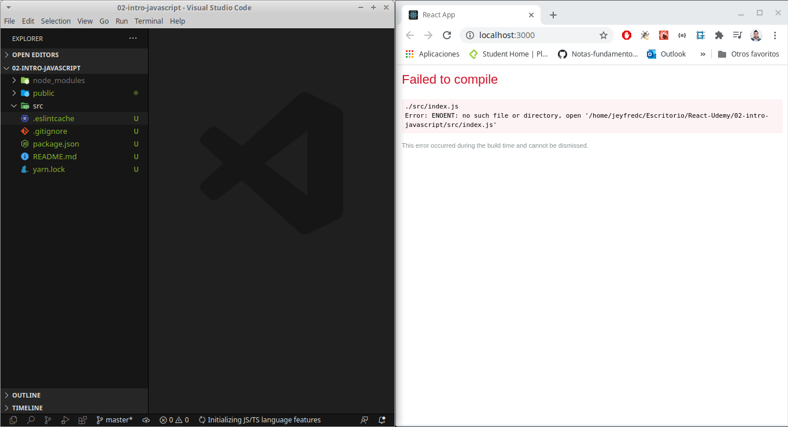
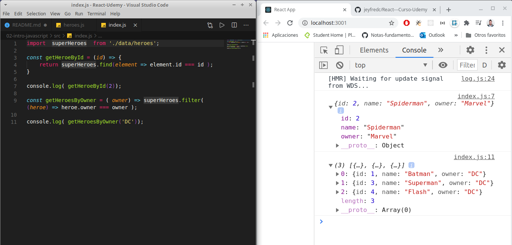

# React-Curso-Udemy

## Tabla de contenido 

[Primeros Pasos En React](#Primeros-Pasos-En-React)

[Introducción a babel](#Introducción-a-babel)

[Bases de JavaScript](#Bases-de-JavaScript)

[Variables y constantes](#Variables-y-constantes)

[Template string](#Template-string)

[Objetos literales](#Objetos-literales)

[Arreglos](#Arreglos)

[Funciones](#Funciones)

[Desestructuración de objetos](#Desestructuración-de-objetos)

[Import, export y funciones comunes de arreglos](#Import-export-y-funciones-comunes-de-arreglos)

[Múltiples exportaciones y exportaciones por defecto](#Múltiples-exportaciones-y-exportaciones-por-defecto)

[Promesas](#Promesas)

[Fetch API](#Fetch-API)

[Async-Await](#Async-Await)

[Operador condicional ternario](#Operador-condicional-ternario)

[¿Qué son los componentes?](#¿Qué-son-los-componentes?)

[Primera aplicación de React](#Primera-aplicación-de-React)

[Estructura de directorios](#Estructura-de-directorios)

[Contenido de la carpeta SRC](#Contenido-de-la-carpeta-SRC)

[Primer Componente](#Primer-Componente)
[Retornar elementos en el componente-Fragment](#Retornar-elementos-en-el-componente-Fragment)

<div align="right">
  <small><a href="#tabla-de-contenido">🡡 volver al inicio</a></small>
</div>

## Primeros Pasos En React

Lo primero que hay que hacer es instalar los siguiente programas

- [Google Chrome](https://www.google.com/chrome/)

- [React Developer Tools](https://chrome.google.com/webstore/detail/react-developer-tools/fmkadmapgofadopljbjfkapdkoienihi?hl=es&authuser=1)

- [Redux Devtools](https://chrome.google.com/webstore/detail/redux-devtools/lmhkpmbekcpmknklioeibfkpmmfibljd?hl=es)

- [Visual Studio Code](https://code.visualstudio.com/)

- [Postman](https://www.postman.com/downloads/)

- [Mongo Compass](https://www.mongodb.com/try/download/compass)

- [Git](https://git-scm.com/)

- [Node](https://nodejs.org/es/)

## Instalaciones recomendadas en React

- [ES7 React/Redux](https://marketplace.visualstudio.com/items?itemName=dsznajder.es7-react-js-snippets)

- [Simple React Snippets](https://marketplace.visualstudio.com/items?itemName=burkeholland.simple-react-snippets)

- [Auto Close Tag](https://marketplace.visualstudio.com/items?itemName=formulahendry.auto-close-tag)

--

Despues de tener los programas y dependencias instalados en el escritorio se puede crear una nueva carpeta que se llame **React** y dentro de esta crear otra carpeta que se llame **01-intro-react** o cualquier otro nombre. dentro de esta carpeta crear un **index.html** que lleva la siguiente estructura

```
<!DOCTYPE html>
<html lang="en">
<head>
    <meta charset="UTF-8">
        <!-- Cargar React -->
        <script crossorigin src="https://unpkg.com/react@16/umd/react.production.min.js"></script>
        <script crossorigin src="https://unpkg.com/react-dom@16/umd/react-dom.production.min.js"></script>
        <script src="https://unpkg.com/babel-standalone@6/babel.min.js"></script>
    <title>ReactApp</title>
</head>
<body>
    
</body>
</html>
```

los script estan trayendo los cdn de react, react-dom y babel.

Buscar el archivo en la carpeta del escritorio y abrirla para ver en el navegador.

Cuando este ya este desplegado ejecutar los comandos `ctrl+shift+i` para abrir las herramientas de desarrollador del navegador y no se deberia mostrar ningun error sobre la consola del navegador, debe aparecer todo tal cual esta en la siguiente imagen


Regresando al archivo abrir una etiqueta script a continuacion de body y crear la siguiente constante

```
<!DOCTYPE html>
<html lang="en">
<head>
    <meta charset="UTF-8">
        <!-- Cargar React -->
        <script crossorigin src="https://unpkg.com/react@16/umd/react.production.min.js"></script>
        <script crossorigin src="https://unpkg.com/react-dom@16/umd/react-dom.production.min.js"></script>
        <script src="https://unpkg.com/babel-standalone@6/babel.min.js"></script>
    <title>ReactApp</title>
</head>
<body>
    
<script>


    const h1Tag = <h1>Hola Mundo</h1>;

</script>


</body>
</html>
```

Ahora en la consola del navegador se va a mostrar un error que indica que no se esperaba el token `'<'`.

Esto es debido a que lo que esta dentro de la etiqueta script es por un lado javaScript `const h1Tag`y por el otro lado `<h1>Hola Mundo</h1>` XML


Para corregir el error simplemente delante de la etiqueta que abre el script se agrega babel para que compile el codigo en cualquier navegador y este debe ir de la siguiente forma.

`<script type="text/babel">`

Si se recarga el navegador nuevamente va a aparecer una advertencia que indica que Babel esta en uso


A continuacion dentro del html se agrega una etiqueta div con id root, para despues renderizar Hola mundo dentro de la etiqueta.

```
<!DOCTYPE html>
<html lang="en">
<head>
    <meta charset="UTF-8">
        <!-- Cargar React -->
        <script crossorigin src="https://unpkg.com/react@16/umd/react.production.min.js"></script>
        <script crossorigin src="https://unpkg.com/react-dom@16/umd/react-dom.production.min.js"></script>
        <script src="https://unpkg.com/babel-standalone@6/babel.min.js"></script>
    <title>ReactApp</title>
</head>
<body>

    <div id="root"></div>
    
<script type="text/babel">


    const h1Tag = <h1>Hola Mundo</h1>;

</script>


</body>
</html>
```

para renderizarlo se necesita la referencia al elemento con id `root` por tanto se debe inicializar una constante con la propiedad querySelector

`const divRoot = document.querySelector('#root');`

hasta el momento se tiene la referencia pero para renderizarlo se debe hacer uso de `ReactDOM.render()` y pasar como argumento la constante que trae al XML y la referencia

```
<!DOCTYPE html>
<html lang="en">
<head>
    <meta charset="UTF-8">
        <!-- Cargar React -->
        <script crossorigin src="https://unpkg.com/react@16/umd/react.production.min.js"></script>
        <script crossorigin src="https://unpkg.com/react-dom@16/umd/react-dom.production.min.js"></script>
        <script src="https://unpkg.com/babel-standalone@6/babel.min.js"></script>
    <title>ReactApp</title>
</head>
<body>

    <div id="root"></div>
    
<script type="text/babel">

    const divRoot = document.querySelector('#root');

    const h1Tag = <h1>Hola Mundo</h1>;

    ReactDOM.render(h1Tag, divRoot);

</script>


</body>
</html>
```

Despues de realizar esto y recargar la pagina estara el primer **Hola Mundo**


Ahora si se utiliza por ejemplo una constante para traer un nombre, de esta forma


En principio no se ve nada pero se traigo la constante nombre a los corchetes va a haber un cambio, de esta forma


<div align="right">
  <small><a href="#tabla-de-contenido">🡡 volver al inicio</a></small>
</div>

## Introducción a babel

Babel funciona en el Background cuando creamos aplicaciones en React. Babel nos permite utilizar caracteristicas actuales de JavaScript, es decir el ultimo estandar de EcmaScript que tengamos e incluso permite hacer uso de estas caracteristicas en navegadores que aun no las soporten.

Aqui un ejemplo que tambien se puede probrar en la pagina de [babel](https://babeljs.io/):

En el lado derecho de la pantalla Babel hace la transformacion de JavaScript moderno a un navegador que no sea compatible con JavaScript.

El lado izquierdo utiliza template literals los cuales sirven para concatenar en este caso un string con numeros


El siguiente ejemplo utiliza ub objeto que recibe un array de personajes


De momento se ven iguales, pero si se comenta y se prueba en la consola del navegador va a salir un error que dice que la propiedad length no se puede leer en un elemento indefinido


Si delante de la palabra personajes se agrega un signo `?`, la consola no va a mostrar error solo mostrara undefined pero al mismo tiempo si se agrega a Babel el codigo que hace que sea compatible con otros navegadores cambia a una una forma mas compleja y es para esto que existe Babel


## Bases de JavaScript

A continuacion se va a crear la primera aplicacion React utilizando la terminal del computador y moviendose hasta la carpeta que se haya instalado en el escritorio. Cuando esten sobre la ubicacion de la carpeta ejecutar el comando `npx create-react-app intro-javascript` y luego presionar Enter

**Nota:**Deben tener en cuenta que ya se debio haber instalado node-js para verificar que ya este instalado ejecutar `npx --version` en la consola


a continuacion la consola despues de realizar la instalacion de la aplicacion sugiere ejecutar los comandos 

  `cd intro-javascript`
  `yarn start` o tambien se puede ejecutar `npm start`

Antes de realizar esto ir al escritorio abrir la carpeta que en mi caso se llama React-Udemy y renombrar la carpeta `intro-javascript` por `02-intro-javascript`

Ahora en la consola ejecutar 

  `cd 02-intro-javascript`
  `yarn start` o tambien se puede ejecutar `npm start`


para finalizar o cerrar el servidor que ejecuta react se debe presionar sobre la consola `ctrl + c`

si se quiere abrir solo la carpeta **02-intro-javascript** se puede ejecutar en consola `code .`, este comando solo va a abrir todo lo que este contenido en la carpeta. Asi por un lado esta la carpeta y por el otro el navegador ejecutando React


La carpeta **node_modules**, son todas las librerias que trae React por defecto, alli esta instalada Babel y otras librerias mas, el archivo .gitignore va a ayudar a no presentar algunos archivos cuando se utilice git, package.json es donde estan las dependencias del proyecto instaladas y comandos del proyecto. Dentro del Readme.md se encuentran instrucciones basicas de React.

Dentro de la carpeta **src** borrar todos los archivos que esten, del lado del navegador inmediatamente se va a mostrar un error



Este error pasa porque esta buscando un archivo dentro de la carpeta **src** que se llame **index.js**, para eso crear el archivo dentro de la carpeta

si dentro de este archivo se escribe un `console.log('Hola Mundo');` y abrimos la consola del navegador se va a mostrar sobre la consola.


Esto pasa gracias a webpack, que es el que ejecuta todo al instante en el navegador, lo pasa por Babel, lo pasa por varias configuraciones, detecta el cambio y actualiza el navegador web, lo cual permite realizar un desarrollo rapido para las aplicaciones

<div align="right">
  <small><a href="#tabla-de-contenido">🡡 volver al inicio</a></small>
</div>

## Variables y constantes

Lo primero que se debe hacer es que si en algun momento se trabajo con el keyword `var` en JavaScript, actualmente EcmaScript ya no hace uso de esta porque el scope siempre era declarado como global cuando se usaba en funciones y queriamos que no se usaran fuera de ella.

Actualmente se utilizan los keyword `let` y `const` para asignar informacion.

Dentro del archivo **index.js** del capitulo anterior borramos el `console.log('Hola Mundo');` y agregamos al archivo

```
const nombre= 'Pablito';
let
```
y vemos como en la consola del navegador aparece Pablito pero tambien se muestra un error que señala el keyword let en la linea 6 y ademas lanza un error `Unexpected reserved word 'let' (6:0)`


para solucionarlo simplemente a let  lo nombramos como apellido y le asignamos un string

```
const nombre= 'Pablito';
let apellido ='clavo un clavito'
```

Ahora lanza una advertencia o warning en la consola que indica que la variables nombre y apellido fueron asignadas pero no se esta haciendo uso de ellas 


Si nunca se va a cambiar el valor del apellido entonces se debe declarar como una constante

```
const nombre= 'Pablito';
const apellido ='clavo un clavito'
```

por ejemplo a continuacion se declara el valor de un dado con let y si quiero empezar a utilizar esas variables y constantes, hago uso de un `console.log` de esta forma ya no van a aparecer advertenciaas porque se esta haciendo uso de las variables

```
const nombre = 'pablito';
let apellido ='clavo un clavito'

let valorDado = 3;

console.log(nombre, apellido, valorDado);
```


Pero ahora, si yo quiero asignar otro numero a `valorDado` lo establezco porque utilice el keyword `let` y no `const`

```
const nombre = 'pablito';
let apellido ='clavo un clavito'

let valorDado = 3;
valorDado = 6;

console.log(nombre, apellido, valorDado);
```


**Nota:** si se utilizo el keyword `let` para declarar y asignar `valorDado`, no es necesario hacerlo 2 veces. por ejemplo este bloque de condigo lanzaria un error si se estalece de esta forma

```
let valorDado = 3;
let valorDado = 6;
```

Ahora viendolo en el scope, let ValorDado si lo puedo establecer pero solo dentro de un bloque de codigo, la variable que esta por encima del if es una variable que pertenece al scope global y la que esta dentro del if es del Scope local

```
const nombre = 'pablito';
let apellido ='clavo un clavito'

let valorDado = 3;
valorDado = 6;

console.log(nombre, apellido, valorDado);

if (true){
    let valorDado = 1;
    
    console.log(`Esto solo pertene al bloque de codigo del if" ${valorDado}`)
}
```


<div align="right">
  <small><a href="#tabla-de-contenido">🡡 volver al inicio</a></small>
</div>

## Template string

Anteriormente en JavaScript declarabamos 2 variables y las concatenabamos usando `variable + " " + variable`.

Ejemplo

```
const nombre = "pablito";
const apellido = "clavo un clavito";

const nombreCompleto = nombre + " " + apellido

console.log(nombreCompleto)
```


Actualmente JaaScript utiliza los template string las cuales son estas llamadas comillas francesas **` `**, las cuales se tiene que ubicar en el teclado porque cada configuracion es diferente y esto permite hacer la concatenacion de variables utilizando `${}`. 

Ejemplo

```
const nombre = "pablito";
const apellido = "clavo un clavito";

//const nombreCompleto = nombre + " " + apellido

const nombreCompleto = `${nombre} ${apellido}`

console.log(nombreCompleto)
```


adicional permite hacer saltos de linea y concatenar con mas elementos de JavaScript, por ejemplo añadiendo un numero y otra frase

Ejemplo

```
const nombre = "pablito";
const apellido = "clavo un clavito";

//const nombreCompleto = nombre + " " + apellido

const nombreCompleto = `
${nombre}
${apellido}
${4}
Esta es una 
           frase distinta al nombre`

console.log(nombreCompleto)
```


Ahora creamos una funcion a continuación que recibe como parametro a nombre y atención porque no se esta llamando en la funcion getSaludo que se esta pasando al `console.log`. 

La consola va a mandar un `undefined`

```
function getSaludo(nombre){
    return 'Hola ' + nombre;
}

console.log(`Este es un texto: ${getSaludo()}`)
```


Este undefined lo trae porque el argumento o parametro que establecimos en la funcion `getSaludo` es `nombre` por tanto se debe pasar en la funcion para que traiga el valor de este

```
function getSaludo(nombre){
    return 'Hola ' + nombre;
}

console.log(`Este es un texto: ${getSaludo(nombre)}`)
```


<div align="right">
  <small><a href="#tabla-de-contenido">🡡 volver al inicio</a></small>
</div>

## Objetos literales

Un objeto literal se considera que son 2 corchetes `{}` y estos tienes unas propiedades y prototipos por ejemplo aqui se crea una constante persona y se hace un console.log de esta 

```
const persona = {

};

console.log(persona)
```


`{}` estas llaves o corchetes inidican que es un objeto y si en la consola del navegador abrimos esos corchetes vamos a ver que tiene un `__proto__` donde encontramos, sus funciones, propiedades y metodos del objeto.


Los objeto literales trabajan con pares de valores, donde en este ejemplo tenemos una llave la cual es `nombre:` y su valor el cual es `Tony`

Ejemplo 

```
const persona = {
  nombre: 'Tony'
};

console.log(persona)
```

y si quiero objetener el valor del nombre haria un console.log`(persona.nombre)`


tambien se pueden añadir mas propiedades al objeto persona como apellido, edad. Cada propiedad va separada de una coma y recibe en este caso 2 string y 1 valor numerico

```
const persona = {
    nombre: 'Tony',
    apellido: 'Stark',
    edad: 45,
  };
  
  console.log(persona)
```


Si ahora hicieramos un `console.log( {persona: persona})` vamos a crear y crear un objeto dentro de otro objeto


Pero en JavaScript actualmente cuando la propiedad se llama igual al objeto se puede obviar la propiedad y hacer un `console.log({persona})`, se obtendra el mismo resultado de la imagen anterior.

Si se hace un `console.table` se puede obtener la misma informacion presentada en tabla pero tambien ver la onformacion como se ha venido presentando


En el objeto se puede adicionar, mas objetos, funciones, metodos y por ejemplo ahora se va a añadir otro objeto que se llama direccion y tiene otras propiedades

```
const persona = {
    nombre: 'Tony',
    apellido: 'Stark',
    edad: 45,
    direccion: {
        ciudad:'New york',
        zip: 55321321,
        lat: 14.3232,
        lng: 34.9233321
    }
  };
  
  console.log( persona )
```

En el navegador los datos se van a presentar en orden alfabetico asi yo no lo establezca de esta forma pero esto es propiedo del navegador 


Si queremos clonar al objeto persona existe una mala practica que se va a demostrar a continuacion pero no se debe poner en practica porque React no admite este tipo de errores y podria generar algunas complicaciones.

Primero se va a realizar de la forma incorrecta de hacer un clon y luego de forma correcta.

primero declaro una constante de `persona2 = persona;` y luego hago un `console.log` de `persona2`

luego en la consola del navegador vemos como tenemos una copia de persona 


y si yo quiero asignar otro nombre a `persona2`, lo que hago es que pongo

`persona2.nombre = 'peter';`


pero esto es una falsa idea porque lo que esta haciendo `persona2` es obtener una referencia de `persona`, por tanto si yo hago un `console.log` de `persona` despues de haber asignado a peter. Voy a obtener una modificacion de la referencia del nombre en memoria y ahora `persona` y `persona2` se van a tener el nombre de `peter`


A continuación la forma correcta de realizar un clon o una mutación de un objeto, se puede crea un objeto de persona2 asignando todas las propiedades

```
const persona2 = { nombre:'peter'};
```

y añadir el resto de propiedades manualmente, pero tampoco se debe realizar de esta forma a menos que se quiera, para esto JavaScript actualmente hace uso del operador de spread o operador de propagacion el cual esta representado con 3 puntos `...`.

Si utilizo la constante `persona2` y le asigno un objeto con el operador spread apuntando a `persona`, lo que realmente estoy haciendo es hacer una copia de persona y obtener todas sus propiedades para utilizarlas en mi nuevo objeto `persona2`

```
const persona = {
    nombre: 'Tony',
    apellido: 'Stark',
    edad: 45,
    direccion: {
        ciudad:'New york',
        zip: 55321321,
        lat: 14.3232,
        lng: 34.9233321
    }
  };
  
  
  const persona2 = { ...persona };
  
  persona2.nombre = 'peter';
  
  console.log( persona )
  console.log(persona2)

```


De esta forma es como se obtiene el clon del objeto `persona`.

<div align="right">
  <small><a href="#tabla-de-contenido">🡡 volver al inicio</a></small>
</div>

## Arreglos

Un arreglo es una colección de información que se encuentra dentro de una variable

por ejemplo un array se encuentra en JavaScript y se reconoce por que esta entre parentesis cuadrados `[]`, como lo definimos a continuación

```
const arreglo = new Array();

console.log(arreglo);
```


el array generalmente no se declara asi, no es recomendable pero se puede hacer, normalmente un array se declara de la siguiente forma

`const arreglo = [];`

y este se le puede añadir valores con el metodo `push` de la siguiente forma

```
const arreglo = [];

arreglo.push(1);
arreglo.push(2);
arreglo.push(3);
arreglo.push(4);

console.log(arreglo);
```

y luego encontramos a 1 en la posicion 0, 2 en la posicion 1, 3 en la posición 2 y 4 en la posición 3


Pero no solo se puede añadir valores mediante el metodo `push` si no tambien declararlos dentro del arreglo

```
const arreglo = [1, 2, 3, 4];

// arreglo.push(1);
// arreglo.push(2);
// arreglo.push(3);
// arreglo.push(4);

console.log(arreglo);
```


y si declaro un `arreglo2` puedo hacer una copia del 1 y de cierta forma concatenar `arreglo` con `arreglo2` de esta forma

```
const arreglo = [1, 2, 3, 4];

// arreglo.push(1);
// arreglo.push(2);
// arreglo.push(3);
// arreglo.push(4);

let arreglo2 = [ ...arreglo, 5 ];

console.log(arreglo);
console.log(arreglo2);
```


Ahora se va a crear un `arreglo3` haciendo uso del metodo `map` el cual hace un recorrido por el arreglo que se defina y a partir de este puedo crear un nuevo arreglo. para saber mas a cerca de este metodo pueden visitar el siguiente [enlace](https://developer.mozilla.org/es/docs/Web/JavaScript/Referencia/Objetos_globales/Array/map).

A continuacion declaro el arreglo3 que es igual al recorrido del arreglo 2 y dentro de los parentesis establezoco una funcion que recibe como parametro un numero

```
const arreglo = [1, 2, 3, 4];

// arreglo.push(1);
// arreglo.push(2);
// arreglo.push(3);
// arreglo.push(4);

let arreglo2 = [ ...arreglo, 5 ];

const arreglo3 = arreglo2.map( function(numero) {

})


console.log(arreglo);
console.log(arreglo2);
console.log(arreglo3);
```

Por el momento arreglo 3 esta obteniendo 5 veces el valor e undefined porque no le estoy retornando nada. Como se ve en la imagen a continuación `map` recorrio el `arreglo2` el cual esta compuesto por una copia de arreglo mas el numero de la variable, es por esta razon que se imprime 5 veces `undefined`


si hago un return de `Hola` se va a imprimir 5 veces Hola


y si a continuación retorno `numero * 2` voy a obtener el valor de cada numero por su doble


## Funciones

Una funcion basica se puede crear de la siguiente forma

```
function saludar( nombre){
  return `Hola, ${ nombre }`
}

console.log( saludar('Tony'));
```


si a continuacion se comenta el `console.log` anterior y se hace un `console.log()` de la función voy a obtener en consola una referencia a la funcion que se indica mediante una `f` en el navegador


y si ahora agrego `saludar=30`, voy a obtener su valor pero voy a dejar de obtener una referencia a la función


Por tanto no es recomendable declarar una función de esa forma.

Por tanto su a continuación se crea una constante `saludar` y el resto de la funcion se deja de la misma forma y asigno el numero a saludar voy a obtener un error

```
const saludar = function( nombre){
    return `Hola, ${ nombre }`;
  }

  saludar = 30;
  
/*   console.log( saludar('Tony')); */

console.log(saludar)
```


Una función como la anterior se puede transformar a una función de flecha o un `arrow function`, en esta modificación se quita el keyword `function` y delante del parametro se agrega una flecha `=>`

```
const saludar = function( nombre){
    return `Hola, ${ nombre }`;
  }

const saludar2 = (nombre) => {
    return `Hola, ${nombre}`;
}
  
  
console.log(saludar('Tony'));
console.log(saludar2('peter'));
```


Y existe otra forma de hacerlo mas facil en el caso que solo se necesite retornar una sola cosa y la funcion sea corta y es quitar la palabra `return` y dejar la función de flecha sin los corchetes

```
const saludar = function( nombre){
    return `Hola, ${ nombre }`;
  }

const saludar2 = (nombre) => {
    return `Hola, ${nombre}`;
}
  
const saludar3 = (nombre) => `Hola, ${nombre}`;
    
console.log(saludar('Tony'));
console.log(saludar2('peter'));
console.log(saludar3('Valentina'));
```


Ahora otro ejemplo utilizando una nueva funcion llamada `getUser` la cual retorna el id y el nombre de usuario de una persona

```
const saludar = function( nombre){
    return `Hola, ${ nombre }`;
  }

const saludar2 = (nombre) => {
    return `Hola, ${nombre}`;
}
  
const saludar3 = (nombre) => `Hola, ${nombre}`;
    
console.log(saludar('Tony'));
console.log(saludar2('peter'));
console.log(saludar3('Valentina'));


const getUser = () => {
    return{
    id: 'zxh123',
    username: 'camilo2004',
    }
}

console.log(getUser())
```


Si quitara el `return` y las llaves a continuación tendria un error porque de esta forma no puedo obtener un objeto


Si quiero obtener el objeto implicitamente debo establecer todo dentro de un parentesis para obtener el valor del objeto

```
const saludar = function( nombre){
    return `Hola, ${ nombre }`;
  }

const saludar2 = (nombre) => {
    return `Hola, ${nombre}`;
}
  
const saludar3 = (nombre) => `Hola, ${nombre}`;
    
console.log(saludar('Tony'));
console.log(saludar2('peter'));
console.log(saludar3('Valentina'));


const getUser = () => 
    ({
    id: 'zxh123',
    username: 'camilo2004',
    });

console.log(getUser());
```


El siguiente codigo esta funcionando pero como refuerzo pueden realizar la siguiente tarea

```
// Tarea
// 1. Tranformar a una función de flecha
// 2. Tiene que retornar un objeto implicito
// 3. Realizar pruebas

function getUsuarioActivo( nombre ) {
    return{
        id: 'abc567',
        username: nombre
    }
};

const usuarioActivo = getUsuarioActivo('Gonzalo');

console.log( usuarioActivo);
```

<div align="right">
  <small><a href="#tabla-de-contenido">🡡 volver al inicio</a></small>
</div>

## Desestructuración de objetos

Esta tambien es llamada como Asignación desestructurante y para ver mas a cerca de esta se puede revisar en el siguiente [enlace](https://developer.mozilla.org/es/docs/Web/JavaScript/Referencia/Operadores/Destructuring_assignment), donde esta la documentación de JavaScript.

A continuacióin se va a declarar nuevamente a un objeto persona que tiene propiedades de nombre, edad y clave

```
const persona = {
  nombre: 'Tony',
  edad: 45,
  clave: 'IronMan',
}
```

si quiero obtener el valor de cada propiedad anteriormente haria esto

```
console.log(persona.nombre);
console.log(persona.edad);
console.log(persona.clave);
```


pero si quiero dejar de utilizar la palabra `persona.` desestructuro el objeto de la siguiente forma y es muy común encontrarla en React

`const {} = persona;`

Lo que ahora coloque dentro de los corchetes va a ser lo que quiero obtener de ese objeto por ejemplo nombre

`const {nombre} = persona;`


si quiero obtener los otros valores agrego las otras propiedades no es necesario que tengan algun tipo de orden

`const {edad, clave, nombre} = persona;`


Ahora se puede crear una función de flecha que se llame `retornaPersona`, la cual va a recibir una `persona`, dentro de esta hacemos un console.log de persona que es lo que esta recibiendo como parametro y por fuera de esta se llama a la funcion pasando como parametro a persona

```
const persona = {
    nombre: 'Tony',
    edad: 45,
    clave: 'Ironman',
}

// const {edad, clave, nombre} = persona;

// console.log(nombre);
// console.log(edad);
// console.log(clave);

const retornaPersona = ( persona ) => {

    console.log(persona);
}

retornaPersona( persona );
```


y si nuevamente tengo la desestructuración de la persona tambien puedo hacer un `console.log` de cada propiedad


pero tambien se puede destructurar en los parametros de la función 

```
const persona = {
    nombre: 'Tony',
    edad: 45,
    clave: 'Ironman',
}

// const {edad, clave, nombre} = persona;

// console.log(nombre);
// console.log(edad);
// console.log(clave);

const retornaPersona = ( { nombre, clave} ) => {

    console.log( clave, nombre);
}

retornaPersona( persona );
```


tambien se pueden asignar valores que vienen por defecto por ejemplo asignar un rango

```
const persona = {
    nombre: 'Tony',
    edad: 45,
    clave: 'Ironman',
}

// const {edad, clave, nombre} = persona;

// console.log(nombre);
// console.log(edad);
// console.log(clave);

const retornaPersona = ( { nombre, clave, rango} ) => {

    console.log( clave, nombre, rango);
}

retornaPersona( persona );
```

Pero si se mira en el navegador rango es undefined porque no se ha definido como propiedad.


pero si a continuacion se agrega un `=` a `rango` y se asigna `capitán` este se va a imprimir


Pero si se asigna al objeto rango, va a tomar el valor del objeto

```
const persona = {
    nombre: 'Tony',
    edad: 45,
    clave: 'Ironman',
    rango: 'Ingeniero',
}

// const {edad, clave, nombre} = persona;

// console.log(nombre);
// console.log(edad);
// console.log(clave);

const retornaPersona = ( { nombre, clave, rango = 'Capitán'} ) => {

    console.log( clave, nombre, rango);
}

retornaPersona( persona );
```


tambien si hago un `return` dentro de la funcion de flecha y establezco nuevos pares de valores y lo obtengo en otra constante puedo obtener los valores de `persona` asi:

```
const persona = {
    nombre: 'Tony',
    edad: 45,
    clave: 'Ironman',
    rango: 'Ingeniero',
}

// const {edad, clave, nombre} = persona;

// console.log(nombre);
// console.log(edad);
// console.log(clave);

const retornaPersona = ( { edad, nombre, clave, rango = 'Capitán'} ) => {

    // console.log( clave, nombre, rango);

    return{
        nombreClave: clave,
        agnos: edad,
    }
}

const avenger = retornaPersona( persona );

console.log(avenger)
```


Si ahora cambio el nombre de `retornaPersona` por `usecontext` sigo obteniendo el mismo valor


Y si lo quiero desestructurar nuevamente, hago la constante que recibe al objeto con las propiedades = a la funcion que recibe el parametro `persona`

```
const persona = {
    nombre: 'Tony',
    edad: 45,
    clave: 'Ironman',
    rango: 'Ingeniero',
}

// const {edad, clave, nombre} = persona;

// console.log(nombre);
// console.log(edad);
// console.log(clave);

const usecontext = ( { edad, nombre, clave, rango = 'Capitán'} ) => {

    // console.log( clave, nombre, rango);

    return{
        nombreClave: clave,
        agnos: edad,
    }
}

const {nombreClave, agnos} = usecontext( persona );

console.log(nombreClave, agnos);
```


Como un objeto recibe a otro objeto, a continuación se va a agregar un nuevo objeto que retorna la funcion `usecontext` que va a aser `latlng` y luego se va a hacer la extraccion del objeto 

```
const persona = {
    nombre: 'Tony',
    edad: 45,
    clave: 'Ironman',
    rango: 'Ingeniero',
}

// const {edad, clave, nombre} = persona;

// console.log(nombre);
// console.log(edad);
// console.log(clave);

const usecontext = ( { edad, nombre, clave, rango = 'Capitán'} ) => {

    // console.log( clave, nombre, rango);

    return{
        nombreClave: clave,
        agnos: edad,
        latlng: {
            lat: 14.235,
            lng: 45.245,
        }
    }
}

const {nombreClave, agnos, latlng} = usecontext( persona );

console.log(nombreClave, agnos);
console.log(latlng);
```


pero si yo solo quiero obtener los valores, sin que se muestren como un objeto, cuando se hace la desestructuración en `usecontext` al objeto `latlng` debo agregarle `:{ propiedades que quiero extraer}` y ya no puedo hacer un `console.log` del objeto si no, de las propiedades

```
const persona = {
    nombre: 'Tony',
    edad: 45,
    clave: 'Ironman',
    rango: 'Ingeniero',
}

// const {edad, clave, nombre} = persona;

// console.log(nombre);
// console.log(edad);
// console.log(clave);

const usecontext = ( { edad, nombre, clave, rango = 'Capitán'} ) => {

    // console.log( clave, nombre, rango);

    return{
        nombreClave: clave,
        agnos: edad,
        latlng: {
            lat: 14.235,
            lng: 45.245,
        }
    }
}

const {nombreClave, agnos, latlng: { lat, lng}} = usecontext( persona );

console.log(nombreClave, agnos);
console.log(lat, lng);
```


normalmente se puede encontrar la desestructuración del objeto que esta dentro de otro objeto de la siguiente forma pero el resultado sera el mismo que esta en la imagen anterior

```
const {nombreClave, agnos, latlng,/* : { lat, lng} */} = usecontext( persona );
const { lat, lng} = latlng;
console.log(nombreClave, agnos);
console.log(lat, lng);
```


<div align="right">
  <small><a href="#tabla-de-contenido">🡡 volver al inicio</a></small>
</div>

## Desestructuración de arreglos

A continuación, una de las formas mas comunes de desestructurar un objeto, es accediendo por su posición

por ejemplo

```
const personajes = ['Iron Man', 'Capitan America', 'Spiderman'];

console.log(personajes[0])
console.log(personajes[1])
console.log(personajes[2])
```


pero no siempre se quiere acceder de esa forma a un elemento de un arreglo, existe otra forma y es definiendo otra constante que apunte al arreglo y llamando por posicion segun se requiera

```
const personajes = ['Iron Man', 'Capitan America', 'Spiderman'];

// console.log(personajes[0])
// console.log(personajes[1])
// console.log(personajes[2])

const [p1] = personajes;

console.log(p1);
```


El que haya colocado `p1`, no necesariamente quiere decir que por ser `p1` siempre vaya a acceder a `Iron Man`, por ejemplo si quiero acceder con `p1` a `Capitan America`, simplemente antepongo una coma antes y con esto ya tengo acceso a `Capitan America`

```
const personajes = ['Iron Man', 'Capitan America', 'Spiderman'];

// console.log(personajes[0])
// console.log(personajes[1])
// console.log(personajes[2])

const [ , p1] = personajes;

console.log(p1);
```


y asi mismo sera para acceder al personaje 3.

O tambien se puede ignorar un elemento y acceder a los otros 2

```
const personajes = ['Iron Man', 'Capitan America', 'Spiderman'];

// console.log(personajes[0])
// console.log(personajes[1])
// console.log(personajes[2])

const [ , p2, p3] = personajes;

console.log(`${p2}, ${p3}`);
```


Tambien se puede desestructurar una función como la siguiente, la cual se llama `retornaArreglo`

```
const retornaArreglo = () => {
    return ['ABC' , 123];
}

const arr = retornaArreglo()
console.log(arr);
```


Si quiero obtener los campos y no retornarlo en un arreglo la desestructuro en letras y numeros de esta forma

```
const retornaArreglo = () => {
    return ['ABC' , 123];
}

const [letras, numeros] = retornaArreglo()
console.log(letras, numeros);
```


Ahora un ejercicio, se crea una constante llamada estados que retorna un arreglo en el cual estan un valor y una función

```
const estados = (valor) => {
    return [valor, () => { console.log('Hola Mundo')}];
}

const arr = estados('Iron Man');
console.log(arr);
```


La tarea consiste en hacer un console.log donde la primera posicion que se recibe es nombre y la funcion se llama en `setNombre();`

Transforma el siguiente codigo para que funcione

```
// Tarea
// 1. El primer valor del arr se llamara nombre
// 2. se llamara setNombre

const estados = (valor) => {
    return [valor, () => { console.log('Hola Mundo')}];
}

const arr = estados('Iron Man');

console.log( nombre );

setNombre();
```

La solucion se puede encontrar en el archivo [07-desestructuracion-array.js](https://github.com/jeyfredc/React---Curso-Udemy/blob/master/02-intro-javascript/src/bases/07-desesctructuracion-arreglos.js)

<div align="right">
  <small><a href="#tabla-de-contenido">🡡 volver al inicio</a></small>
</div>

## Import, export y funciones comunes de arreglos

A continuación dentro de la carpeta src crear una subcarpeta que se llame data y crear un archivo que se llame **heores.js** y pegar la siguiente información.

```
const heroes = [
    {
        id: 1,
        name: 'Batman',
        owner: 'DC'
    },
    {
        id: 2,
        name: 'Spiderman',
        owner: 'Marvel'
    },
    {
        id: 3,
        name: 'Superman',
        owner: 'DC'
    },
    {
        id: 4,
        name: 'Flash',
        owner: 'DC'
    },
    {
        id: 5,
        name: 'Wolverine',
        owner: 'Marvel'
    },
];
```

Lo que queremos hacer es traer este archivo y usarlo en **index.js**, para importarlo nos debemos dirigir a este archivo y hacer un import de la constante que necesito que es heroes, la ubicación del archivo es relativa en donde me encuentre, `./` quiere decir que voy a buscar dentro de las carpetas que estan al mismo nivel que **index.js** si quisiera irme una carpeta atras tendria que hacer `../` y empezar a buscar lo que necesito traer.

```
import { heroes } from './data/heroes'
```

Si hago un `console.log( heroes );` lo que espero es que me retorne el arreglo de heroes, pero en este caso obtengo `undefined`


Si ocurre esto, entonces a continuación me debo dirigir al archivo de **heroes.js** y exportar la constante de esta forma

```
export const heroes = [
    {
        id: 1,
        name: 'Batman',
        owner: 'DC'
    },
    {
        id: 2,
        name: 'Spiderman',
        owner: 'Marvel'
    },
    {
        id: 3,
        name: 'Superman',
        owner: 'DC'
    },
    {
        id: 4,
        name: 'Flash',
        owner: 'DC'
    },
    {
        id: 5,
        name: 'Wolverine',
        owner: 'Marvel'
    },
];
```

y con esto en la consola del navegador ya recibo todos los heroes


Ahora para hacer practica en el archivo **index.js** se va a crear un ejercicio, para traer el personaje 2 utilizando el metodo [find](https://developer.mozilla.org/es/docs/Web/JavaScript/Referencia/Objetos_globales/Array/find), para esto se deja la documentación y el ejercicio a realizar. Por tal motivo se debe buscar la forma para resolverlo y traer el id 2 el cual seria Spiderman.

```
import { heroes } from './data/heroes';

const getHeroeById = (id) => {
    return heroes.find();
}

console.log( getHeroeById(2));
```

la solucion la puedes encontrar en [08-import-import-export](https://github.com/jeyfredc/React---Curso-Udemy/blob/master/02-intro-javascript/src/bases/08-import-import-export.js)

**Nota:** Lo que este dentro del archivo del repositorio lo deben llevar para el index para poder probar el codigo

la otra tarea es buscar en la documentación de mozilla como usar `filter`, por tanto se deja planteado un ejercicio tambien para resolver. Aclarando que `find` solo sirve para traer un solo elemento por tanto se debe hacer un cambio en la siguiente función para traer todos los elementos que pertenezcan a DC

```
const getHeroesByOwner = ( owner) => heroes.find( (heroe) => heroe.id === id ); 

console.log( getHeroesByOwner('DC'));
```

El resultado de los 2 ejercicios debe ser el siguiente


**Nota:** Una forma facil para importar un archivo es que se escribe la referencia del archivo al que quiero ir por ejemplo escribo solo la palabra `heroes` y luego presiono `ctrl + espacio`, si aparece la opcion en las sugerencias de vsCode presiono `tab` y se importa de manera automatica la ruta

<div align="right">
  <small><a href="#tabla-de-contenido">🡡 volver al inicio</a></small>
</div>

## Múltiples exportaciones y exportaciones por defecto

Continuando con el mismo archivo del capitulo anterior en **index.js**, existen otras formas de exportar, en este caso se va hacer un exportacion por defecto, en el archivo de **heroes.js** se deja la siguiente forma
 
```
export default [
    {
        id: 1,
        name: 'Batman',
        owner: 'DC'
    },
    {
        id: 2,
        name: 'Spiderman',
        owner: 'Marvel'
    },
    {
        id: 3,
        name: 'Superman',
        owner: 'DC'
    },
    {
        id: 4,
        name: 'Flash',
        owner: 'DC'
    },
    {
        id: 5,
        name: 'Wolverine',
        owner: 'Marvel'
    },
];
```

En primer lugar la consola del navegador va a mostrar un error


pero luego que pasemos al archivo **index.js** y quitemos los corchetes de `import { heroes }` el codigo va a continuar funcionando como antes


pero no quiere decir que `heroes` sea una referencia del archivo **heroes.js**, si estas en linux y presionas `F2` cambias por otro nombre por ejemplo superHeroes, cambias todas las variables y el archivo va a seguir funcionando.
Si estas en windows presionas `windows + F2`.



Pero por lo general una exportación y sobre todo en React se encuentra  el `export default` en la ultima parte del documento asi, modificando esta vez sobre **heroes.js** y regresando todo como estaba


Tambien se pueden importar constantes, en este caso se crea la constante owners en el archivo **heroes.js**

`export const owners = ['DC' , 'Marvel'];`

En este caso tendria una exportacion por defecto + una exportacion individual. Entonces en **index.js** debo agregar la exportacion por defecto seguido de una coma y la desestructuracion de ese archivo o objeto que viene de heroes

`import heroes, { owners }  from './data/heroes';`

y si hago un `console.log( owners);` pueedo ver como esta importando de manera correcta esa exportación individual


<div align="right">
  <small><a href="#tabla-de-contenido">🡡 volver al inicio</a></small>
</div>

## Promesas

Las promesas en la vida real es algo que se propone realizar y al final se cumple, exactamente pasa eso con las promesas en javaScript.

La forma en como funcionan es que primero se ejecuta todo lo que exista de manera sincrona en la pila de tareas y la promesa se cumple al final, es decir de manera asincrona. Para ver como funciona pueden investigar mas en la [documentación](https://developer.mozilla.org/es/docs/Web/JavaScript/Referencia/Objetos_globales/Promise).

Las promesas llevan como argumento un callback y se estructura de la siguiente forma, dentro de estos estan `resolve` que es lo que resuelve el callback y `reject` que es cuando la promesa no se puede cumplir 

```
const promesa = new Promise((resolve, reject) => {


});
```

Si se agrega un callback como lo es la funcion `setTimeOut` obtenemos una respuesta por consola de que algo esta ocurriendo 2 segundos despues 

```
const promesa = new Promise((resolve, reject) => {

    setTimeout(() => {
        console.log('2 segundos después')
    }, 2000)
});
```


Pero aun no existe el modo de reaccionar o esperar cuando la promesa se termine, como realizar una acción. Existen 3 metodos, el primero es `then` que significa que la promesa se hizo correctamente, `catch` que captura un error y `finally` que es algo que se ejecuta despues del `then` y despues del `catch`, usualmente no es usado, pero en algunos proyectos se puede requerir.

Por el momento la promesa funcionara de la siguiente forma, se debe ejecutar dentro de un `resolve` porque `then` esta esperando una respuesta, cuando `then` detecta que la función se cumplio lanza el mensaje que la función ya se ejecuto

```
const promesa = new Promise((resolve, reject) => {

    setTimeout(() => {
        resolve(console.log('2 segundos después'))
    }, 2000)
});

promesa.then(() => {
    console.log('La promesa se cumplio')
})
```


Esto tambien se puede hacer por ejemplo con los archivos de los capitulos pasados, si estan guardados en archivos para hacer la importación de la función `getHeroById`.

```
const promesa = new Promise((resolve, reject) => {

    setTimeout(() => {
        /* resolve(console.log('2 segundos después')) */

        //Tarea
        // Importar 
        const heroe = getHeroeById(2);
        console.log(heroe)
    }, 2000)
});

promesa.then(() => {
    console.log('La promesa se cumplio')
})
```

primero hay que importar el archivo correctamente al **index.js**

`import {getHeroeById} from './bases/08-import-export';`

el archivo `08-import-export` contiene lo siguiente, es el de el capitulo anterior, pero se corrigio el acceso a la importación porque dejo de llamarse **index** en las clases anteriores

```
import heroes from '../data/heroes';

export const getHeroeById = (id) => {
    return heroes.find(element => element.id === id );
}

/* console.log( getHeroeById(2)); */

export const getHeroesByOwner = ( owner) => heroes.filter( (heroe) => heroe.owner === owner ); 

/* console.log( getHeroesByOwner('DC')); */
```

mientras tanto el **index.js** esta de esta forma, por el momento no se esta llamando `resolve` o `reject` y es por esta razon que la consola en el navegador trae a un objeto que contiene al heroe

```
import {getHeroeById} from './bases/08-import-export';


const promesa = new Promise((resolve, reject) => {

    setTimeout(() => {
        /* resolve(console.log('2 segundos después')) */

        //Tarea
        // Importar 
        const heroe = getHeroeById(2);
        console.log(heroe)
    }, 2000)
});

promesa.then(() => {
    console.log('La promesa se cumplio')
})
```


Ahora lo que se puede hacer es mandar al heroe en el `then` de la `promesa`

para esto se utiliza `resolve(heroe)` en la promesa y al hacer esto tambien se puede pasar en el argumento de `promesa.then` para llamarlo en el `console.log` de esta forma

```
import {getHeroeById} from './bases/08-import-export';


const promesa = new Promise((resolve, reject) => {

    setTimeout(() => {
        /* resolve(console.log('2 segundos después')) */

        //Tarea
        // Importar 
        const heroe = getHeroeById(2);
        resolve(heroe)
    }, 2000)
});

promesa.then((heroe) => {
    console.log('heroe', heroe)
})
```


pero tampoco importa si la constante de heroe en la promesa se cambia por otra palabra como `personaje` por ejemplo, el `heroe` de esa constante no tiene que ver nada con el `heroe` que se esta pasando en `promesa.then`

```
import {getHeroeById} from './bases/08-import-export';


const promesa = new Promise((resolve, reject) => {

    setTimeout(() => {
        /* resolve(console.log('2 segundos después')) */

        //Tarea
        // Importar 
        const personaje = getHeroeById(2);
        resolve(personaje)
    }, 2000)
});

promesa.then((heroe) => {
    console.log('heroe', heroe)
})
```


si agrega `reject` en ves de `resolve`, va a aparecer un error en la consola del navegador

```
import {getHeroeById} from './bases/08-import-export';


const promesa = new Promise((resolve, reject) => {

    setTimeout(() => {
        /* resolve(console.log('2 segundos después')) */

        //Tarea
        // Importar 
        const personaje = getHeroeById(2);
        reject(personaje)
    }, 2000)
});

promesa.then((heroe) => {
    console.log('heroe', heroe)
})
```


Esto quiere decir que se debe capturar el error asi que si se comenta al personaje en el `reject` y ahora se manda un mensaje en `promesa.then` se debe capturar el error con un `.catch` que generalmente es usado como se muestra aqui

```
import {getHeroeById} from './bases/08-import-export';


const promesa = new Promise((resolve, reject) => {

    setTimeout(() => {
        /* resolve(console.log('2 segundos después')) */

        //Tarea
        // Importar 
        const personaje = getHeroeById(2);
        /* reject(personaje) */
        reject('No se pudo encontrar al heroe')
    }, 2000)
});

promesa.then((heroe) => {
    console.log('heroe', heroe)
})
.catch( err => console.error( err ));
```


**Nota:** en el `catch` se puede enviar `console.error` para que en el navegador se muestre como un error o un `console.warn` para que salga como una advertencia.

Tambien se puede pasar el id como argumento de una función, y ahora hacer que la constante personaje reciba el id directamente de esta forma

```
const getHeroeByIdAsync = (id) => {
    const promesa = new Promise((resolve, reject) => {

        setTimeout(() => {
            const personaje = getHeroeById(id);
            resolve(personaje)
            // reject('No se pudo encontrar al heroe')
        }, 2000)
    });    
}

getHeroeByIdAsync(4)
```

pero cuando se hace asiy se coloca un punto delante de `getHeroeByIdAsync(4)` no hay acceso a la promesa, pero si se quita la constante promesa y en vez de eso se cambia por un return de la promesa, despues de colocar el punto se puede acceder a los metodos de la promesa

```
const getHeroeByIdAsync = (id) => {
    return new Promise((resolve, reject) => {

        setTimeout(() => {
            const personaje = getHeroeById(id);
            resolve(personaje)
            // reject('No se pudo encontrar al heroe')
        }, 2000)
    });    
}

getHeroeByIdAsync(4).
```


Ahora nuevamente es posible usar el `.then` para obtener al heroe 

```
const getHeroeByIdAsync = (id) => {
    return new Promise((resolve, reject) => {

        setTimeout(() => {
            const personaje = getHeroeById(id);
            resolve(personaje)
            // reject('No se pudo encontrar al heroe')
        }, 2000)
    });    
}

getHeroeByIdAsync(4)
    .then( heroe => console.log('Heroe', heroe))
```


pero ahora hay que capturar el error en caso que no se encuentre al heroe.

La condición dice que si encuentra el heroe, resuelva e imprimalo por consola, pero si no, imprima la advertencia en la consola, para esto como argumento de la función se pasa un numero de personaje que no se ha creado

```
const getHeroeByIdAsync = (id) => {
    return new Promise((resolve, reject) => {

        setTimeout(() => {
            const personaje = getHeroeById(id);
            if(personaje){
            resolve(personaje)
            }else{
                reject('No se pudo encontrar al heroe')
            }
        }, 2000)
    });    
}

getHeroeByIdAsync(12)
    .then( heroe => console.log('Heroe', heroe))
    .catch( err => console.warn(err))
```


pero si se pasa como argumento un heroe que si exista va a resolver


<div align="right">
  <small><a href="#tabla-de-contenido">🡡 volver al inicio</a></small>
</div>

## Fetch API

En el siguiente [enlace](https://developer.mozilla.org/es/docs/Web/API/Fetch_API) se encuentra toda la documentación acerca de lo que es Fetch API que es algo que viene en los navegadores web y va a permitirnos realizar peticiones http a endpoints directamente sin importar alguna libreria.

En este [enlace](https://developers.giphy.com/) encontramos giphy developers, para poder traer gifs animados y poder interactuar con ellos desde React.

Como no es un endpoint abierto debemos generar una APIkey y para esto se debe abrir una cuenta.

Asi que empezar por dar clic en donde dice **Get Started**.

Luego dar clic en **Login** y empezar a crear la cuenta, que se puede crear a traves de una cuenta de facebook o apple.

Despues de haber creado la cuenta seleccionar **Create an App**, se abrir una ventana modal, donde se debe seleccionar **API** y luego hacer clic sobre **Next Step**,

Los campos de formulario que aparecen se deben llenar, se puede colocar cualquier nombre y descripción y luego aceptar los terminos y posteriormente seleccionar **Create App**


Luego se va abrir una ventana donde aparece el **API Key**, simplemente hay que copiar la que se genero abrir **index.js** y luego colocar una constante que guarde el **API Key**


**Nota:** Realizar este proceso tal como se describe y evitar utilizar la que se va a colocar en el **index.js** por si en algun momento se llega a desactivar

**index.js** por el momento tiene esto 

`const apiKey = 'soVdva8bjB8shZXmy18BLAE5wCSgYZZv';`

Luego regresamos a la pagina y buscamos la parte de la documentación y el menu lateral buscamos donde diga **Random Endpoint** y copíamos el **gif URL**


Luego lo abrimos en otra pestaña, va a salir un mensaje que dice **"No API key found in request"**


para que funcione en la url del navegador despues de la palabra random lo siguiente `?api_key=apiKey` lo que esta como **apiKey** es lo que nos genero la misma aplicacion que en mi caso lo pongo de esta forma 

`http://api.giphy.com/v1/gifs/random?api_key=soVdva8bjB8shZXmy18BLAE5wCSgYZZv`

Despues de buscarla en el navegador, se va a obtener toda la data que proporciona la **API**


lo que vamos a obtener despues es lo que esta dentro de data ->images y despues lo que se quiera obtener dentro de esta.

Regresando al **index.js** empezamos a utilizar fetch y para esto creamos una constante llamada petición, donde pasamos `fetch` y dentro de este se copia toda la url, como ya el `apiKey` estaba en el archivo lo llamamos mediante templates literals

```
const apiKey = 'soVdva8bjB8shZXmy18BLAE5wCSgYZZv';

const peticion = fetch(`http://api.giphy.com/v1/gifs/random?api_key=${apiKey}`)
```

Si mantenemos el cursor del mouse sobre la palabra fetch, se abre en la parte de arriba la descripcion de la función fetch y despues de los : al final aparece `Promise<Response>`, esto quiere decir que retorna una promesa y lo que esta dentro de `<Response>` que retorna o resuelve


como es una promesa tambien puedo hacer uso de `.then` y dentro de esta obtener una respuesta `resp`, luego abrir corchetes y hacer un console.log de la respuesta para ver que datos esta retornando

```
const apiKey = 'soVdva8bjB8shZXmy18BLAE5wCSgYZZv';

const peticion = fetch(`http://api.giphy.com/v1/gifs/random?api_key=${apiKey}`)

peticion.then( resp => {
    console.log(resp);
})
```


tambien es buena practica hacer un .catch en el caso que exista un error del **API** y se puede establecer solo como un `console.warn`

```
const apiKey = 'soVdva8bjB8shZXmy18BLAE5wCSgYZZv';

const peticion = fetch(`http://api.giphy.com/v1/gifs/random?api_key=${apiKey}`)

peticion.then( resp => {
    console.log(resp);
})
.catch(console.warn)
```

Por el momento del lado derecho de la pantalla vemos que `ok` esta en true y el `status` que se retorna es 200, lo que nos interesa es lo que esta dentro de `body`, por tanto debemos hacer otra promesa dentro del `.then` llamando a respuesta con el metodo `json()` el cual devuelve otra promesa. Quiere decir que tambien se puede agregar un `.then` para empezar a imprimir la data que nos habia arrojado la pagina anteriormente

```
const apiKey = 'soVdva8bjB8shZXmy18BLAE5wCSgYZZv';

const peticion = fetch(`http://api.giphy.com/v1/gifs/random?api_key=${apiKey}`)

peticion.then( resp => {
    resp.json().then( data => {
        console.log(data);
    })
})
.catch(console.warn)
```


Existe otra forma de presentar el codigo para obtener la misma petición al **API** que es mucho mas legible y facil de mantener, se le llama promesas en cadena, como el primer `then` retorna una promesa, esa promesa es pasada al siguiente `then`

```
const apiKey = 'soVdva8bjB8shZXmy18BLAE5wCSgYZZv';

const peticion = fetch(`http://api.giphy.com/v1/gifs/random?api_key=${apiKey}`)

peticion
.then( resp => resp.json())
.then( data => {
    console.log(data)
})
.catch(console.warn)
```


y como viene la data dentro de otra data, se podria hacer un `console.log(data.data)` o desestructurar la data encerrarla entre parentesis y corchetes y de esta forma se obtiene el mismo resultado

```
const apiKey = 'soVdva8bjB8shZXmy18BLAE5wCSgYZZv';

const peticion = fetch(`http://api.giphy.com/v1/gifs/random?api_key=${apiKey}`)

peticion
.then( resp => resp.json())
.then( ({data}) => {
    console.log(data)
    // console.log(datad.data)
})
.catch(console.warn)
```


Lo que en el momento interesa obtener son los `images` por tanto se hace un `console.log(data.images)`


Ahora esta el acceso a todas las urls de images, dentro de esta se puede buscar cualquiera por ejemplo `downsized` y luego vamos a querer obtener la `url` que se obtiene de `downsized`


si funciona el gif, se puede copiar la url obtenida, que en mi caso salio esta [https://media1.giphy.com/media/ki1NNcU9xZcwXDroCd/giphy-downsized.gif?cid=42b994492396160304f06de95df68983ed648b99230fdd0e&rid=giphy-downsized.gif](https://media1.giphy.com/media/ki1NNcU9xZcwXDroCd/giphy-downsized.gif?cid=42b994492396160304f06de95df68983ed648b99230fdd0e&rid=giphy-downsized.gif) y pegarla en cualquier otra pestaña del navegador

para extraer el `url` se debe agregar una constante, utilizando la destructuración de objetos de esta forma

```
const apiKey = 'soVdva8bjB8shZXmy18BLAE5wCSgYZZv';

const peticion = fetch(`http://api.giphy.com/v1/gifs/random?api_key=${apiKey}`)

peticion
.then( resp => resp.json())
.then( ({data}) => {
    const { url } = data.images.downsized;
    console.log(url)
})
.catch(console.warn)
```


Ahora para presentar esta imagen en un html y verla renderizada en el navegador creamos una constante llamada img esta crea un elemento o etiqueta de tipo imagen, y a traves de `img.src` se hace igual a la url extraida.

Despues con el metodo `append()` se manda la imagen y de esta forma queda renderizada

```
const apiKey = 'soVdva8bjB8shZXmy18BLAE5wCSgYZZv';

const peticion = fetch(`http://api.giphy.com/v1/gifs/random?api_key=${apiKey}`)

peticion
.then( resp => resp.json())
.then( ({data}) => {
    const { url } = data.images.downsized;
    // console.log(url)

    const img = document.createElement('img');
    img.src = url;

    document.body.append( img );

})
.catch(console.warn)
```

y se obtienen gifs diferentes cada vez que se recargue el navegador 


## Async-Await

Async Await, permite ser mas claro a la hora de construir una función como la del capitulo anterior

En este ejemplo se va a obtener la misma url que pertenece a data => images => downsized => url

para esto creamos una funcion llamada getImagen y para establecer la función despues del `=` llamamos a `async`, si no se hace esto no va a funcionar `await` y empezamos a obtener por dentro de esta todos los datos que obteniamos con `fetch` el `apiKey`, la `respuesta`, la `data` y asi es como se empieza a traer elemento por elemento hasta obtener la url. `await` se usa para esperar que se resuelva la promesa y de esta forma se van trayendo todos los datos

```
const getImagen = async() => {

    const apiKey = 'soVdva8bjB8shZXmy18BLAE5wCSgYZZv';
    const resp = await fetch(`http://api.giphy.com/v1/gifs/random?api_key=${apiKey}`)
    const {data} = await resp.json();
    const {url} = await data.images.downsized;
    console.log(url)

}

getImagen()
```

Con esta parte ya es posible obtener la url, recordar que es dinamica, porque se muestran diferentes gif cuando se renderizan


y ahora solo queda renderizar la imagen, que es igual a como se hizo en el capitulo anterior

```
const getImagen = async() => {

    const apiKey = 'soVdva8bjB8shZXmy18BLAE5wCSgYZZv';
    const resp = await fetch(`http://api.giphy.com/v1/gifs/random?api_key=${apiKey}`)
    const {data} = await resp.json();
    const {url} = await data.images.downsized;
    console.log(url)

    const img = document.createElement('img');
    img.src = url;

    document.body.append( img );

}

getImagen()
```


Lo ultimo que faltaria por explicar es que con **Async-Await** se puede manejar errores con **try catch**, que consiste en que el `try{}` intenta obtener todo el cuerpo que esta dentro de los `{}` y el `catch{error}` captura un error y lo maneja para que el navegador continue funcionando normalmente en caso de no encontrar algo.

```
const getImagen = async() => {

    try {
        const apiKey = 'soVdva8bjB8shZXmy18BLAE5wCSgYZZv';
        const resp = await fetch(`http://api.giphy.com/v1/gifs/random?api_key=${apiKey}`)
        const {data} = await resp.json();
        const {url} = await data.images.downsized;
        console.log(url)
    
        const img = document.createElement('img');
        img.src = url;
    
        document.body.append( img );
    } catch (error) {
        console.error(error)
    }
}

getImagen()
```


<div align="right">
  <small><a href="#tabla-de-contenido">🡡 volver al inicio</a></small>
</div>

## Operador condicional ternario

Una forma común y facil de ver una condicion if es la siguiente

```
const activo= true;

let mensaje = '';

if( activo){
    mensaje = 'El mensaje esta en true por tanto esta Activo'
}else{
    mensaje = 'Estoy en false ahora me muestro en la pantalla pero estoy inactivo'
}

console.log(mensaje)
```

cuando se imprime por consola muestra el mensaje cuando esta en `true`


pero si hago la negación de la verdad `if(!activo)`, aparece el otro mensaje


Para reducir todo el codigo se puede declarar una constante que lleve toda la condición, por tal motivo se comenta todo lo anterior.

Se declara la constante mensaje, la condicion esta dentro de parentesis `(activo)` el signo de pregunta indica que si esta en `true` se cumpla lo que sigue delante del signo `?` y los `:` indican que es el `else` o de lo contrario y se cumple todo lo que sigue delante de ente.

```
const activo= true;

const mensaje = (activo) ? 'El mensaje esta en true por tanto esta Activo' : 'Estoy en false ahora me muestro en la pantalla pero estoy inactivo';

console.log(mensaje)
```


y tambien se niega de la misma forma solo que antes no lo antecede un if, es decir `(!activo)` y con esto se cumple la otra condición.


otra forma en la que se puede encontrar un ternario es que en vez de que despues de los dos puntos exista un mensaje solo aparezca un `null`

```
const activo= true;

// const mensaje = (!activo) ? 'El mensaje esta en true por tanto esta Activo' : 'Estoy en false ahora me muestro en la pantalla pero estoy inactivo';
const mensaje = (!activo) ? 'El mensaje esta en true por tanto esta Activo' : null;


console.log(mensaje)
```


y la ultima forma de encontrar es encontrarlo como si se utilizaran tablas de la verdad como decir verdadero y verdadero entonces verdadero, si se niega va a dar `false`

```
const activo= true;

// const mensaje = (!activo) ? 'El mensaje esta en true por tanto esta Activo' : 'Estoy en false ahora me muestro en la pantalla pero estoy inactivo';
// const mensaje = (!activo) ? 'El mensaje esta en true por tanto esta Activo' : null;

const mensaje = (activo) && 'El mensaje esta en true por tanto esta Activo'


console.log(mensaje)
```

<div align="right">
  <small><a href="#tabla-de-contenido">🡡 volver al inicio</a></small>
</div>

## ¿Qué son los componentes?

Un componente es una pequeña pieza de codigo encapsulada y re-utilizable que puede tener estado o no.

Los componentes son código de html y javascript que se encuentran separados por ejemplo en la imagen a continuación cada componente representa un color distinto y una seccion distinta, y en el caso del contenido, este puede estar encapsulado dentro de las secciones del menú y podria tener una ruta protegida para que no todos puedan accedes, y el componente principal encapsula a toda la pagina, despues puede existir el componente para el menu y el menu a su vez tiene distintos componentes que son las secciones, etc. 


Es una convención nombrar cada componente con la primer letra en mayúscula y hacer uso de CamelCase.

Lo siguiente que hay que entender es el manejo del estado, por ejemplo un formulario que tiene los campos de nombre, apellido y edad como el que se muestra a continuación tiene un estado inicial, este estado seria vacio, porque aun no tiene datos


Cuando los campos empiezan a recibir información ocurre el cambio de estado.

Entonces un cambio de estado es como se encuentra la información del componente en un punto determinado del tiempo 

<div align="right">
  <small><a href="#tabla-de-contenido">🡡 volver al inicio</a></small>
</div>

## Primera aplicación de React

A continuacion se va a crear otra aplicacion de React utilizando la terminal del computador y moviendose hasta la carpeta que se haya instalado en el escritorio. Cuando esten sobre la ubicacion de la carpeta ejecutar el comando `npx create-react-app 03-counter-app` y luego presionar Enter.

Despues de crearla moverse a la ubicacion de la carpeta en la terminal utilizando el comando `cd 03-counter-app` y cuando la terminal muestre la ubicacion de esta ejecutar el comando `code .` para que se abra unicamente ese proyecto que acabamos de crear


nuevamente regresar a la terminal y ahora ejecutar el comando `npm start` o `yarn start`.

Posteriormente se debe abrir la aplicación de React, con la imagen del React y el componente funcionando


<div align="right">
  <small><a href="#tabla-de-contenido">🡡 volver al inicio</a></small>
</div>

## Estructura de directorios

Estas carpetas en general siempre van a estar al iniciar o instalar una aplicación en React


La primer carpeta llamada **node_modules** son las librerias y paquetes que hacen que la aplicacón en React funcionen, gracias a estos modulos es que podemos ver la aplicación de React corriendo en el navegador y tambien visualizando los cambios cada vez que cambiamos algo en nuestro codigo. Usualmente **node_modules** no se modifica manualmente ni se manipula ninguna de las carpetas que esten instaladas alli, con comando se pueden instalar o desinstalar librerias.

La siguiente carpeta que se encuentra es **public**, la cual tiene los siguientes archivos 


En estos archivos se encuentran unas imagenes y configuraciones que vienen por defecto tambien cuando se crea una aplicación en React, el archivo **index.html** tiene referencias a los archivos con extensiones como .ico y los logos, esos archivos despues se pueden eliminar pero es importante tener en cuenta que en el html hay referencias como la siguiente `"%PUBLIC_URL%/favicon.ico"` el `favicon.ico` se puede borrar pero la estructura `%PUBLIC_URL%/` es importante en el momento que se suban los archivos a producción, pues esta estructura va a permitir encontrar alguna carpeta o archivo en el momento que se lleguen a mover o cambiar a otro lado


Las lineas 5, 12 y 17 se podrian eliminar ya que estas son utilizadas para paginas PWA(Paginas web progresivas), sobre esto se puede consultar en la [documentación](https://developers.google.com/web/ilt/pwa), adicional se deja un [enlace](https://developers.google.com/search/docs/advanced/robots/intro?hl=es&visit_id=637469290874026655-2440452045&rd=1) para revisar el para que sirve el archivo llamado **robots.txt**.

Si seguimos buscando en el html podemos hacer cambio en el `<title>` y renombrarlo ahora como **CounterAPP** 


Si guardamos los cambios inmediantamente podemos ver como el nombre de la aplicación cambia instantaneamente, sin tener que recargar la pagina 


Y este es un punto inicial de la aplicación, pero en el html no existe nada que indique que se utiliza un JavaScript

despues de la etiqueta body hay otra etiqueta que es la siguiente

`<noscript>You need to enable JavaScript to run this app.</noscript>`

Esta etiqueta significa que si un navegador es antiguo, lo cual es muy poco probable, indique o lance el mensaje que el navegador no soporta JavaScript, luego existe otra etiqueta `<div id="root"></div>` el cual es el punto de acceso que tenemos cuando empezamos a trabajar con React, si se quiere se pueden eliminar todos los comentarios y dejar la estructura del html mas limpias, los comentarios son ayudas que vienen cuando instalamos una aplicación y finalmente puede quedar de esta forma

```
<!DOCTYPE html>
<html lang="en">
  <head>
    <meta charset="utf-8" />
    <link rel="icon" href="%PUBLIC_URL%/favicon.ico" />
    <meta name="viewport" content="width=device-width, initial-scale=1" />
    <meta name="theme-color" content="#000000" />
    <meta
      name="description"
      content="Web site created using create-react-app"
    />
    <link rel="apple-touch-icon" href="%PUBLIC_URL%/logo192.png" />

    <link rel="manifest" href="%PUBLIC_URL%/manifest.json" />

    <title>Counter App</title>
  </head>
  <body>
    <noscript>You need to enable JavaScript to run this app.</noscript>
    <div id="root"></div>

  </body>
</html>

```

El archivo **.gitignore** es un archivo que sirve para indicarle a git que carpetas y archivos se quieren ignorar y no se les debe dar seguimiento

El archivo **package.json** son las configuraciones que va a tener la aplicación, usualmente tampoco es modificada, ni se recomienda modificar a menos que se conozca bien lo que se va a hacer, la parte de los **scripts** es donde estan los comandos que hacen funcionar de diferentes maneras la aplicacion

por ejemplo esta **"start"**, cuando ejecutamos **npm start** o **yarn start** desplegamos la aplicación en modo desarrollador, luego sigue **"build"** que es para producción, **"test"** sirve para ejecutar pruebas con el fin de tener la menor cantidad de errores posibles, **"eject"** se recomienda no utilizarlo a menos que no se sepa lo que se esta haciendo 

el archivo **README.md** es donde se encuentran las instrucciones de como usar React y el acceso a la documentación

el archivo **yarn.lock** no se debe manipular y este define todas las versiones de paquetes utilizados en la aplicación

<div align="right">
  <small><a href="#tabla-de-contenido">🡡 volver al inicio</a></small>
</div>

## Contenido de la carpeta SRC

Inicialmente cuando instalamos la aplicación React, por defecto se instalan los siguieentes archivos en la carpeta **src o source**, la cual es donde se van a manipular archivos la mayor parte del tiempo 


**App.css** es el archivo de estilos que ayuda a que el componente de **App.js** se vea asi, esta es la primer parte que se renderiza en el navegador


Luego esta el archivo **App.test.js**, en este caso no importa tanto el nombre `App` pero si importa **test.js** porque es lo que va a leer el archivo cuando ejecutemos **npm test**

Luego esta el archivo de **index.css**, el cual es el archivo de estilos global de la aplicación

El archivo **index.js**, es el punto inicial de la aplicacion, alli se carga el archivo **index.css**, compoenentes, etc y gracias a este obtenemos y lanzamos toda la configuracion para que el **index.html** que esta en la carpeta public funcione

Esta el archivo **Logo.svg** el cual es el logo de React girando cuando abrimos la aplicación

Esta el archivo **serviceWorker.js**, el cual sirve para hacer una PWA(Aplicación web progresiva)

Pot ultimo esta el archivo de **setupTests.js**, el cual es el archivo que se ejecuta en el momento que se levantan por primera vez las pruebas 

<div align="right">
  <small><a href="#tabla-de-contenido">🡡 volver al inicio</a></small>
</div>

## Hola Mundo en React

Inicialmente borrar todos los archivos que se encuentran dentro de la carpeta **src** para empezar a construir uno por uno y ahora nuevamente en la carpeta **src** crear el archivo **index.js**

dentro de este archivo construir una constante que se llame saludo y asignar etiquetas html h1 con la frase Hola Mundo

`const saludo = <h1>Hola Mundo</h1>`

la linea de codigo anterior es codigo en formato jsx pero para poder renderizarlo es necesario importar en este archivo a React y ReactDom, que es traducirlo al arbol de componentes que nos va a ayudar a renderizar en el navegador.

Luego debemos crear la referencia al div `<div id="root"></div>` que esta en el archivo **index.html** de la carpeta public que es el punto de acceso para renderizar la aplicación. Para esto creamos otra constante la cual se llama divRoot y atraves de javascript la llamamos por su id

`const divRoot = document.querySelector('#app')`;

Haciendo uso de ReactDom, agregamos el metodo `render()` y en este pasamos los parametros, que son las constantes que se crearon y finalemente el **index.js** queda de esta forma.

```
import React from 'react';
import ReactDom from 'react-dom';

const saludo = <h1>Hola Mundo</h1>;

const divRoot = document.querySelector('#root');

ReactDom.render( saludo, divRoot );
```

y con esto tenemos nuestro primer Hola Mundo en el navegador 


## Primer Componente

El archivo del capitulo anterior no es un componente por tanto se va a realizar y para eso tenemos que ubicar la carpeta **src** y alli crear el archivo **PrimeraApp.js**, como se menciono en un capitulo anterior los componentes llevan la primer letra en mayuscula por convención y funcionan con el sistema CamelCase.

Existen dos tipos de componentes en React, los que estan basados en clases y los que estan basados en funciones, estos se trabajan actualmente con **Fuctional Components** y empezamos con el primero creando esta estructura de funcion y exportandola, dentro de esta hacemos un `return` del elemento html que queremos renderizar, en este tipo de archivos es donde debe ir el html

```
//Functional Components
const primeraApp = () => {


    return <h1>Hola Mundo</h1>
}

export default primeraApp;
```

Ahora nuevamente pasamos al **index.js** y eliminamos el codigo del capitulo anterior donde se pasaba el html e importamos el componente que acabamos de crear, los componentes son llamados de esta forma `<PrimeraApp />` e incluso es convención dejar el espacio entre la `p` y el `/`, para identificar que es un componente

```
import React from 'react';
import ReactDom from 'react-dom';
import PrimeraApp from './PrimeraApp';


const divRoot = document.querySelector('#root');

ReactDom.render( <PrimeraApp /> , divRoot );
```


y ahora si queremos podemos añadirle estilos a esta pagina de Hola Mundo para esto creamos un archivo dentro de **src** que se llame **index.css** y le agregamos los siguientes estilos

```

html, body {
    color: white;
    background-color: #21232A;
    font-family: "Helvetica Neue", Arial,Arial, Helvetica, sans-serif;
    font-size: 1.3rem;
    padding: 70px;
}
```

para que se cargen los estilos agregados al componente debemos importar los estilos de esta forma, esto es la forma de importar estilos

`import './index.css'`

```

import './index.css'

//Functional Components
const primeraApp = () => {

    return <h1>Hola Mundo</h1>
}

export default primeraApp;
```

y con esto ya tenemos el primer componente con estilos


<div align="right">
  <small><a href="#tabla-de-contenido">🡡 volver al inicio</a></small>
</div>

## Retornar elementos en el componente-Fragment

Hay que tener en cuenta que si por ejemplo se baja toda la etiqueta `h1` una linea mas abajo del `return`, inmediatamente el `h1` se va a marcar como en un color gris o apagado que significa que ya no se esta leyendo esa linea de codigo por tanto tendriamos un error en el navegador


el codigo que se quiere renderizar puede crecer mucho y llevar otros elementos como etiquetas de parrafo, contenedores, formularios, etc. para esto se deben utilizar los parentesis y la razon es que JavaScript solo reconoce un objeto, por tanto si se encierra y se agrega una linea abajo no va a existir algun problema y nuevamente obtenemos el componente renderizado

```

import './index.css'

//Functional Components
const primeraApp = () => {

    return (
    <h1>Hola Mundo</h1>
    )
}

export default primeraApp;
```


Si colocamos ahora una etiqueta de parrafo debajo del h1 va a existir otro problema y es que cuando estamos retornando elementos de html deben estar encapsulados o contenidos dentro de un contenedor

asi que pueden estar contenidos dentro de una etiqueta div como se ve a continuación

```
import './index.css'

//Functional Components
const primeraApp = () => {

    return (
        <div>
            <h1>Hola Mundo</h1>
            <p>Mi primera aplicación</p>
        </div>
    )
}

export default primeraApp;
```

pero esto va a crear un elemento div mas en el navegador cuando miramos los elementos


Se pueden utilizar o no si se quiere carga una clase o estilo en ese `<div>` pero existe otra forma de quitar esos `<div>` adicionales y es utilizando el componente `Fragment` que proporciona React, se debe importar para poder usar y queda de esta forma

```
import React, { Fragment } from 'react';
import './index.css'

//Functional Components
const primeraApp = () => {

    return (
        <Fragment>
            <h1>Hola Mundo</h1>
            <p>Mi primera aplicación</p>
        </Fragment>
    )
}

export default primeraApp;
```

con esto se logran quitar los div adicionales que se resaltan en la imagen, pero tambien existe una forma nativa de hacerlo sin necesidad de importar Fragment y es encerrando todo entre etiquetas vacias `<></>`

```

import './index.css'

//Functional Components
const primeraApp = () => {

    return (
        <>
            <h1>Hola Mundo</h1>
            <p>Mi primera aplicación</p>
        </>
    )
}

export default primeraApp;
```


<div align="right">
  <small><a href="#tabla-de-contenido">🡡 volver al inicio</a></small>
</div>